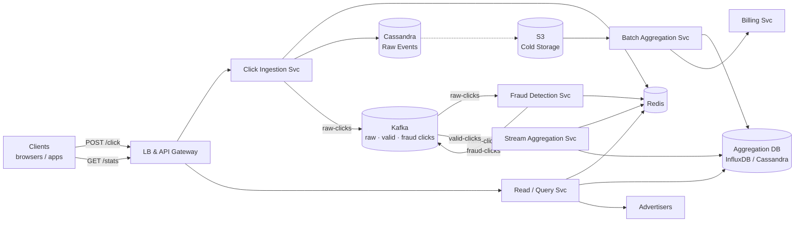
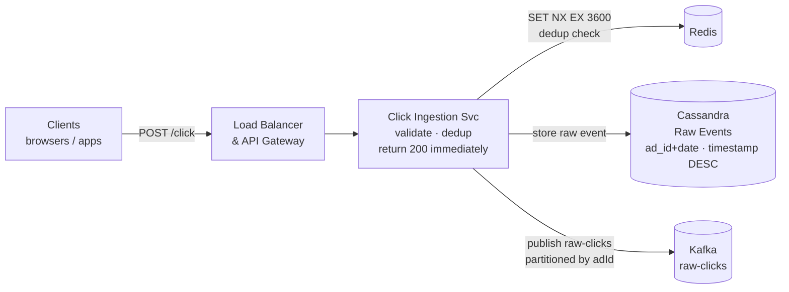
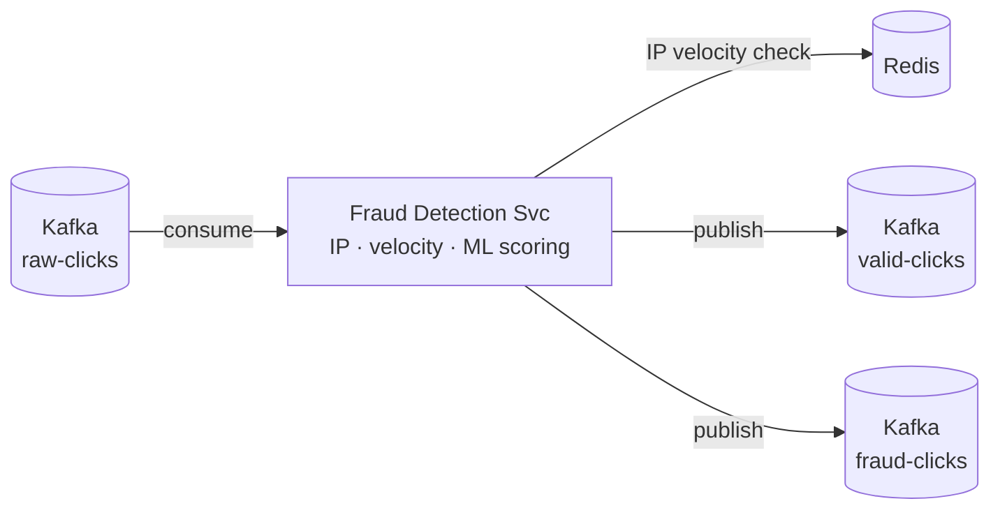
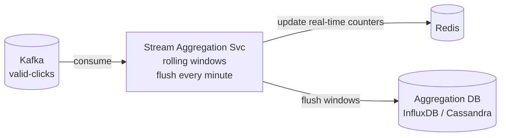
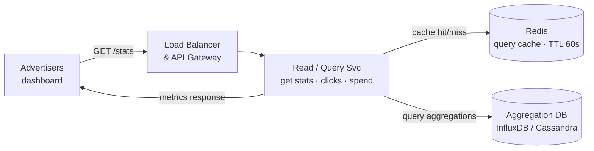
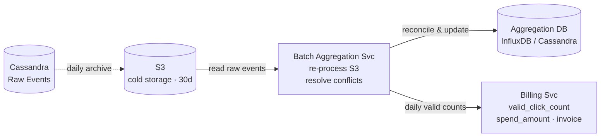

# Ad Click Aggregation System Design

## System Overview
A real-time ad click aggregation system that ingests billions of click events, aggregates them by ad/campaign/time window, detects click fraud, and serves aggregated metrics to advertisers — similar to Google Ads or Facebook Ads analytics backend.

## 1. Requirements

### Functional Requirements
- Ingest ad click events in real-time (adId, userId, timestamp, IP, device)
- Aggregate clicks by adId, campaignId, time window (per minute, hour, day)
- Detect and filter fraudulent clicks (bot traffic, click farms)
- Serve aggregated metrics to advertisers (click count, CTR, spend)
- Support queries: "clicks for ad X in last 1hr", "top 10 ads by clicks today"
- Billing: charge advertisers based on valid click counts

### Non-Functional Requirements
- Throughput: 1M+ click events/sec at peak
- Latency: aggregated metrics available within 1 min of click
- Accuracy: billing-critical — must not over-count or under-count valid clicks
- Idempotency: duplicate click events must not inflate counts
- Scalability: 100B+ clicks/day, 10M+ active ads

## 2. Back-of-the-Envelope Estimation

### Assumptions
- 100B clicks/day (including fraudulent)
- 30% fraud rate → 70B valid clicks/day
- Peak: 1M clicks/sec (flash sale, major event)
- Average click event: 200B
- 10M active ads, 1M campaigns

### Traffic
```
Clicks/sec (avg)    = 100B / 86400 ≈ 1.16M/sec
Clicks/sec (peak)   = 3M/sec

Kafka throughput    = 3M × 200B = 600MB/sec
```

### Storage
```
Raw events/day      = 100B × 200B = 20TB/day
  → retain 30 days = 600TB rolling
Aggregated data     = 10M ads × 1440 min/day × 50B = 720GB/day
  → retain 2 years = ~525TB
```

## 3. Architecture Diagram

### Components

| Component | Role |
|---|---|
| API Gateway | Auth, rate limiting, routing |
| Click Ingestion Svc | Validate, dedup, publish to Kafka, return 200 async |
| Fraud Detection Svc | Score clicks by IP, velocity, ML; route to valid/fraud topics |
| Stream Aggregation Svc | Rolling windows per minute/hour; flush to Aggregation DB |
| Batch Aggregation Svc | Daily reprocess from S3 for billing accuracy |
| Query Svc | Serve aggregated metrics from Aggregation DB + Redis cache |
| Billing Svc | Generate invoices from daily valid click counts |
| Kafka | Durable stream; topics: `raw-clicks`, `valid-clicks`, `fraud-clicks`; partitioned by adId |
| Cassandra (Raw Events) | Append-only raw click store; partition by adId + date |
| Aggregation DB (InfluxDB / Cassandra) | Pre-aggregated counts by adId + time window |
| Redis | Dedup cache, real-time counters, query result cache |
| S3 | Cold storage for raw events (30d retention); batch source |

### Overview



## 4. Key Flows

### 4.1 Click Ingestion



1. Browser/app sends `POST /click` with `{clickId, adId, userId, ip, userAgent, timestamp}`
2. Click Ingestion Service validates format
3. Deduplication: `SET dedup:{clickId} 1 NX EX 3600` — if key exists, duplicate → discard
4. Publish to Kafka `raw-clicks` topic, partition key = `adId`
5. Return 200 immediately (async processing)

**Why partition by adId:** all clicks for the same ad go to the same Kafka partition → ordered processing → accurate per-ad aggregation without cross-partition coordination.

### 4.2 Fraud Detection



**Fraud signals:**
- IP velocity: `INCR fraud:ip:{ip}` in Redis; if > 100 clicks/hr → fraud
- User velocity: > 50 clicks/hr from same user → fraud
- Bot detection: known bot user agents → fraud
- Time pattern: clicks < 1s apart → fraud

Valid click → publish to `valid-clicks`. Fraud click → publish to `fraud-clicks` + update Cassandra `is_fraud=true`.

### 4.3 Stream Aggregation



1. Service maintains in-memory hash maps per time window: `window[adId]++`
2. Every minute: flush window to Aggregation DB
3. Hourly and daily aggregations computed from minute-level data
4. Late-arriving events (up to 5 min): still counted in the correct window

### 4.4 Advertiser Query



1. Advertiser queries "clicks for campaign X in last 24hr"
2. Query Service checks Redis cache (TTL 60s)
3. Cache miss: query Aggregation DB for hourly buckets in range
4. Sum up buckets, cache result, return to advertiser

### 4.5 Batch Reconciliation & Billing



Daily batch job for billing accuracy:
1. Read all raw click events from S3 (previous day)
2. Re-apply fraud detection with updated models (more accurate than real-time)
3. Recompute daily aggregations and compare with stream results
4. Use batch results for billing — stream results are for display only

This two-layer approach is the **Lambda Architecture** pattern.

## 5. Database Design

### Cassandra — click_events (raw)

Partition key: `ad_id + date`, Clustering: `timestamp DESC`

| Field | Type |
|---|---|
| ad_id | UUID (partition key) |
| date | DATE (partition key) |
| click_id | UUID (clustering) |
| timestamp | TIMESTAMP |
| user_id | UUID, nullable |
| ip_address | VARCHAR |
| user_agent | VARCHAR |
| device_type | VARCHAR |
| is_fraud | BOOLEAN |
| session_id | VARCHAR |

### Cassandra / InfluxDB — click_aggregations

| Field | Type |
|---|---|
| ad_id | UUID |
| campaign_id | UUID |
| window_start | TIMESTAMP |
| window_type | TEXT (minute / hour / day) |
| total_clicks | BIGINT |
| valid_clicks | BIGINT |
| fraud_clicks | BIGINT |
| unique_users | BIGINT |

### Redis Keys

| Key Pattern | Type | Value | TTL |
|---|---|---|---|
| `dedup:{clickId}` | String | "1" | 3600s (dedup window) |
| `clicks:realtime:{adId}` | Counter | click count in current minute | 120s |
| `fraud:ip:{ip}` | Counter | clicks from IP in 1hr | 3600s |
| `query:cache:{queryHash}` | String | aggregation result JSON | 60s |

## 6. Key Interview Concepts

### Lambda Architecture
- Speed layer (stream): Kafka → Stream Aggregation → real-time metrics (approximate, low latency)
- Batch layer: S3 → Batch Aggregation → accurate billing metrics (exact, higher latency)
- Serving layer: merges both for queries

### Kafka Partitioning by adId
All clicks for the same ad go to the same partition → same consumer instance processes them in order → accurate per-ad counting without distributed coordination.

### Deduplication
`clickId` (UUID generated client-side) + Redis `SET NX EX` with 1hr TTL. If `clickId` already seen → discard. TTL limits Redis memory usage.

### Late-Arriving Events
A click at 12:59:55 might arrive at 13:00:05. Solution: allow 5-min late window — events arriving within 5 min of window close still counted in that window.

### Fraud Detection at Scale
- Simple rules in-memory (IP velocity, user agent) — O(1) Redis lookups
- Complex ML models run async on sampled traffic
- Known fraud IPs/users cached in Redis for fast lookup

### Billing Accuracy
Over-counting = advertiser overpays (legal risk). Under-counting = revenue loss. Batch reconciliation with more accurate fraud models; billing always uses batch results.

## 7. Failure Scenarios

### Kafka Consumer Lag (Stream Aggregation)
- Impact: real-time metrics delayed; billing unaffected (uses batch)
- Recovery: scale up Stream Aggregation instances; Kafka retains events; catches up
- Prevention: monitor consumer lag; auto-scale on lag threshold

### Aggregation DB Failure
- Impact: real-time metric queries fail; stream aggregation buffers in memory
- Recovery: InfluxDB cluster failover; buffered aggregations flushed on recovery
- Prevention: InfluxDB clustering; Redis cache absorbs query load during brief outage

### Fraud Detection Service Failure
- Impact: all clicks treated as valid (fail open) or all blocked (fail closed)
- Recovery: fail open with enhanced logging; Fraud Service is stateless, restarts quickly
- Prevention: multiple Fraud Detection instances; circuit breaker

### Duplicate Click Storm (DDoS)
- Scenario: attacker sends millions of clicks with same clickId
- Recovery: Redis `SET NX` deduplicates all; only first click processed
- Prevention: rate limiting at API Gateway per IP; CAPTCHA for suspicious traffic

### Late Batch Reconciliation Discrepancy
- Scenario: stream count = 1M, batch count = 950K (50K fraud detected in batch)
- Recovery: billing uses batch count; stream count updated retroactively in dashboard
- Prevention: expected behavior — stream is approximate, batch is authoritative
