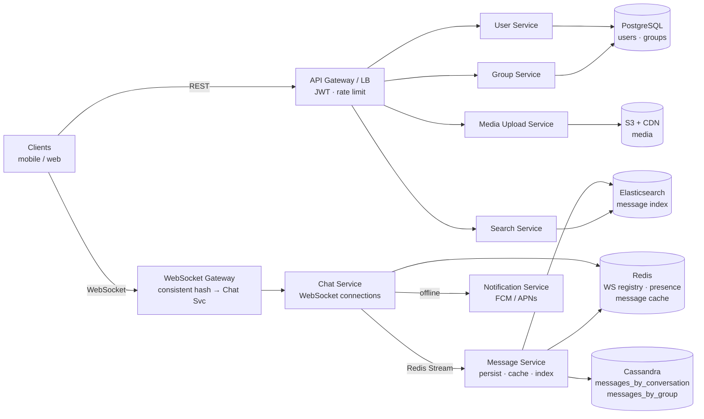
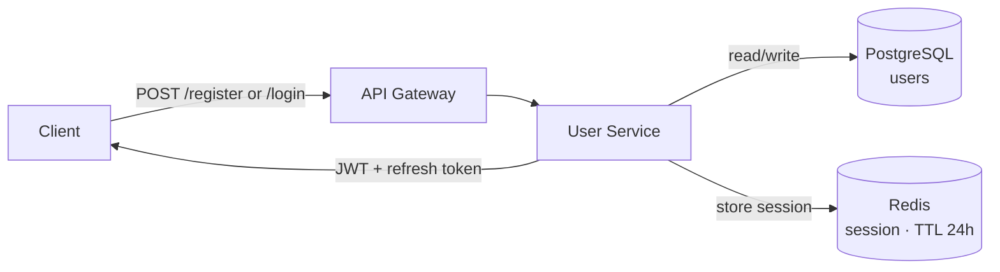
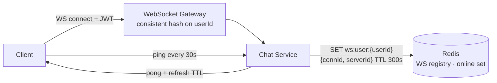
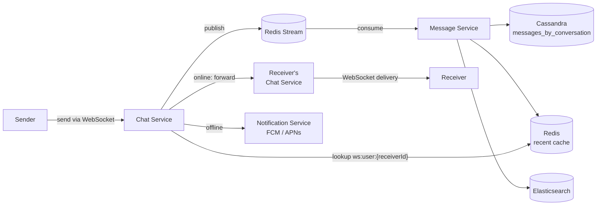
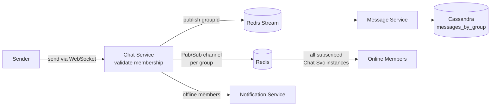
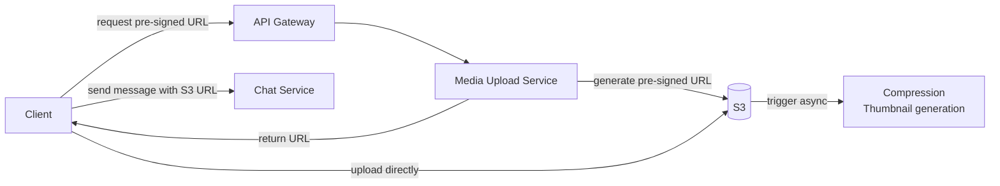
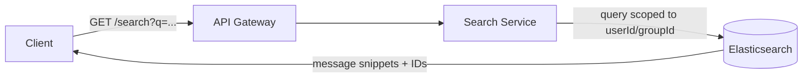

# Chat Application System Design

## System Overview
A real-time chat application supporting one-on-one messaging, group chats, media sharing, message search, and online presence tracking.

## 1. Requirements

### Functional Requirements
- User registration and authentication
- One-on-one and group messaging
- Real-time message delivery with delivery/read receipts
- Media upload and sharing (images, videos)
- Message search
- Online/offline presence and last seen

### Non-Functional Requirements
- Availability: 99.9% uptime
- Latency: <200ms for message delivery
- Scalability: 100M+ DAU, 1B+ messages/day
- Consistency: Eventual consistency acceptable for messages
- Durability: Messages must never be lost
- Security: TLS in transit, auth on every request

## 2. Back-of-the-Envelope Estimation

### Assumptions
- 100M DAU, each sends 50 messages/day
- 20% messages contain media (avg 500KB)
- Text message avg size: 100 bytes
- Read:Write ratio = 10:1

### Traffic
```
Messages/day  = 100M × 50 = 5B
Messages/sec  = 5B / 86400 ≈ 58K/sec
Peak (3×)     ≈ 174K msg/sec

Media/day     = 5B × 0.2 = 1B files
Media/sec     ≈ 11.5K/sec
```

### Storage
```
Text/day      = 5B × 100B   = 500GB/day  → ~180TB/year
Media/day     = 1B × 500KB  = 500TB/day  → ~180PB/year
```

### Memory (Redis)
```
Active connections (10% DAU) = 10M
WebSocket registry            = 10M × 1KB  = 10GB
Recent message cache          = 10M convos × 100 msgs × 100B ≈ 100GB
```

## 3. Architecture Diagram

### Components

| Component | Role |
|---|---|
| API Gateway / LB | SSL termination, JWT validation, rate limiting, routing |
| WebSocket Gateway | Persistent connection entry point; consistent hashing to Chat Service |
| User Service | Registration, login, JWT issuance, profile management |
| Chat Service | Maintains WebSocket connections, routes messages, registers connections in Redis |
| Message Service | Persists messages to Cassandra, updates cache, indexes to Elasticsearch |
| Group Service | Group CRUD, member management, permission checks |
| Media Upload Service | Generates pre-signed S3 URLs, triggers compression/thumbnails |
| Search Service | Full-text search via Elasticsearch |
| Notification Service | Sends FCM/APNs push notifications to offline users |
| Cassandra | Write-heavy message store; partition by conversation_id or group_id |
| PostgreSQL | Structured user/group data, ACID |
| Redis | WebSocket registry, online presence, message cache, Pub/Sub |
| S3 + CDN | Media storage and edge delivery |
| Elasticsearch | Full-text message search |

### Overview



## 4. Key Flows

### 4.1 Auth



1. Register: validate input → hash password (bcrypt) → write to PostgreSQL → return JWT
2. Login: validate credentials → generate JWT (1hr) + refresh token → store session in Redis → return tokens
3. Every request: API Gateway validates JWT signature + expiry + Redis session existence

### 4.2 WebSocket Connection & Presence



1. Client connects with JWT in header
2. Gateway routes to Chat Service via consistent hashing on userId (same user → same instance)
3. Chat Service registers: `SET ws:user:{userId} {connId, serverId}` TTL 300s
4. Adds userId to `online:users` Redis set
5. Heartbeat: client pings every 30s → server pongs + refreshes TTL
6. On disconnect: remove from registry, remove from online set, update last seen

### 4.3 One-on-One Message



1. Client sends message via WebSocket with client-generated `messageId`
2. Chat Service publishes to Redis Stream
3. Message Service consumes → writes to Cassandra (idempotent on `messageId`) → updates Redis cache → indexes to Elasticsearch
4. Chat Service looks up receiver's connection in Redis
5. Online → forward to correct Chat Service instance → deliver via WebSocket
6. Offline → Notification Service sends push notification
7. Receiver ACKs → status updated to `delivered`; read receipt → status updated to `read` → sender notified

### 4.4 Group Message



1. Chat Service validates sender is group member (Redis cache → fallback to PostgreSQL)
2. Publishes to Redis Stream with `groupId`
3. Message Service persists to `messages_by_group`
4. For large groups (1000+): Redis Pub/Sub channel per group — publish once, all subscribed Chat Service instances deliver to their connected members
5. Offline members get push notifications

### 4.5 Media Upload



1. Client requests pre-signed S3 URL from Media Upload Service
2. Client uploads directly to S3 (bypasses app servers)
3. S3 triggers async post-processing (compression, thumbnails)
4. Client sends message with returned S3 URL through normal message flow
5. CDN serves media to recipients

### 4.6 Message Search



1. Search query scoped to userId/groupId with full-text match
2. Returns message snippets + IDs
3. Client fetches full messages from Redis cache or Cassandra if needed

## 5. Database Design

### Selection Reasoning

| Store | Why |
|---|---|
| Cassandra | Write-heavy (58K msg/sec), time-series, horizontal scale, tunable consistency |
| PostgreSQL | Structured user/group data, ACID, relational queries |
| Redis | Sub-ms WebSocket registry, TTL for connections, Pub/Sub, message cache |
| S3 | Cheap durable object storage for media, CDN-friendly |
| Elasticsearch | Full-text search, not suitable for primary storage |

### PostgreSQL — users

| Field | Type |
|---|---|
| user_id | UUID (PK) |
| username | VARCHAR, unique |
| email | VARCHAR, unique |
| password_hash | VARCHAR |
| display_name | VARCHAR |
| profile_picture_url | TEXT |
| created_at | TIMESTAMP |

### PostgreSQL — groups

| Field | Type |
|---|---|
| group_id | UUID (PK) |
| group_name | VARCHAR |
| created_by | UUID (FK → users) |
| created_at | TIMESTAMP |

### PostgreSQL — group_members

| Field | Type |
|---|---|
| group_id | UUID (FK → groups) |
| user_id | UUID (FK → users) |
| role | VARCHAR (admin / member) |
| joined_at | TIMESTAMP |

### Cassandra — messages_by_conversation

Partition key: `conversation_id` ("userId1_userId2", sorted), Clustering: `message_id DESC`

| Field | Type |
|---|---|
| conversation_id | TEXT (partition key) |
| message_id | TIMEUUID (clustering) |
| sender_id | UUID |
| content | TEXT |
| media_url | TEXT |
| message_type | TEXT (text/image/video) |
| delivery_status | TEXT (sent/delivered/read) |
| created_at | TIMESTAMP |

### Cassandra — messages_by_group

Partition key: `group_id`, Clustering: `message_id DESC`

| Field | Type |
|---|---|
| group_id | UUID (partition key) |
| message_id | TIMEUUID (clustering) |
| sender_id | UUID |
| content | TEXT |
| media_url | TEXT |
| message_type | TEXT |
| created_at | TIMESTAMP |

### Redis Keys

| Key Pattern | Type | Value | TTL |
|---|---|---|---|
| `ws:user:{userId}` | String | `{connectionId, serverId}` | 300s (refreshed by heartbeat) |
| `online:users` | Set | userId members | — |
| `chat:{convId}:recent` | List | last 100 messages | 3600s |
| `session:{sessionId}` | String | `{userId, deviceId}` | 86400s |

## 6. Key Interview Concepts

### WebSocket vs HTTP Polling
WebSocket gives full-duplex persistent connection — server pushes instantly. Polling wastes bandwidth asking "any messages?" every N seconds. Trade-off: WebSocket holds memory per connection, but for chat it's worth it.

### Message Ordering
Use TIMEUUID as message ID in Cassandra — embeds timestamp + uniqueness. Cassandra clusters by it descending. Client sorts by timestamp on render. For near-simultaneous messages, last-write-wins is acceptable.

### Offline Message Delivery
Message is persisted to Cassandra before any delivery attempt. On reconnect, client sends its last received `messageId`, server queries Cassandra for everything after that point and delivers the gap.

### Fan-out Problem (Large Groups)
A group with 10K members means 10K delivery attempts per message. Solutions:
- Deliver only to online members immediately
- Offline members pull on reconnect (lazy fan-out)
- Redis Pub/Sub per group channel — Chat Service instances subscribe, publish once

### Idempotency
Client generates a UUID per message. If network fails and client retries, server checks if `messageId` already exists in Cassandra before inserting. Prevents duplicates.

### Consistent Hashing for Chat Service
Chat Service is stateful (holds WebSocket connections). Load balancer uses consistent hashing on `userId` so the same user always routes to the same instance. On scale-out, only a fraction of connections need to move.

### Cassandra Partitioning
Partition key = `conversation_id` keeps all messages for a chat on the same node — efficient range reads. Hot partition risk for very active groups: shard with `group_id + bucket` (e.g., time-based bucket).

### Caching Strategy
Three levels: client local storage → Redis (last 100 msgs, TTL 1hr) → Cassandra. Write-through on new message. Cache-aside on read miss. Targets >90% cache hit rate for active conversations.

### CAP Trade-off
Chat favors Availability over strong Consistency. Cassandra with QUORUM writes + ONE reads gives good balance — messages won't be lost, and slight staleness on reads is acceptable.

## 7. Failure Scenarios

### WebSocket Connection Drop
- Detection: no pong within 60s
- Recovery: client exponential backoff reconnect (1s → 2s → 4s → max 30s), re-auth with stored JWT, request missed messages since last `messageId`

### Message Service Crash
- Detection: no ACK within 5s
- Recovery: Redis Stream retains unacknowledged messages, another instance picks up; `messageId` idempotency prevents duplicates

### Cassandra Node Failure
- RF=3, QUORUM writes mean 2/3 nodes must ack
- Hinted handoff stores writes for the failed node, replays on recovery
- Multi-datacenter replication for regional failures

### Redis Failure
- Impact: WebSocket registry lost, cache miss, sessions lost
- Recovery: Redis Sentinel promotes replica in <30s; users reconnect and rebuild registry; cache warms from Cassandra on miss
- Prevention: Redis Cluster + AOF persistence

### Elasticsearch Failure
- Impact: search unavailable only (non-critical path)
- Recovery: graceful degradation — show "search unavailable"; index writes queued and replayed on recovery
- Message delivery completely unaffected

### S3 / Media Failure
- Recovery: retry with backoff, fallback to secondary region; message sent as text-only with pending media indicator

### DDoS
- Rate limiting at API Gateway (per IP + per user)
- DDoS protection at edge (Cloudflare / AWS Shield)
- Auto-scaling absorbs legitimate traffic spikes
