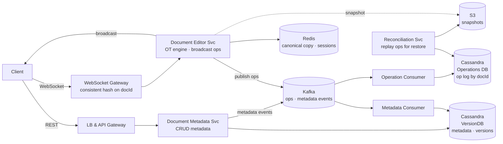
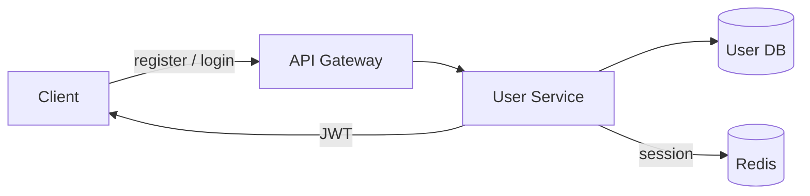
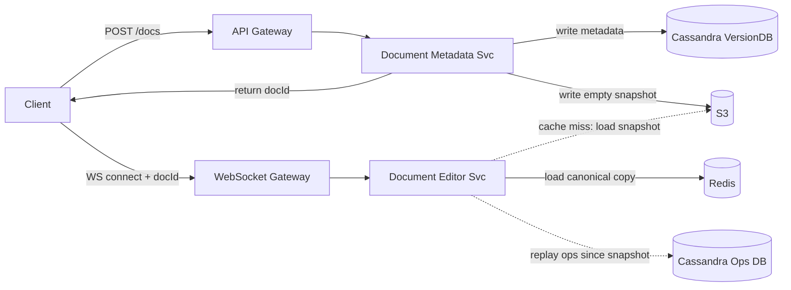
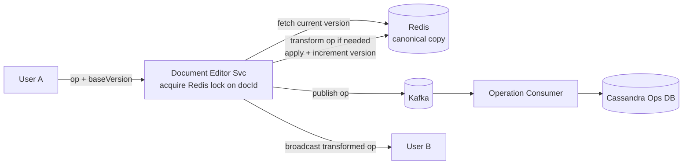
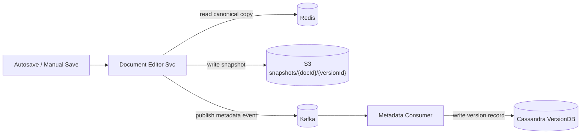
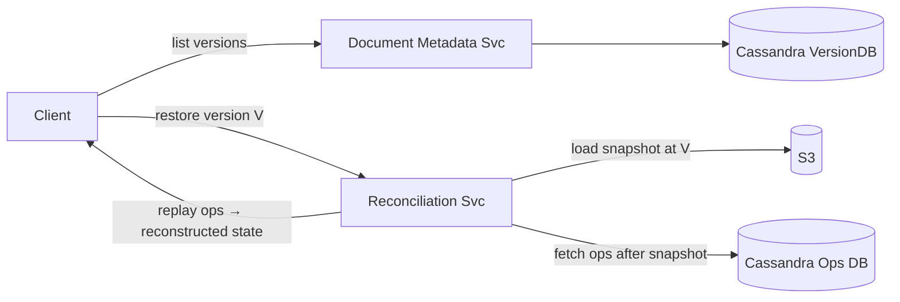

# Collaborative Editor System Design

## System Overview
A real-time collaborative document editor (think Google Docs) where multiple users simultaneously edit the same document, with changes merged conflict-free via Operational Transformation and persisted durably through an event-sourced op log.

## 1. Requirements

### Functional Requirements
- User registration and authentication
- Create, read, update, delete documents
- Real-time collaborative editing (multiple users, same document, simultaneously)
- Conflict-free merge of concurrent edits via OT
- Document versioning — snapshot on manual save and autosave (every 10/20s)
- Ability to view and restore previous versions

### Non-Functional Requirements
- Availability: 99.99% uptime
- Latency: <100ms for local edit to appear; <300ms for remote user to see it
- Scalability: 1B+ documents, 100M+ DAU, 10M+ concurrent editing sessions
- Consistency: All collaborators converge to the same document state
- Durability: No edit ever lost, even on crash
- Security: Document access enforced on every operation

## 2. Back-of-the-Envelope Estimation

### Assumptions
- 100M DAU, avg 5 documents opened/day
- 10M concurrent active editing sessions at peak
- Each session generates ~20 ops/min while active
- Average op size: 50 bytes
- Average document size: 100KB

### Traffic
```
Active sessions at peak  = 10M
Ops/sec                  = 10M × 20/60 ≈ 3.3M ops/sec
Peak (2×)                ≈ 6.6M ops/sec
```

### Storage
```
Ops/day    = 10M sessions × 20 ops/min × 60 min × 8 hrs = 96B ops/day
           ≈ 96B × 50B = 4.8TB/day (raw ops log)
           → retain 30 days rolling = ~144TB

Snapshots  = 1B docs × 100KB avg = 100TB (S3)
```

### Memory (Redis)
```
Hot doc canonical copies = top 1M active docs × 100KB = 100GB
Active session metadata  = 10M × 500B = 5GB
```

## 3. Architecture Diagram

### Components

| Component | Role |
|---|---|
| LB + API Gateway | SSL termination, JWT validation, rate limiting, HTTP routing |
| WebSocket LB + Gateway | Persistent WebSocket connections; consistent hashing on docId |
| Document Metadata Service | Create/read/update document metadata; publishes to Kafka |
| Document Editor Service | Core real-time OT engine; applies ops, updates Redis, broadcasts to collaborators |
| Metadata Consumer | Kafka consumer; persists metadata changes to VersionDB (Cassandra) |
| Operation Consumer | Kafka consumer; persists operations to Operations DB (Cassandra) |
| Reconciliation Service | Replays ops from Cassandra for version restore and recovery |
| Redis | Canonical document copy (live working state), session registry |
| Kafka | Async event bus for ops and metadata events |
| S3 | Document snapshots (versioned saves) |
| Cassandra (Ops DB) | Append-only op log; partition by docId |
| Cassandra (VersionDB) | Document metadata and version records |

### Overview



## 4. Key Flows

### 4.1 Auth



1. Register: validate → hash password → write to DB → return JWT
2. Login: validate credentials → JWT (1hr) + refresh token → session in Redis
3. API Gateway validates JWT on every HTTP and WebSocket request

### 4.2 Document Create & Open



1. Create: write metadata to VersionDB → write empty snapshot to S3 → return docId
2. Open: fetch metadata + snapshot URL from VersionDB → download from S3 via CDN
3. Connect WebSocket → Document Editor Service loads canonical copy from Redis (or reconstructs from S3 + Cassandra on cache miss)

### 4.3 Real-Time Collaborative Editing (OT)



1. User types → client sends op: `{docId, event, baseVersion}`
2. Document Editor Service acquires Redis lock on docId (SETNX)
3. If `baseVersion < currentVersion`: transform op against intermediate ops
4. Apply transformed op to Redis canonical copy, increment version
5. Release lock → publish op to Kafka → broadcast to all collaborators
6. Operation Consumer persists op to Cassandra async

### 4.4 Snapshotting & Versioning



1. Autosave (every 10–20s) or manual save triggers snapshot
2. Read canonical copy from Redis → write to S3
3. Publish metadata event → Metadata Consumer writes version record to VersionDB

### 4.5 Version Restore



1. User selects version V → Reconciliation Service loads snapshot from S3
2. Fetches all ops after that snapshot's timestamp from Cassandra
3. Replays ops → reconstructs exact document state at V
4. On confirm restore: write reconstructed state as new snapshot through normal save path

## 5. Database Design

### Selection Reasoning

| Store | Why |
|---|---|
| Cassandra (Ops DB) | Append-only op log, 3M+ ops/sec, time-series, partition by docId |
| Cassandra (VersionDB) | Document metadata and version history, high availability |
| Redis | Sub-ms canonical copy reads, TTL-based lifecycle, distributed lock |
| S3 | Cheap durable snapshot storage |
| Kafka | Decouples editor from persistence; durable event log |

### Cassandra — operations

Partition key: `doc_id`, Clustering: `timestamp ASC`

| Field | Type |
|---|---|
| doc_id | UUID (partition key) |
| timestamp | TIMESTAMP (clustering) |
| operation_id | UUID |
| event | TEXT (JSON — type, position, content) |

### Cassandra — version_db

| Field | Type |
|---|---|
| id | UUID (PK) |
| doc_id | UUID |
| version_id | UUID |
| title | VARCHAR |
| url | TEXT (S3 snapshot URL) |
| created_by | UUID |
| created_time | TIMESTAMP |
| last_modified_time | TIMESTAMP |
| metadata | TEXT (JSON) |

### Redis Keys

| Key Pattern | Type | Value | TTL |
|---|---|---|---|
| `doc:canonical:{docId}` | String | full document content | evicted when inactive |
| `doc:sessions:{docId}` | Set | connected sessionIds | — |
| `session:{sessionId}` | String | `{userId, docId}` | 86400s |

## 6. Key Interview Concepts

### Operational Transformation (OT)
Every edit is an op: `insert(pos, text)` or `delete(pos, length)`. When two ops are concurrent (same `baseVersion`), the server transforms the second op's position to account for the first before applying. Requires a central server to serialize ops — this is why Document Editor Service holds a per-doc lock.

Example: Doc = "AC"
- User A inserts "B" at pos 1 → "ABC"
- User B (same baseVersion) inserts "D" at pos 1 → without transform: "ADC" ✗
- After transform: insert at pos 2 → "ABDC" ✓

### CRDT as an Alternative
CRDTs assign a globally unique ID to every character; inserts/deletes are always commutative — no central coordinator needed. Used by Figma, Notion. Trade-off: more memory overhead, but better for P2P/offline-first.

### Redis as Canonical Copy
Redis holds the live working document state during active editing. TTL ensures eviction when inactive. On eviction, document is reconstructed from S3 + Cassandra on next open. Redis is a cache — Cassandra + S3 are the durable sources.

### Kafka Decoupling
Document Editor Service publishes to Kafka and returns immediately. Cassandra writes happen async via consumers. Keeps the critical path (OT + Redis update + broadcast) fast.

### Op Log as Event Source
Cassandra Operations DB is an append-only log of every op. Snapshots are performance shortcuts — the full document can always be reconstructed by replaying all ops. This is the event sourcing pattern.

### Consistent Hashing for Document Editor Service
WebSocket Gateway uses consistent hashing on `docId` so all connections for the same document route to the same instance. Benefits: no cross-instance coordination, warm in-memory state.

### Distributed Lock per Document
OT requires serialized op application per document. Redis `SETNX` with short TTL acts as a distributed lock on `docId`. Consistent hashing means the same instance usually handles a doc — lock is a safety net.

## 7. Failure Scenarios

### Document Editor Service Crash
- Recovery: clients reconnect; new instance loads canonical copy from Redis (still warm) or reconstructs from S3 + Cassandra; clients resend pending ops
- Prevention: Redis holds canonical copy independently of any instance

### Redis Failure (Canonical Copy Lost)
- Impact: all active editing sessions lose in-memory state; forced reconnect
- Recovery: Redis Sentinel failover (<30s); reconstruct from S3 + Cassandra ops; no data loss
- Prevention: Redis Cluster + AOF; autosave every 10–20s limits replay needed

### Kafka Consumer Lag
- Impact: ops not yet persisted to Cassandra; if Redis also fails, recent ops could be lost
- Recovery: Kafka retains messages; consumer catches up on recovery
- Prevention: monitor consumer lag; Kafka retention ≥ 24hr

### Distributed Lock Expiry Mid-Op
- Scenario: lock TTL expires mid-transform → two instances both acquire lock
- Recovery: idempotency key deduplicates; version mismatch causes one to reject and retry
- Prevention: lock TTL > max op processing time

### Long Reconnect After Disconnect
- Scenario: user disconnects for minutes, reconnects with stale baseVersion
- Recovery: fetch all ops since client's baseVersion from Cassandra, transform pending ops, return updated state; if gap too large, return full current snapshot
