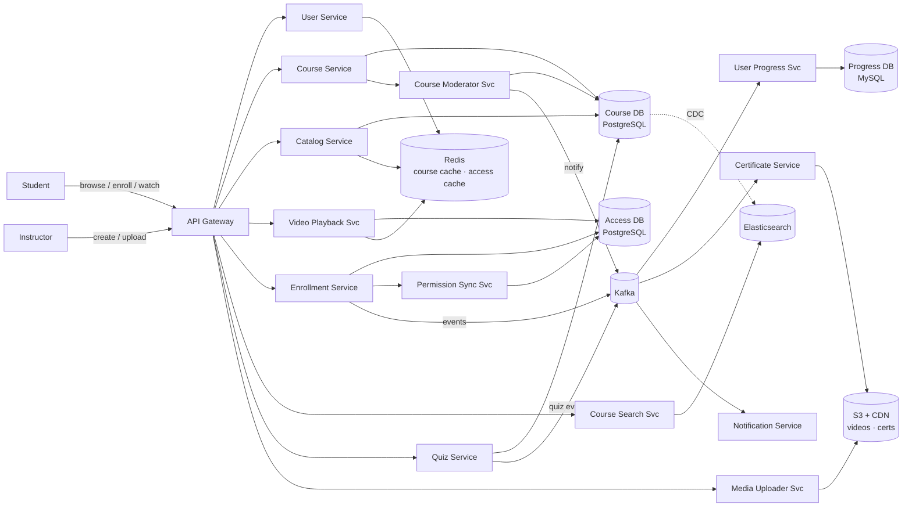
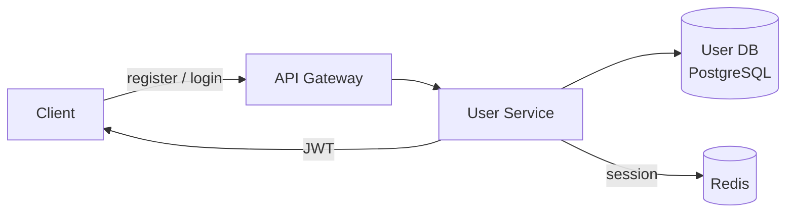
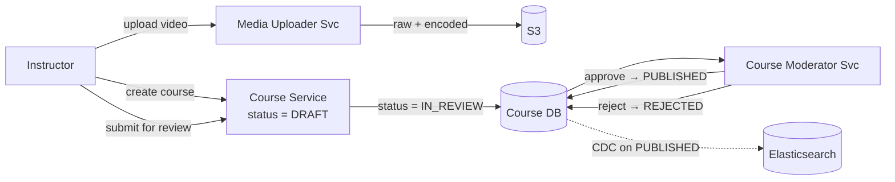
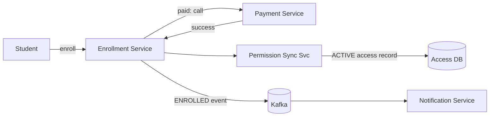
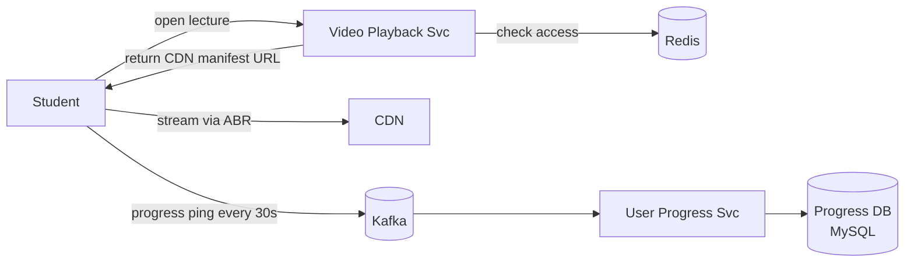
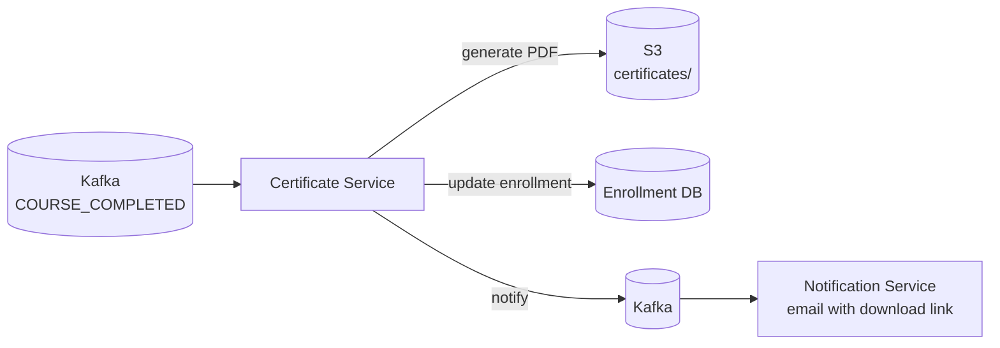
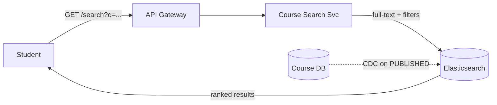

# Coursera (Online Learning Platform) System Design

## System Overview
An online learning platform (think Coursera / Udemy / edX) where instructors create courses with video lectures, quizzes, and assignments — and learners enroll, watch videos, complete assessments, and earn certificates.

## 1. Requirements

### Functional Requirements
- User registration (learners and instructors)
- Course creation with video lectures, quizzes, assignments
- Course enrollment (free and paid)
- Video streaming with progress tracking
- Quizzes and auto-graded assignments
- Certificate generation on course completion
- Course search and discovery
- Reviews and ratings
- Discussion forums per course
- Instructor analytics (enrollment, completion rates)

### Non-Functional Requirements
- Availability: 99.99%
- Latency: <200ms for course browse; video starts within 1s
- Scalability: 100M+ learners, 100K+ courses, Read >> Write
- Durability: Progress and certificates must never be lost
- Video delivery: adaptive bitrate, global CDN

## 2. Back-of-the-Envelope Estimation

### Assumptions
- 100M registered users, 10M DAU
- 100K courses, avg 20 video lectures each = 2M videos
- Average video: 10 min at 5Mbps = ~375MB per quality variant
- 5M video views/day, avg 8 min watched
- 100K course enrollments/day

### Traffic
```
Video views/sec         = 5M / 86400 ≈ 58/sec
Concurrent streams      = 58 × 8min × 60s = ~28K concurrent streams → CDN

Course browse/sec       = 10M × 10 / 86400 ≈ 1.2K/sec
Enrollment/sec          = 100K / 86400 ≈ 1.2/sec (low write)
```

### Storage
```
Videos (encoded)        = 2M × 375MB × 5 variants = 3.75PB → S3
Course metadata         = 100K × 50KB = 5GB
User progress           = 100M × 100 courses × 200B = 2TB
Certificates            = 10M × 100KB = 1TB → S3
```

## 3. Architecture Diagram

### Components

| Component | Role |
|---|---|
| API Gateway | Auth, rate limiting, routing for students, instructors, admins |
| User Service | Registration, login, JWT issuance, profile management |
| Course Service | Course/lecture CRUD; manages status workflow DRAFT→IN_REVIEW→PUBLISHED |
| Course Moderator Service | Admin reviews submitted courses; approves or rejects |
| Catalog Service | Serves structured course browsing (category pages, featured) |
| Media Uploader Service | Instructor video uploads; transcoding pipeline; thumbnails |
| Video Playback Service | Validates enrollment/access; returns CDN manifest URL |
| Enrollment Service | Handles enrollment (free and paid); integrates with Payment Service |
| Permission Sync Service | Syncs access rights after enrollment; manages LIFETIME/SUBSCRIPTION |
| User Progress Service | Consumes tracking events from Kafka; writes to Progress DB |
| Quiz Service | Quiz/question management; auto-grading for MCQ/TRUE_FALSE |
| Certificate Service | Generates PDF certificates on course completion |
| Course Search Service | Full-text search via Elasticsearch; CDC from Course DB |
| Notification Service | Kafka consumer; enrollment confirmations, approvals, certificates |

### Overview



## 4. Key Flows

### 4.1 Auth



1. Register → validate → write to User DB → return JWT
2. Login → validate credentials → JWT (1hr) + refresh token → session in Redis
3. Instructor endpoints require `role = instructor`

### 4.2 Course Creation & Moderation



1. Instructor creates course → `status = DRAFT`
2. Uploads videos → Media Uploader → S3 → transcoding (360p/720p/1080p) → CDN URL stored in lecture
3. Submits for review → `status = IN_REVIEW`
4. Moderator approves → `status = PUBLISHED` → CDC → Elasticsearch indexed
5. Moderator rejects → `status = REJECTED` → Notification Service informs instructor

### 4.3 Enrollment & Access



1. Free course: Enrollment Service → Permission Sync creates `{access_type: LIFETIME, status: ACTIVE}`
2. Paid course: Payment Service → on success → Enrollment Service → Permission Sync
3. Every video request: Video Playback Service checks Redis `access:{userId}:{courseId}` → fallback to Access DB

### 4.4 Video Playback & Progress



1. Validate access (Redis → Access DB)
2. Return CDN manifest URL (HLS/DASH) → client streams via ABR
3. Client sends progress every 30s: `{userId, videoId, currentPosition}`
4. User Progress Service updates `last_position_sec` and `max_position_sec`
5. If `max_position_sec >= 90% of duration`: mark `completed = true`
6. All required videos + quizzes completed → publish `COURSE_COMPLETED` to Kafka

### 4.5 Certificate Generation



1. Certificate Service consumes `COURSE_COMPLETED` event
2. Generates PDF with student name, course name, date, unique certificate ID
3. Stores to S3 → updates enrollment record with certificate URL
4. Notification Service sends email with download link
5. Verification: `coursera.com/verify/{certificateId}` → lookup in PostgreSQL

### 4.6 Course Search



1. CDC from Course DB (on `status = PUBLISHED`) → Elasticsearch
2. Full-text on title, description, instructor; filter by category, level, price, rating

## 5. Database Design

### Selection Reasoning

| Store | Why |
|---|---|
| PostgreSQL (Course DB) | Structured course hierarchy, ACID, course status workflow |
| PostgreSQL (Enrollment / Access DB) | ACID for enrollment + access rights |
| MySQL (Progress DB) | Per-user per-video progress; high write throughput |
| PostgreSQL (Quiz DB) | Structured quiz/question data, grading, ACID |
| Redis | Course cache, access cache, session store |
| Elasticsearch | Full-text course search |
| S3 + CDN | Video chunks, thumbnails, certificates |

### PostgreSQL — courses

| Field | Type |
|---|---|
| course_id | UUID (PK) |
| owner_instructor_id | UUID |
| title | VARCHAR |
| description | TEXT |
| category_id | UUID |
| level | ENUM (BEGINNER / INTERMEDIATE / ADVANCED) |
| thumbnail_url | TEXT |
| status | ENUM (DRAFT / IN_REVIEW / PUBLISHED / REJECTED / ARCHIVED) |
| metadata | JSONB |

### PostgreSQL — access

| Field | Type |
|---|---|
| access_id | UUID (PK) |
| user_id | UUID |
| course_id | UUID |
| access_type | ENUM (LIFETIME / SUBSCRIPTION) |
| status | ENUM (ACTIVE / REVOKED / EXPIRED / DEMO) |
| purchase_date | TIMESTAMP |
| metadata | JSONB |

### MySQL — progress

| Field | Type |
|---|---|
| user_id | UUID |
| course_id | UUID |
| video_id | UUID |
| duration_sec | INT |
| max_position_sec | INT (furthest point — for completion tracking) |
| last_position_sec | INT (resume point) |
| completed | BOOLEAN |

### PostgreSQL — quizzes

| Field | Type |
|---|---|
| quiz_id | UUID (PK) |
| course_id | UUID |
| lesson_id | UUID |
| points | INT |
| pass_score | DECIMAL |

### Redis Keys

| Key Pattern | Type | Value | TTL |
|---|---|---|---|
| `course:meta:{courseId}` | String | course JSON | 600s |
| `access:{userId}:{courseId}` | String | access status | 300s |
| `session:{sessionId}` | String | userId | 86400s |

## 6. Key Interview Concepts

### Course Status Workflow
`DRAFT → IN_REVIEW → PUBLISHED / REJECTED → ARCHIVED`. Moderation keeps low-quality content off the platform. CDC only fires to Elasticsearch on `PUBLISHED` — search index stays clean.

### max_position_sec vs last_position_sec
- `last_position_sec`: where to resume — always updated to current position
- `max_position_sec`: furthest point watched — only moves forward, never backward

Prevents scrubbing to the end to mark a video complete. Completion requires `max_position_sec >= 90% of duration`.

### Permission Sync Service
Enrollment is a business record (payment, order). Access is a technical permission (can this user watch this video?). Permission Sync translates enrollment events into access records. Access types: LIFETIME (one-time purchase), SUBSCRIPTION (monthly), DEMO (free preview).

### Video Delivery at Scale
Pre-encoded multiple bitrates, HLS/DASH, CDN delivery. Educational videos are watched repeatedly — popular lectures cached at CDN edge for months. Cache hit rate very high for popular courses.

### Certificate Uniqueness & Verification
Each certificate has a unique ID. Employers verify at `coursera.com/verify/{certificateId}`. Certificate Service stores `certificateId → {userId, courseId, completedAt}` in PostgreSQL. PDF has QR code linking to verification URL.

## 7. Failure Scenarios

### Video Encoding Failure
- Recovery: Kafka retains encoding jobs; another encoder picks up; idempotent encoding
- Lecture stays in `processing` status; instructor notified of delay

### Progress DB Failure
- Impact: progress updates fail; video streaming unaffected
- Recovery: client buffers progress updates locally and retries on reconnect
- Prevention: multi-AZ MySQL; progress loss of a few seconds is acceptable

### Certificate Generation Failure
- Recovery: Kafka retains `COURSE_COMPLETED` event; Certificate Service retries on restart
- Prevention: idempotent generation (same courseId + userId = same certificate)

### Payment Failure on Enrollment
- Recovery: enrollment not created; user notified; retry with idempotency key
- Prevention: idempotency key prevents double charge on retry
