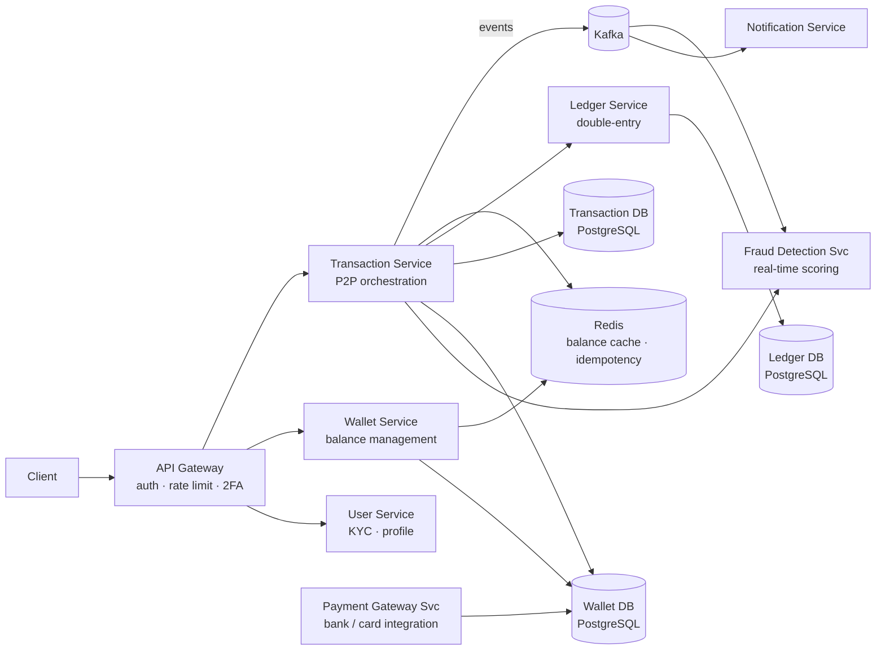
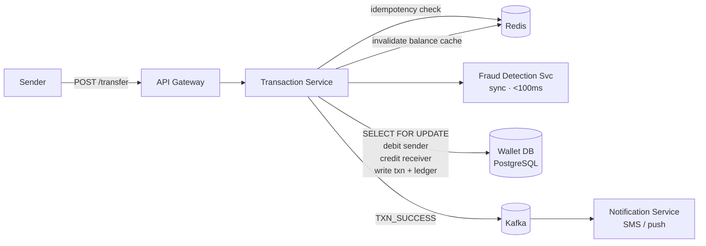
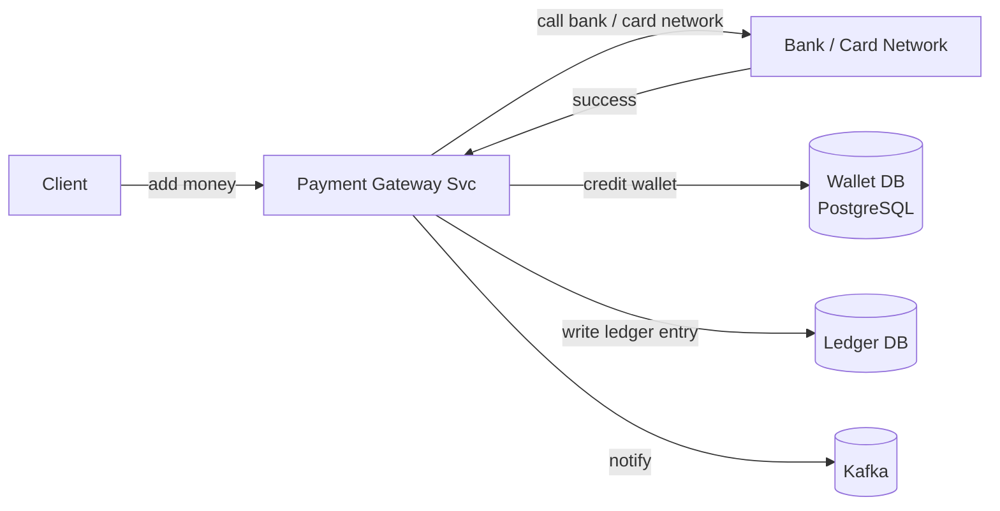
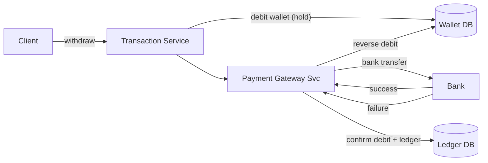

# Digital Wallet System Design

## System Overview
A digital wallet platform (think PayTM / Google Pay / Apple Pay) that allows users to store money, send/receive peer-to-peer payments, pay merchants, and view transaction history — with strong consistency on balances and idempotent transactions.

## 1. Requirements

### Functional Requirements
- User registration, KYC, and authentication
- Add money to wallet (from bank/card)
- Send money to another user (P2P transfer)
- Pay merchants (QR code / UPI / NFC)
- Withdraw money to bank account
- View transaction history and balance
- Notifications for every transaction

### Non-Functional Requirements
- Availability: 99.999% — financial transactions must always be processable
- Latency: <500ms for P2P transfer
- Consistency: Strong — balance must never go negative; no double spend
- Durability: Every transaction must be permanently recorded
- Security: PCI-DSS, fraud detection, 2FA for large transfers
- Idempotency: Retried transactions must not result in double debit/credit

## 2. Back-of-the-Envelope Estimation

### Assumptions
- 100M registered users, 20M DAU
- 10M transactions/day (P2P + merchant payments)
- Average transaction: $25
- Peak: festival season, 5× normal (50M transactions/day)

### Traffic
```
Transactions/sec (avg)  = 10M / 86400 ≈ 116/sec
Transactions/sec (peak) = 50M / 86400 ≈ 580/sec

Balance reads/sec       = 20M DAU × 5 checks/day / 86400 ≈ 1.2K/sec
```

### Storage
```
Users           = 100M × 2KB = 200GB
Transactions    = 10M/day × 500B = 5GB/day → ~1.8TB/year
Ledger entries  = 2 entries per txn × 10M/day × 300B = 6GB/day (double-entry)
```

## 3. Architecture Diagram

### Components

| Component | Role |
|---|---|
| API Gateway | Auth, rate limiting, routing, 2FA enforcement for large transfers |
| User Service | Registration, KYC verification, profile management |
| Wallet Service | Balance management; reads/writes to Wallet DB |
| Transaction Service | Orchestrates P2P transfers; ensures atomicity; writes to Transaction DB and Ledger |
| Payment Gateway Service | Integrates with banks/card networks for add money and withdrawal |
| Fraud Detection Service | Real-time transaction scoring; blocks suspicious transactions |
| Ledger Service | Double-entry bookkeeping; immutable audit trail |
| Notification Service | Kafka consumer; sends SMS/push/email for every transaction |
| Wallet DB (PostgreSQL) | User balances; ACID critical |
| Transaction DB (PostgreSQL) | Transaction records with status |
| Ledger DB (PostgreSQL) | Immutable double-entry ledger |
| Redis | Balance cache, idempotency keys, session store, rate limiting |
| Kafka | Async event bus for notifications, fraud detection, analytics |

### Overview



## 4. Key Flows

### 4.1 P2P Transfer



1. Sender initiates with `idempotency_key = hash(senderId + receiverId + amount + timestamp_bucket)`
2. Check Redis for existing key — if exists, return cached result (no double processing)
3. Fraud Detection scores transaction synchronously (<100ms)
4. PostgreSQL transaction:
   - `SELECT FOR UPDATE` on sender's wallet (row-level lock)
   - Check balance >= amount; if not, rollback
   - Debit sender, credit receiver atomically
   - Write transaction record + two ledger entries
   - Commit
5. Store idempotency key in Redis (TTL 24hr) → invalidate balance cache
6. Publish to Kafka → Notification Service sends SMS/push to both parties

### 4.2 Add Money (Bank → Wallet)



1. User initiates add money → Payment Gateway Service calls bank/card network
2. On success: credit wallet balance in PostgreSQL + write ledger entry
3. On failure: no balance change; notify user

### 4.3 Withdrawal (Wallet → Bank)



1. Debit wallet balance (hold amount)
2. Call Payment Gateway to initiate bank transfer
3. On success: confirm debit, write ledger
4. On failure: reverse debit (credit back), notify user

## 5. Database Design

### Selection Reasoning

| Store | Why |
|---|---|
| PostgreSQL (Wallet DB) | ACID transactions for balance updates; row-level locking prevents double spend |
| PostgreSQL (Transaction DB) | Relational, ACID, audit queries |
| PostgreSQL (Ledger DB) | Immutable double-entry records; append-only; financial compliance |
| Redis | Balance cache (fast reads), idempotency keys, session store |
| Kafka | Async notifications, fraud events — decoupled from critical path |

### PostgreSQL — wallets

| Field | Type |
|---|---|
| wallet_id | UUID (PK) |
| user_id | UUID, unique |
| balance | DECIMAL(18,2) |
| currency | VARCHAR |
| status | ENUM (active / frozen / closed) |
| updated_at | TIMESTAMP |

### PostgreSQL — transactions

| Field | Type |
|---|---|
| txn_id | UUID (PK) |
| sender_id | UUID |
| receiver_id | UUID |
| amount | DECIMAL(18,2) |
| currency | VARCHAR |
| type | ENUM (p2p / merchant / add_money / withdrawal) |
| status | ENUM (pending / success / failed / reversed) |
| idempotency_key | VARCHAR, unique |
| created_at | TIMESTAMP |
| metadata | JSONB |

### PostgreSQL — ledger (double-entry, immutable)

| Field | Type |
|---|---|
| entry_id | UUID (PK) |
| txn_id | UUID (FK → transactions) |
| wallet_id | UUID |
| entry_type | ENUM (debit / credit) |
| amount | DECIMAL(18,2) |
| balance_after | DECIMAL(18,2) |
| created_at | TIMESTAMP |

### Redis Keys

| Key Pattern | Type | Value | TTL |
|---|---|---|---|
| `wallet:balance:{userId}` | String | balance DECIMAL | 60s |
| `idempotency:{key}` | String | txn_id | 86400s |
| `session:{sessionId}` | String | userId | 86400s |
| `rate:{userId}` | Counter | txn count | 60s window |

## 6. Key Interview Concepts

### Double-Entry Bookkeeping
Every transaction creates two ledger entries: one debit and one credit. Sum of all entries for any wallet = current balance. Provides an immutable audit trail and enables reconciliation.
```
P2P: Alice sends $50 to Bob
  Ledger entry 1: DEBIT  Alice  $50  (balance: $150 → $100)
  Ledger entry 2: CREDIT Bob    $50  (balance: $30  → $80)
```

### Preventing Double Spend
`SELECT FOR UPDATE` acquires a row-level lock on the sender's wallet row. Only one transaction can modify the balance at a time. Combined with balance check inside the transaction, negative balances are impossible.

### Idempotency
Client generates `idempotency_key` before the first attempt. Server checks Redis — if key exists, return the original result without re-processing. Key stored with 24hr TTL.

### Consistency vs Availability
Wallet favors strong consistency (CP). A user seeing a slightly stale balance is acceptable (Redis cache, 60s TTL). But a double debit is never acceptable. PostgreSQL ACID transactions are the source of truth.

### Fraud Detection
Real-time scoring on every transaction: velocity checks, unusual amount, new device, geo anomaly. Synchronous check (<100ms) in the critical path. High-risk transactions blocked; medium-risk flagged for review.

## 7. Failure Scenarios

### PostgreSQL Failure Mid-Transaction
- ACID guarantees rollback on failure — no partial state
- Promote replica; retry transaction; idempotency key prevents double processing

### Redis Failure (Balance Cache Lost)
- Impact: balance reads hit PostgreSQL directly (slower but correct)
- Recovery: Sentinel failover; cache rebuilds from DB on next read

### Payment Gateway Timeout (Add Money)
- Recovery: retry with idempotency key; if persistent failure, no balance change; user notified
- Webhook callback from gateway as fallback confirmation

### Fraud Service Failure
- Recovery: fail open (allow transaction) with enhanced logging, or fail closed (block) based on risk tolerance
- Alert ops team; Fraud Service is stateless, restarts quickly
