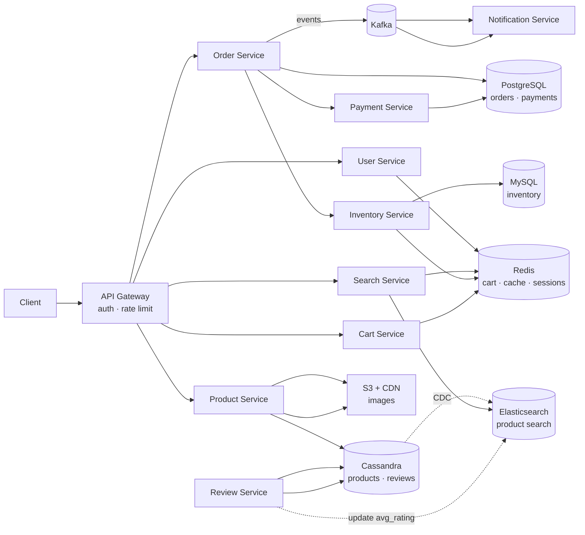
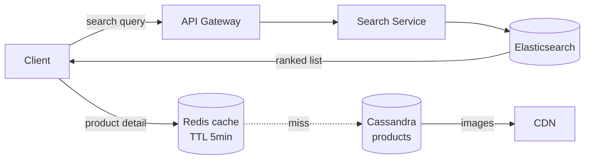
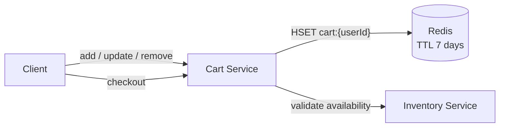
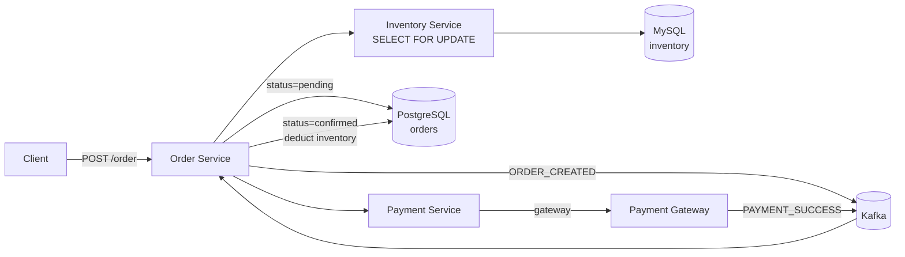
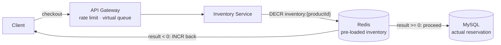
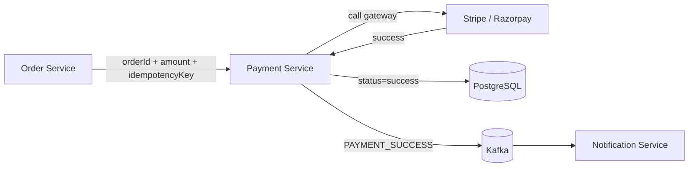

# Ecommerce System Design

## System Overview
A large-scale ecommerce platform (think Amazon / Flipkart) where users browse and search products, manage a cart, place orders, make payments, and track deliveries — with strong consistency on inventory and payments, and high read throughput for product discovery.

## 1. Requirements

### Functional Requirements
- User registration and authentication
- Product listing, search, and filtering (by category, price, rating, brand)
- Product detail pages with images, reviews, and stock availability
- Cart management (add, remove, update quantity)
- Order placement with inventory reservation
- Payment processing
- Order tracking and history
- Seller product and inventory management
- Ratings and reviews

### Non-Functional Requirements
- Availability: 99.99% — especially during flash sales
- Latency: <200ms for search/browse; <500ms for order placement
- Scalability: Read >> Write — 100M+ DAU, billions of product views/day
- Consistency: Strong consistency for inventory and payments; eventual for reviews, search index
- Durability: Orders and payments must never be lost
- Security: PCI-DSS for payments, auth on all order/payment operations

## 2. Back-of-the-Envelope Estimation

### Assumptions
- 100M DAU
- Each user views 20 product pages/day, performs 2 searches
- 1M orders/day average; 10M orders/day during flash sale
- Average order: 2 items, $50 value
- 500M products in catalog
- Read:Write ratio = 1000:1 for product views vs inventory updates

### Traffic
```
Product views/sec   = 100M × 20 / 86400 ≈ 23K/sec
Search queries/sec  = 100M × 2 / 86400  ≈ 2.3K/sec
Peak (flash sale)   ≈ 10× = 230K views/sec

Orders/sec (avg)    = 1M / 86400 ≈ 12/sec
Orders/sec (peak)   = 10M / 86400 ≈ 116/sec
Inventory updates   ≈ 116 × 2 items = 232 writes/sec (peak)
```

### Storage
```
Product catalog     = 500M × 2KB avg = 1TB
Product images      = 500M × 5 images × 200KB = 500TB → S3 + CDN
Orders/day          = 1M × 2KB = 2GB/day → ~730GB/year
Reviews             = 500M products × 10 reviews × 500B = 2.5TB
```

## 3. Architecture Diagram

### Components

| Component | Role |
|---|---|
| API Gateway | Auth, rate limiting, routing; aggressive throttling during flash sales |
| User Service | Registration, login, JWT issuance, profile and address management |
| Product Service | Product catalog CRUD; writes to Cassandra; CDC to Elasticsearch |
| Search Service | Full-text search via Elasticsearch; filters, facets; read-heavy, stateless |
| Inventory Service | Stock levels per product; reservation and deduction; strong consistency |
| Cart Service | Ephemeral cart state in Redis |
| Order Service | Orchestrates order lifecycle; writes to Order DB |
| Payment Service | Payment gateway integration; idempotent transactions; refunds |
| Notification Service | Order confirmation, shipping updates via Kafka |
| Review Service | Ratings and reviews; eventually consistent |
| CDN | Serves product images; absorbs majority of read traffic |

### Overview



## 4. Key Flows

### 4.1 Product Search & Browse



1. Elasticsearch query: full-text + price/category filters, ranked by relevance × rating
2. Product detail: Redis cache (TTL 5min) → fallback to Cassandra
3. Inventory availability: Redis cache (TTL 60s) → fallback to MySQL
4. Images served from CDN

CDC sync: Product Service writes to Cassandra → Debezium captures → Kafka → Elasticsearch consumer updates index (eventual consistency, few seconds lag)

### 4.2 Cart Management



- Cart stored only in Redis (`HSET cart:{userId}`) — ephemeral, TTL 7 days
- Price shown in cart is live; price snapshot happens at order creation in `order_items`

### 4.3 Order Placement & Inventory Reservation



Inventory reservation SQL:
```sql
BEGIN;
SELECT quantity_available FROM inventory WHERE product_id = ? FOR UPDATE;
UPDATE inventory SET quantity_available = quantity_available - qty,
                     quantity_reserved = quantity_reserved + qty
WHERE product_id = ? AND quantity_available >= qty;
COMMIT;
```

Saga pattern via Kafka:
- `ORDER_CREATED` → reserve inventory
- `PAYMENT_SUCCESS` → confirm order, deduct inventory
- `PAYMENT_FAILED` → release reservation, cancel order

### 4.4 Flash Sale



- Pre-load inventory counts into Redis before sale
- `DECR inventory:{productId}` — atomic, fast; if result < 0, out of stock immediately
- MySQL only sees requests that passed the Redis check

### 4.5 Payment



`idempotency_key = hash(orderId + userId)` — safe to retry on gateway timeout.

## 5. Database Design

### Selection Reasoning

| Store | Why |
|---|---|
| Cassandra (Products) | 500M products, read-heavy, denormalized, high throughput; no joins needed |
| MySQL (Inventory) | Row-level locking for stock deduction; ACID critical |
| PostgreSQL (Orders, Payments) | ACID transactions; relational |
| Redis | Cart (ephemeral), sessions, hot product cache, inventory cache |
| Elasticsearch | Full-text search, faceted filtering |
| S3 + CDN | Product images |
| Kafka | Order events, inventory updates, notifications, CDC |

### Cassandra — products

| Field | Type |
|---|---|
| product_id | UUID (PK) |
| seller_id | UUID |
| title | VARCHAR |
| description | TEXT |
| category | VARCHAR |
| brand | VARCHAR |
| price | DECIMAL |
| image_urls | LIST\<TEXT\> |
| attributes | MAP\<TEXT, TEXT\> |
| avg_rating | DECIMAL |
| created_at | TIMESTAMP |

### MySQL — inventory

| Field | Type |
|---|---|
| inventory_id | UUID (PK) |
| product_id | UUID |
| seller_id | UUID |
| quantity_available | INT |
| quantity_reserved | INT |
| updated_at | TIMESTAMP |

### PostgreSQL — orders

| Field | Type |
|---|---|
| order_id | UUID (PK) |
| user_id | UUID |
| status | ENUM (pending / confirmed / shipped / delivered / cancelled) |
| total_amount | DECIMAL |
| shipping_address | JSONB |
| payment_id | UUID |
| idempotency_key | VARCHAR, unique |
| created_at | TIMESTAMP |

### PostgreSQL — order_items

| Field | Type |
|---|---|
| item_id | UUID (PK) |
| order_id | UUID (FK → orders) |
| product_id | UUID |
| quantity | INT |
| unit_price | DECIMAL (snapshot at order time) |
| title | VARCHAR (snapshot at order time) |

### Redis Keys

| Key Pattern | Type | Value | TTL |
|---|---|---|---|
| `cart:{userId}` | Hash | `{productId: {qty, price, title}}` | 7 days |
| `product:{productId}` | String | product JSON | 300s |
| `inventory:{productId}` | String | available quantity | 60s |
| `session:{sessionId}` | String | userId | 86400s |
| `flash:lock:{productId}` | String | NX EX | 30s |

## 6. Key Interview Concepts

### Preventing Oversell
MySQL `SELECT FOR UPDATE` acquires row-level lock. For flash sales: Redis `DECR` as fast pre-check — absorbs the spike, MySQL only sees requests that passed.

### Why Cassandra for Products but MySQL for Inventory
Products are read-heavy, denormalized, no transactions needed. Inventory requires row-level locking and ACID — MySQL is the right tool.

### Cart in Redis
Most carts are never converted to orders. Redis Hash per user is fast, cheap, auto-expires. Only on order placement does cart data get snapshotted into `order_items`.

### Price Snapshot on Order
Snapshot `unit_price` and `title` at order creation. Order history is always accurate regardless of future price changes.

### CDC for Search Sync
Cassandra → Debezium → Kafka → Elasticsearch. Avoids dual-write risk. Guarantees eventual consistency with no data loss.

### Saga Pattern
Three distributed operations (inventory + order + payment) must succeed together. This uses a **choreography-based saga** — no central orchestrator; each service reacts to Kafka events and publishes compensating events on failure.

```
ORDER_CREATED     → Inventory Service reserves stock
INVENTORY_RESERVED → Payment Service charges customer
PAYMENT_SUCCESS   → Order Service confirms order, Inventory deducts permanently
PAYMENT_FAILED    → Inventory Service releases reservation, Order Service cancels
```

If payment fails: `PAYMENT_FAILED` event triggers Inventory Service to release the reservation and Order Service to cancel the order. No distributed transaction needed — each step has a compensating action. The outbox pattern (write event to `outbox` table in same DB transaction as the state change) ensures no event is lost even if the service crashes between the DB write and Kafka publish.

## 7. Failure Scenarios

### Oversell on Inventory Service Crash
- Recovery: background reconciliation job checks `quantity_reserved` with no matching pending order → releases after timeout
- Prevention: outbox pattern — write reservation and order in same MySQL transaction

### Payment Gateway Timeout
- Recovery: retry with same `idempotency_key`; after 3 retries, release inventory, cancel order
- Prevention: async payment with webhook callback as fallback

### Redis Cache Failure
- Impact: cart data lost; inventory cache miss → all reads hit MySQL
- Recovery: Redis Sentinel failover (<30s); inventory reads fall back to MySQL

### Flash Sale Overload
- Recovery: virtual queue activates; Redis `DECR` pre-check absorbs spike
- Prevention: pre-scale; pre-warm Redis inventory cache before sale starts
