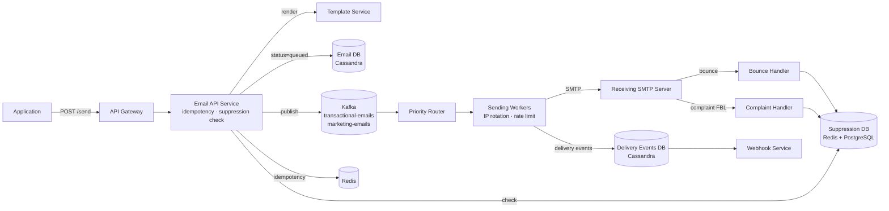
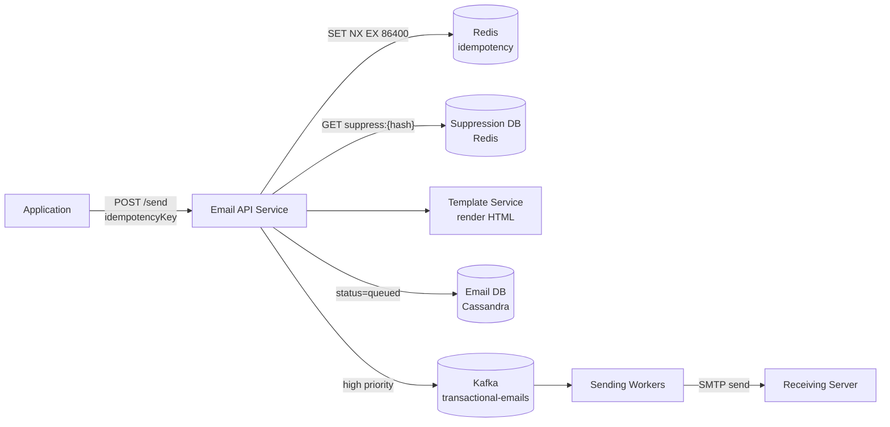
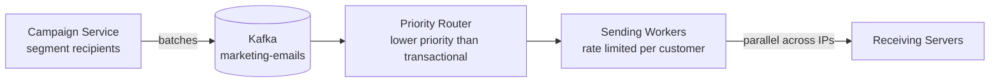
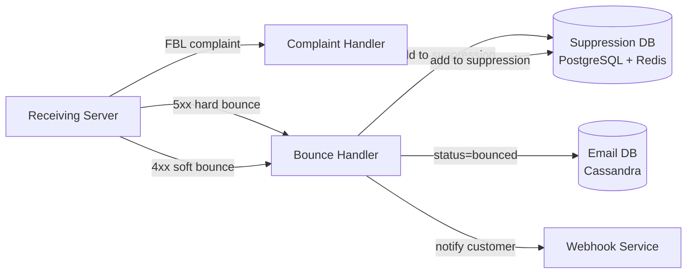

# Email Service System Design

## System Overview
A large-scale email sending service (think Gmail SMTP / SendGrid / Amazon SES) that handles transactional emails (OTP, receipts, alerts) and bulk marketing emails — with delivery tracking, bounce handling, spam compliance, and high deliverability.

## 1. Requirements

### Functional Requirements
- Send transactional emails (OTP, order confirmation, password reset)
- Send bulk marketing emails (newsletters, promotions)
- Email template management with variable substitution
- Delivery status tracking (sent / delivered / bounced / opened / clicked)
- Bounce and complaint handling (unsubscribe, spam reports)
- Suppression list management (do not email)
- Scheduled email sending
- Attachment support

### Non-Functional Requirements
- Throughput: 1M+ emails/sec for bulk campaigns
- Latency: <1s for transactional emails; minutes acceptable for bulk
- Deliverability: >99% inbox delivery rate (not spam)
- Availability: 99.99%
- Durability: No email lost before delivery attempt
- Compliance: CAN-SPAM, GDPR, DMARC/DKIM/SPF

## 2. Back-of-the-Envelope Estimation

### Assumptions
- 10M transactional emails/day
- 1B marketing emails/day (campaigns)
- Average email size: 50KB (with HTML + images)
- Bounce rate: 2%; spam complaint rate: 0.1%
- Open rate: 20%; click rate: 3%

### Traffic
```
Transactional/sec   = 10M / 86400 ≈ 116/sec
Marketing burst     = 1B / 3600s (1hr campaign) = 277K/sec

SMTP connections    = 277K/sec → distributed across sending IPs
```

### Storage
```
Email records/day   = 1.01B × 200B = 202GB/day → ~74TB/year
Delivery events     = 1.01B × 3 events × 100B = 303GB/day
Templates           = thousands × 50KB = small
Suppression list    = 100M entries × 100B = 10GB
```

## 3. Architecture Diagram

### Components

| Component | Role |
|---|---|
| API Gateway | Auth, rate limiting, routing |
| Email API Service | Receives send requests; validates; deduplicates; writes to Email DB; publishes to Kafka |
| Template Service | Manages templates; renders HTML with variable substitution |
| Suppression Service | Manages suppression list (bounced, unsubscribed, complained) |
| Priority Router | Routes emails to transactional or marketing queue |
| Sending Workers | Connect to SMTP servers; manage IP rotation and rate limiting |
| Bounce Handler | Receives bounce notifications; classifies hard vs soft; updates suppression list |
| Complaint Handler | Receives FBL spam complaints; adds to suppression list |
| Delivery Tracker | Tracks open/click events via tracking pixels and link wrapping |
| Webhook Service | Delivers delivery events to customers |
| Email DB (Cassandra) | Email records; partition by customerId |
| Delivery Events DB (Cassandra) | Open, click, bounce, complaint events |
| Template DB (PostgreSQL) | Email templates |
| Suppression DB (Redis + PostgreSQL) | Redis for fast lookup; PostgreSQL for persistence |
| Kafka | Email queues: `transactional-emails`, `marketing-emails`, bounce/complaint events |

### Overview



## 4. Key Flows

**API Gateway** — Auth, rate limiting, routing for email submission API

**Email API Service** — Receives email send requests; validates; deduplicates; writes to Email DB; publishes to Kafka

**Template Service** — Manages email templates; renders HTML with variable substitution (Handlebars/Jinja2)

**Suppression Service** — Manages suppression list (bounced, unsubscribed, complained); checked before every send

**Priority Router** — Kafka consumer; routes emails to appropriate sending queue based on priority (transactional vs marketing)

**Sending Workers** — Pool of workers that connect to SMTP servers and send emails; manage IP rotation and rate limiting

**SMTP Pool** — Pool of dedicated sending IP addresses; reputation managed per IP

**Bounce Handler** — Receives bounce notifications from receiving mail servers; updates suppression list; classifies hard vs soft bounce

**Complaint Handler** — Receives spam complaints (FBL — Feedback Loop); adds to suppression list; alerts on high complaint rates

**Delivery Tracker** — Tracks open and click events via tracking pixels and link wrapping; updates delivery events

**Webhook Service** — Delivers delivery events to customers via webhooks

**Email DB (Cassandra)** — Email records, delivery status; high write throughput

**Suppression DB (Redis + PostgreSQL)** — Suppression list; Redis for fast lookup, PostgreSQL for persistence

**Template DB (PostgreSQL)** — Email templates

**Delivery Events DB (Cassandra)** — Open, click, bounce, complaint events

**Redis** — Suppression cache, idempotency keys, rate limiting per IP, sending quotas

**Kafka** — Email queue (transactional + marketing topics), bounce/complaint events

## 5. Database Design

### Selection Reasoning

| Store | Why |
|---|---|
| Cassandra (Email DB) | High write throughput for email records; time-series; partition by customerId |
| Cassandra (Events DB) | Billions of delivery events; append-only; time-series |
| PostgreSQL (Templates) | Structured template data, versioning |
| Redis | Suppression list cache (fast lookup before every send), rate limiting per IP |
| PostgreSQL (Suppression) | Persistent suppression list, GDPR compliance |

### Cassandra — emails

Partition key: `customer_id`, Clustering: `email_id DESC`

| Field | Type |
|---|---|
| customer_id | UUID (partition key) |
| email_id | TIMEUUID (clustering) |
| to_address | VARCHAR |
| from_address | VARCHAR |
| subject | VARCHAR |
| template_id | UUID, nullable |
| status | ENUM (queued / sent / delivered / bounced / failed) |
| idempotency_key | VARCHAR |
| scheduled_at | TIMESTAMP, nullable |
| sent_at | TIMESTAMP, nullable |
| sending_ip | VARCHAR |

### Cassandra — delivery_events

| Field | Type |
|---|---|
| email_id | UUID (partition key) |
| event_time | TIMESTAMP (clustering) |
| event_type | TEXT (sent / delivered / opened / clicked / bounced / complained / unsubscribed) |
| metadata | TEXT (JSON — IP, user agent, link clicked) |

### PostgreSQL — suppression_list

| Field | Type |
|---|---|
| email_address | VARCHAR (PK) |
| reason | ENUM (hard_bounce / soft_bounce / complaint / unsubscribe / manual) |
| added_at | TIMESTAMP |
| customer_id | UUID, nullable |

### Redis Keys

| Key Pattern | Type | Value | TTL |
|---|---|---|---|
| `suppress:{emailHash}` | String | reason | — (permanent) |
| `idempotency:{key}` | String | emailId | 86400s |
| `ip:rate:{ip}` | Counter | emails sent in window | 60s |
| `quota:{customerId}` | Counter | emails sent today | 86400s |

## 5. Key Flows

### 5.1 Transactional Email Send



1. Idempotency check: `SET idempotency:{key} 1 NX EX 86400` — if exists, return cached emailId
2. Suppression check: `GET suppress:{hash(toAddress)}` — if suppressed, skip send
3. Template Service renders HTML with variables
4. Write to Cassandra (`status = queued`) → publish to `transactional-emails` topic
5. Sending Worker connects to SMTP server, sends email, updates `status = sent`

### 5.2 Bulk Marketing Campaign



Separate Kafka topics ensure transactional workers always have capacity regardless of marketing volume.

### 5.3 Bounce & Complaint Handling



- Hard bounce (5xx): add to suppression immediately
- Soft bounce (4xx): retry with backoff (1hr, 4hr, 24hr); after 3 retries → treat as hard bounce
- Complaint rate > 0.5%: pause sending for that customer

### 5.4 Delivery Tracking

Open tracking: `` — browser loads pixel on open

Click tracking: wrap links as `https://track.email.com/click/{emailId}/{linkHash}` → redirect to original URL

Both events written to Delivery Events DB (Cassandra) and delivered to customers via Webhook Service.

Note: Apple Mail Privacy Protection (iOS 15+) pre-fetches tracking pixels → inflated open rates. Click tracking is more reliable.

## 6. Key Interview Concepts

### Email Authentication (DMARC/DKIM/SPF)
Three DNS-based mechanisms that prove email legitimacy:
- **SPF:** "Only these IPs are allowed to send from our domain" — DNS TXT record
- **DKIM:** Cryptographic signature on email headers — receiving server verifies with public key in DNS
- **DMARC:** Policy for what to do if SPF/DKIM fail (reject, quarantine, none) + reporting

Without these, emails go to spam. All three must be configured for good deliverability.

### Suppression List
Critical for deliverability and compliance. Before every send, check if recipient is suppressed (bounced, unsubscribed, complained). Redis cache for fast lookup (O(1)). PostgreSQL for persistence. GDPR requires honoring unsubscribe requests immediately.

### Transactional vs Marketing Separation
Transactional emails (OTP, receipts) have high engagement → good reputation. Marketing emails have lower engagement → risk of spam complaints. Mixing them on same IPs means marketing complaints damage transactional deliverability. Always separate IPs and sending infrastructure.

### Idempotency
Application retries on timeout → risk of duplicate email (user gets OTP twice). Solution: `idempotency_key` checked in Redis before processing. Same key → return original emailId, no re-send.

### Rate Limiting Per IP
ISPs rate-limit incoming connections per IP. Sending too fast → connections rejected → emails queued or dropped. Solution: Redis counter per IP per minute; throttle to ISP's limit (e.g., Gmail: 3000/min per IP).

### Unsubscribe Compliance (CAN-SPAM / GDPR)
Every marketing email must have an unsubscribe link. On click: add to suppression list immediately. Honor within 10 business days (CAN-SPAM) or immediately (GDPR). Failure = regulatory fines.

## 7. Failure Scenarios

### SMTP Server Failure
- Detection: connection refused, timeout
- Recovery: retry with backoff; switch to backup SMTP server; Kafka retains messages
- Prevention: multiple SMTP servers; circuit breaker per server

### Suppression Cache Miss (Redis Failure)
- Impact: emails sent to suppressed addresses → bounce/complaint → reputation damage
- Recovery: Redis Sentinel failover; fall back to PostgreSQL lookup (slower but correct)
- Prevention: Redis Cluster + AOF; suppression check always falls back to PostgreSQL on cache miss

### High Bounce Rate
- Detection: bounce rate > 5% for a customer
- Recovery: pause sending for that customer; alert; investigate list quality
- Prevention: email validation before adding to list; double opt-in for marketing lists

### IP Blacklisted
- Detection: emails rejected by major ISPs; blacklist monitoring service alerts
- Recovery: stop sending from blacklisted IP; warm up replacement IP; request delisting
- Prevention: monitor bounce/complaint rates; never send to purchased lists; IP warming

### Kafka Consumer Lag (Sending Workers)
- Impact: email delivery delayed
- Recovery: scale up Sending Workers; Kafka retains messages; transactional emails prioritized
- Prevention: separate topics for transactional vs marketing; auto-scale workers on lag
