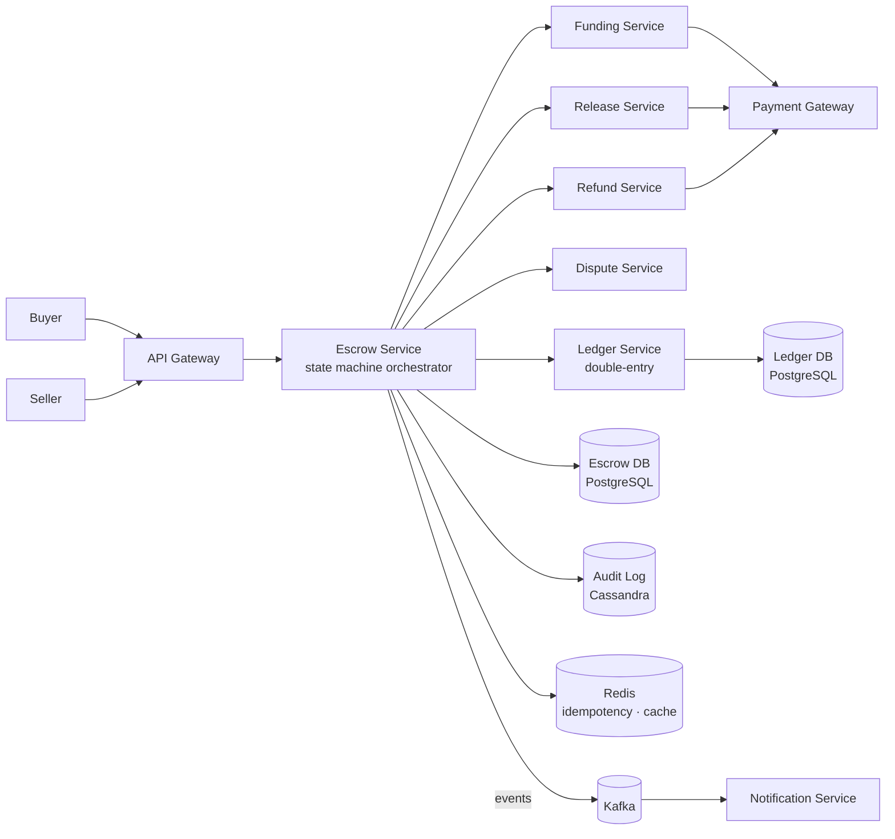
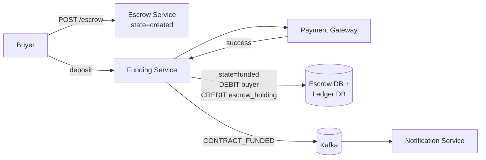
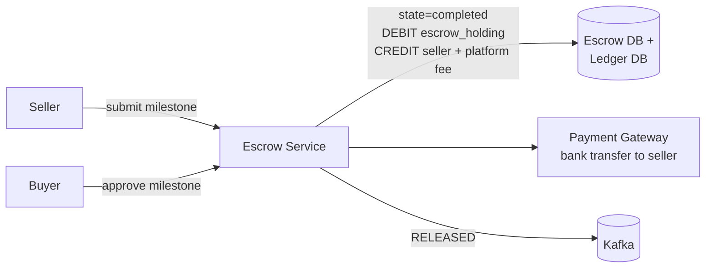
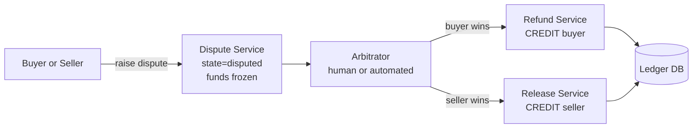

# Escrow System Design

## System Overview
An escrow service that holds funds from a buyer until predefined conditions are met, then releases to the seller — used in freelance platforms (Upwork), real estate, marketplace transactions, and M&A deals. Ensures neither party can be defrauded.

## 1. Requirements

### Functional Requirements
- Buyer deposits funds into escrow
- Define release conditions (milestone completion, delivery confirmation, date)
- Seller fulfills conditions; buyer confirms
- Release funds to seller on confirmation
- Dispute resolution: hold funds pending arbitration
- Refund to buyer if conditions not met or dispute resolved in buyer's favor
- Full audit trail of all escrow actions

### Non-Functional Requirements
- Consistency: Strong — funds must never be double-released or lost
- Durability: Every state transition must be permanently recorded
- Availability: 99.99%
- Security: Funds held in segregated accounts; PCI-DSS compliance
- Auditability: Complete immutable log for regulatory compliance

## 2. Back-of-the-Envelope Estimation

### Assumptions
- 1M active escrow contracts
- 100K new contracts/day
- Average escrow amount: $500
- Average duration: 14 days
- 10K disputes/day (1% of contracts)

### Traffic
```
New contracts/sec   = 100K / 86400 ≈ 1.2/sec (low write)
State transitions   = 100K × 5 avg transitions = 500K/day ≈ 6/sec
Dispute events      = 10K/day ≈ 0.1/sec
```

### Storage
```
Contracts           = 1M × 2KB = 2GB active
Contract history    = 100K/day × 365 × 2KB = 73GB/year
Ledger entries      = 500K/day × 300B = 150MB/day
Audit log           = 500K/day × 500B = 250MB/day
```

## 3. Architecture Diagram

### Components

| Component | Role |
|---|---|
| API Gateway | Auth, rate limiting, routing |
| Escrow Service | Core orchestrator; manages contract lifecycle; enforces state machine |
| Funding Service | Buyer deposit into escrow; integrates with payment gateway |
| Release Service | Releases funds to seller on condition fulfillment |
| Refund Service | Returns funds to buyer on cancellation or dispute resolution |
| Dispute Service | Manages dispute lifecycle; holds funds during arbitration |
| Ledger Service | Double-entry bookkeeping; immutable fund movement record |
| Notification Service | Kafka consumer; notifies parties of state changes |
| Escrow DB (PostgreSQL) | Contract records, state, conditions, parties |
| Ledger DB (PostgreSQL) | Immutable double-entry ledger |
| Audit Log (Cassandra) | Immutable audit trail of every action and state transition |
| Redis | Contract state cache, idempotency keys, session store |
| Kafka | State transition events, notification fan-out |

### Overview



## 4. Key Flows

### 4.1 Contract Lifecycle (State Machine)

```
CREATED → FUNDED → IN_PROGRESS → COMPLETED
                              ↘ DISPUTED → resolved → COMPLETED or REFUNDED
                              ↘ CANCELLED → REFUNDED
                              ↘ EXPIRED → REFUNDED
```

Every state transition: validated → written to PostgreSQL atomically with ledger entry → logged to Cassandra audit log → published to Kafka

### 4.2 Contract Creation & Funding



1. Buyer creates contract with `{sellerId, amount, conditions, expiresAt}` → `state = created`
2. Buyer deposits → Funding Service → payment gateway
3. On success: `state = funded`, DEBIT buyer_account, CREDIT escrow_holding_account
4. Seller notified: "Funds secured in escrow, begin work"

### 4.3 Milestone Release



1. Seller submits milestone → buyer approves
2. Release Service: DEBIT escrow_holding, CREDIT seller_account + platform fee
3. Payout Service initiates bank transfer to seller

### 4.4 Dispute Flow



Funds remain frozen in escrow_holding during arbitration. Arbitrator decision triggers atomic ledger entry + state transition.

### 4.5 Expiry & Auto-Refund

Scheduled job checks contracts where `expires_at < now AND state IN (funded, in_progress)` → Refund Service initiates refund → `state = refunded`

## 5. Database Design

### PostgreSQL — escrow_contracts

| Field | Type |
|---|---|
| contract_id | UUID (PK) |
| buyer_id | UUID |
| seller_id | UUID |
| amount | DECIMAL(18,2) |
| currency | VARCHAR |
| state | ENUM (created / funded / in_progress / completed / disputed / refunded / cancelled) |
| release_conditions | JSONB |
| funded_at | TIMESTAMP, nullable |
| released_at | TIMESTAMP, nullable |
| expires_at | TIMESTAMP, nullable |
| idempotency_key | VARCHAR, unique |
| created_at | TIMESTAMP |

### PostgreSQL — milestones

| Field | Type |
|---|---|
| milestone_id | UUID (PK) |
| contract_id | UUID (FK → escrow_contracts) |
| description | TEXT |
| amount | DECIMAL(18,2) |
| status | ENUM (pending / submitted / approved / released) |
| submitted_at | TIMESTAMP, nullable |
| approved_at | TIMESTAMP, nullable |

### PostgreSQL — disputes

| Field | Type |
|---|---|
| dispute_id | UUID (PK) |
| contract_id | UUID (FK → escrow_contracts) |
| raised_by | UUID |
| reason | TEXT |
| status | ENUM (open / under_review / resolved_buyer / resolved_seller / escalated) |
| arbitrator_id | UUID, nullable |
| resolution_notes | TEXT, nullable |
| created_at | TIMESTAMP |
| resolved_at | TIMESTAMP, nullable |

### PostgreSQL — ledger (immutable)

| Field | Type |
|---|---|
| entry_id | UUID (PK) |
| contract_id | UUID |
| account_type | ENUM (buyer / escrow_holding / seller / platform) |
| entry_type | ENUM (debit / credit) |
| amount | DECIMAL(18,2) |
| event_type | VARCHAR (funded / released / refunded / fee) |
| created_at | TIMESTAMP |

### Cassandra — audit_log

| Field | Type |
|---|---|
| contract_id | UUID (partition key) |
| event_time | TIMESTAMP (clustering) |
| event_type | TEXT |
| actor_id | UUID |
| from_state | TEXT |
| to_state | TEXT |
| details | TEXT (JSON) |

### Redis Keys

| Key Pattern | Type | Value | TTL |
|---|---|---|---|
| `idempotency:{key}` | String | contractId | 86400s |
| `contract:state:{contractId}` | String | current state | 300s |
| `session:{sessionId}` | String | userId | 86400s |

## 6. Key Interview Concepts

### Escrow as a State Machine
Invalid transitions (e.g., `refunded → completed`) are rejected. Prevents race conditions where buyer and seller simultaneously trigger conflicting actions. State transitions are atomic PostgreSQL transactions.

### Segregated Holding Accounts
Escrow funds held in a separate holding account — not mixed with platform operating funds. Regulatory requirement in many jurisdictions. Ledger tracks exact balance per contract.

### Preventing Double Release
PostgreSQL `UPDATE contracts SET state='completed' WHERE state='in_progress'` — only one concurrent request succeeds. Idempotency key on release request. Ledger entry creation is atomic with state transition.

### Dispute Arbitration
Automated: rule-based (e.g., seller submitted proof of delivery → release to seller). Human: for complex cases, assign with SLA. Escalation: if no resolution in 7 days, auto-escalate. Funds remain frozen (safe) throughout.

### Regulatory Compliance
- Segregated client funds
- Full audit trail (Cassandra immutable log)
- KYC/AML checks on parties
- Reporting to financial regulators

## 7. Failure Scenarios

### Payment Gateway Failure During Funding
- Recovery: idempotency key prevents double charge on retry; contract stays in `created` until funding confirmed
- Prevention: webhook callback from gateway as confirmation fallback

### Release Service Crash Mid-Release
- Recovery: PostgreSQL transaction rolled back; contract stays in `in_progress`; retry release; idempotency key prevents double release
- Prevention: atomic DB transaction for state change + ledger entry

### Dispute Arbitrator Unavailable
- Recovery: SLA-based escalation; funds remain frozen (safe)
- Prevention: multiple arbitrators; automated rule-based resolution for clear-cut cases

### PostgreSQL Failure
- Recovery: promote replica; all in-flight operations retry; idempotency prevents duplicates
- Prevention: synchronous replication; automated failover; Cassandra audit log survives independently
