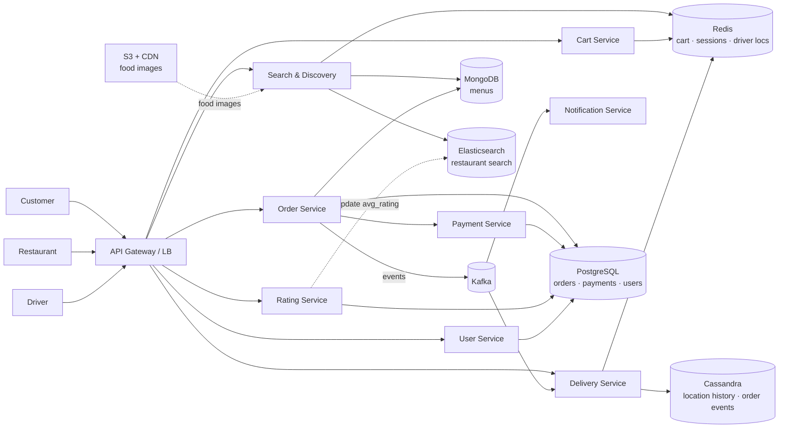
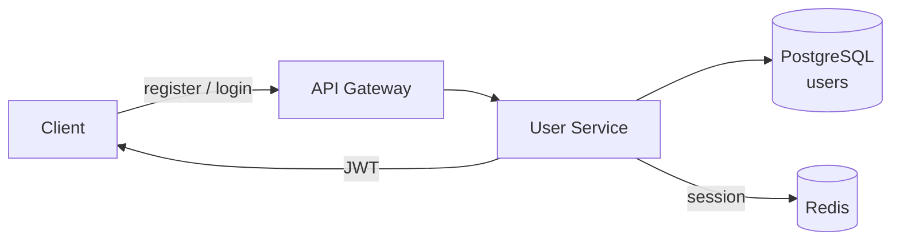
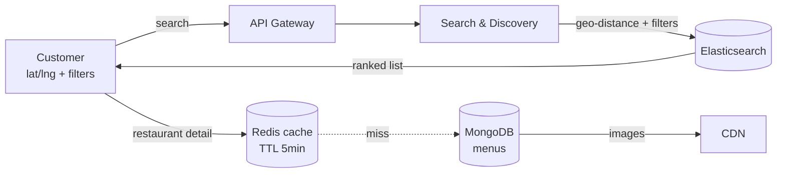
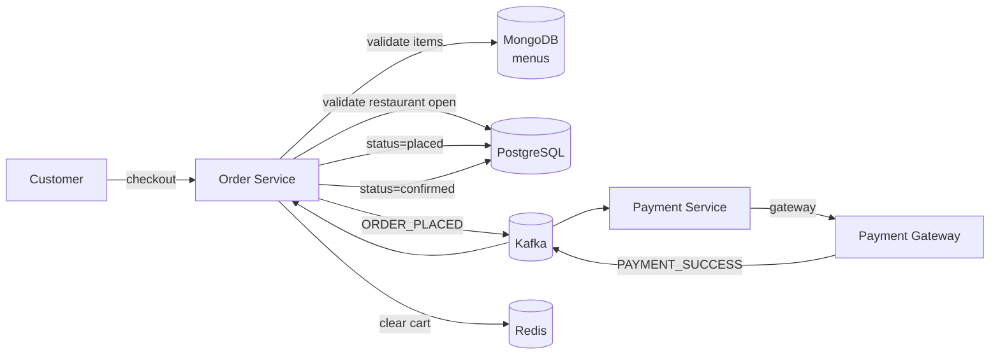
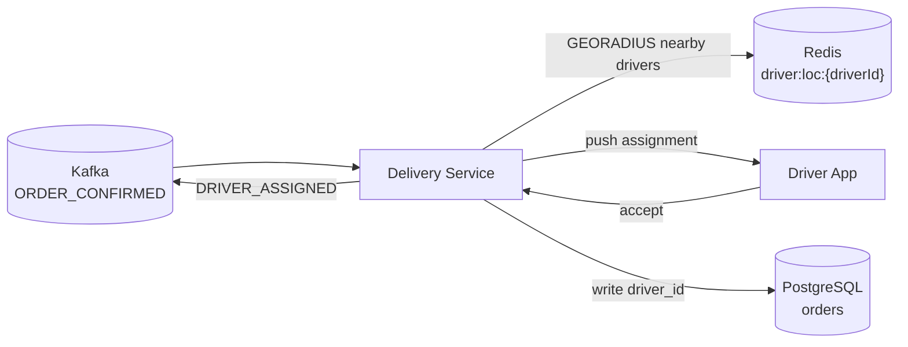
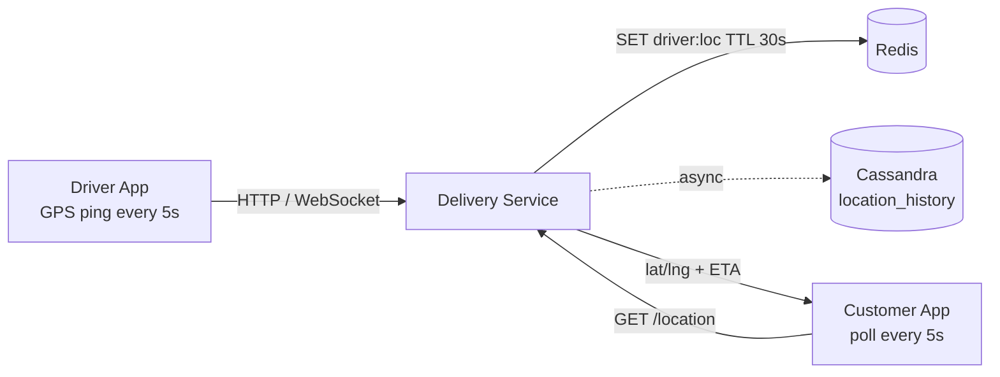

# Food Delivery System Design

## System Overview
A food delivery platform (think Swiggy / Zomato / DoorDash) connecting customers, restaurants, and delivery partners — handling order placement, real-time order tracking, payments, and restaurant discovery.

## 1. Requirements

### Functional Requirements
- User registration and authentication (customers, restaurants, delivery partners)
- Restaurant and menu browsing with search and filters
- Cart management and order placement
- Payment processing
- Real-time order status tracking (placed → confirmed → preparing → picked up → delivered)
- Real-time delivery partner location tracking
- Ratings and reviews for restaurants and delivery partners
- Notifications (order updates, promotions)

### Non-Functional Requirements
- Availability: 99.99% uptime (especially during peak meal hours)
- Latency: <500ms for search/browse, <2s for order placement
- Scalability: 10M+ DAU, 5M+ orders/day
- Consistency: Strong consistency for payments and orders; eventual for reviews/ratings
- Durability: Orders and payments must never be lost
- Security: PCI-DSS compliance for payments, TLS everywhere

## 2. Back-of-the-Envelope Estimation

### Assumptions
- 10M DAU (customers), 500K active restaurants, 1M delivery partners
- 5M orders/day, avg order value $15
- Peak hours: 12–2pm, 7–9pm (5× normal traffic)
- Each order has ~10 status updates
- Location ping from delivery partner every 5s while on delivery

### Traffic
```
Orders/sec (avg)  = 5M / 86400 ≈ 58/sec
Peak orders/sec   = 58 × 5 ≈ 290/sec

Active deliveries at peak = 290 × 30min × 60s = ~500K
Location pings/sec        = 500K × (1/5s) = 100K pings/sec

Search requests/sec = 10M × 20 / 86400 ≈ 2300/sec
```

### Storage
```
Orders/day        = 5M × 2KB = 10GB/day → ~3.6TB/year
Location history  = retain 30 days → ~9TB rolling
Menu/restaurant   = 500K × 50KB = 25GB
Media (food imgs) = 500K × 20 images × 200KB = 2TB
```

## 3. Architecture Diagram

### Components

| Component | Role |
|---|---|
| API Gateway / LB | SSL termination, JWT validation, rate limiting, routing |
| User Service | Registration, login, JWT issuance for all roles |
| Restaurant Service | Restaurant CRUD, menu management, availability |
| Search & Discovery Service | Restaurant search by location, cuisine, rating, ETA via Elasticsearch |
| Order Service | Order lifecycle orchestrator |
| Cart Service | Ephemeral cart state in Redis |
| Payment Service | Gateway integration, refunds, idempotent transactions |
| Delivery Service | Driver assignment, location tracking, ETA calculation |
| Notification Service | Push (FCM/APNs), SMS, email for order updates |
| Rating & Review Service | Post-delivery ratings |

### Overview



## 4. Key Flows

### 4.1 Auth



Register: validate → hash password → write to PostgreSQL with role → return JWT
Login: validate → JWT (1hr) + refresh token → session in Redis

### 4.2 Restaurant Discovery



Elasticsearch query: geo-distance filter + `is_open = true` + text match + sort by relevance/rating/ETA

### 4.3 Order Placement



Saga via Kafka: `ORDER_PLACED` → payment → `PAYMENT_SUCCESS` → confirm order / `PAYMENT_FAILED` → cancel order

This is a **choreography-based saga** — Order Service publishes `ORDER_PLACED`, Payment Service consumes it and charges the customer, then publishes `PAYMENT_SUCCESS` or `PAYMENT_FAILED`. Order Service consumes the result and either confirms or cancels. No central orchestrator; each service reacts to events.

**Outbox pattern** is applied here: Order Service writes the order record and the `ORDER_PLACED` event to an `outbox` table in the same DB transaction. A separate CDC poller reads the outbox and publishes to Kafka. This guarantees the event is never lost even if the service crashes between the DB write and Kafka publish.

### 4.4 Order Lifecycle

```
ORDER_PLACED → payment → ORDER_CONFIRMED → restaurant accepts → PREPARING
→ driver assigned → PICKED_UP → DELIVERED
```

Each transition publishes a Kafka event → Notification Service pushes to relevant parties

### 4.5 Driver Assignment



1. Geo-radius search on Redis for nearby available drivers
2. Rank by proximity + acceptance rate + load
3. Push assignment; if no accept in 30s → try next driver
4. On assignment: write `driver_id` to order, notify customer with ETA

### 4.6 Real-Time Location Tracking



Redis TTL 30s — driver considered offline if no ping received

## 5. Database Design

### Selection Reasoning

| Store | Why |
|---|---|
| PostgreSQL | Orders, payments, users — ACID critical, relational |
| MongoDB | Restaurant menus — flexible schema, nested items/variants |
| Redis | Cart, sessions, active order state, driver location cache |
| Elasticsearch | Restaurant/menu search by location, cuisine, text |
| Cassandra | Location history, order event log — time-series, high write throughput |
| S3 + CDN | Food images |
| Kafka | Async event bus |

### PostgreSQL — orders

| Field | Type |
|---|---|
| order_id | UUID (PK) |
| customer_id | UUID |
| restaurant_id | UUID |
| driver_id | UUID, nullable |
| status | ENUM (placed / confirmed / preparing / picked_up / delivered / cancelled) |
| total_amount | DECIMAL |
| delivery_address | JSONB |
| payment_id | UUID |
| placed_at | TIMESTAMP |
| updated_at | TIMESTAMP |

### MongoDB — menus (one document per restaurant)

| Field | Type |
|---|---|
| restaurant_id | UUID |
| categories | Array of { name, items[] } |
| items[].item_id | UUID |
| items[].name | STRING |
| items[].price | DECIMAL |
| items[].is_available | BOOLEAN |
| items[].customizations | Array |
| updated_at | TIMESTAMP |

### Cassandra — location_history

Partition key: `driver_id`, Clustering: `timestamp DESC`

| Field | Type |
|---|---|
| driver_id | UUID (partition key) |
| timestamp | TIMESTAMP (clustering) |
| lat | DOUBLE |
| lng | DOUBLE |
| order_id | UUID, nullable |

### Redis Keys

| Key Pattern | Type | Value | TTL |
|---|---|---|---|
| `cart:{userId}` | Hash | `{itemId: {qty, price}}` | 3600s |
| `session:{sessionId}` | String | `{userId, role}` | 86400s |
| `order:active:{orderId}` | String | order state JSON | until delivered |
| `driver:loc:{driverId}` | String | `{lat, lng, updatedAt}` | 30s |
| `restaurant:cache:{id}` | String | restaurant + menu JSON | 300s |

## 6. Key Interview Concepts

### Geo-Search for Restaurants and Drivers
Elasticsearch `geo_distance` for restaurant search. Redis `GEORADIUS` for driver lookup — sub-ms geo queries on driver locations.

### Order State Machine
`placed → confirmed → preparing → picked_up → delivered`. Invalid transitions rejected. Optimistic locking (version column) in PostgreSQL prevents race conditions.

### Driver Assignment — Matching Problem
Proximity + acceptance rate + load balancing. Timeout + fallback: if no accept in 30s, try next candidate.

### Real-Time Tracking Scalability
100K location pings/sec: write to Redis first (fast), async flush to Cassandra. Customer polling at 5s intervals is acceptable.

### Kafka as Event Bus
Order Service publishes events; Payment, Notification, Delivery consume independently. Benefits: resilience, scalability, auditability.

### Outbox Pattern
Risk: Order Service writes to DB then crashes before publishing to Kafka → event lost, payment never triggered, order stuck in `placed` state forever.

Solution: write the order record and the `ORDER_PLACED` event to an `outbox` table in the same DB transaction. A separate CDC poller (e.g., Debezium) reads the outbox and publishes to Kafka, then marks the row as published. This guarantees at-least-once delivery — even if the service crashes, the CDC poller will pick up the unpublished event on restart.

### CAP Trade-off
- Orders/payments: CP — strong consistency
- Location tracking: AP — slight staleness acceptable
- Restaurant search: AP — cached results acceptable

## 7. Failure Scenarios

### Payment Gateway Timeout
- Recovery: retry with same `idempotency_key`; after 3 retries, cancel order, notify customer
- Prevention: async payment with webhook callback as fallback

### Driver Goes Offline Mid-Delivery
- Detection: no location ping for 60s, Redis TTL expires
- Recovery: reassign if not yet picked up; alert ops if already picked up

### Restaurant Stops Responding
- Detection: no order confirmation within 5 min
- Recovery: auto-cancel, full refund, flag restaurant for ops review

### Redis Failure
- Impact: cart data lost, driver locations unavailable
- Recovery: Redis Sentinel failover (<30s); driver locations rebuilt from next ping

### Elasticsearch Failure
- Impact: restaurant search degraded
- Recovery: fall back to PostgreSQL geo query; Elasticsearch rebuilt from PostgreSQL + MongoDB on recovery
