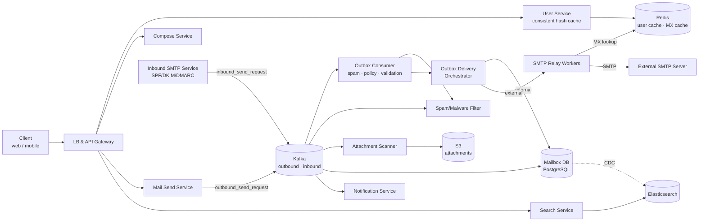
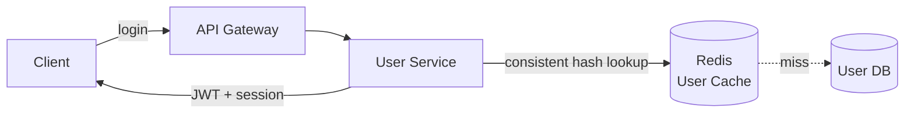
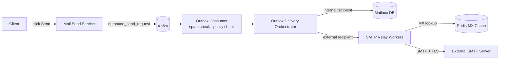
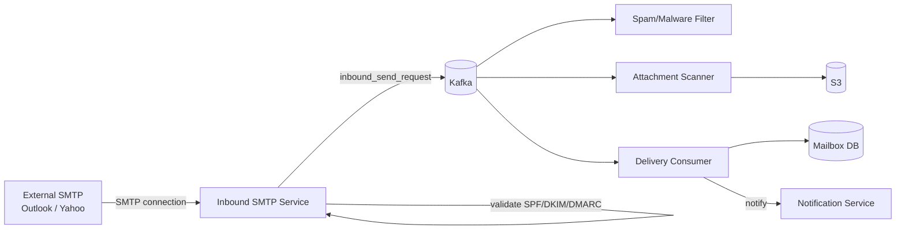
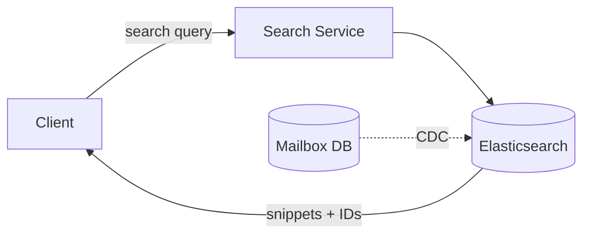

# Gmail (Email Client) System Design

## System Overview
A full-featured email client and server (think Gmail / Outlook) where users compose, send, and receive emails — with SMTP relay for outbound delivery, inbound SMTP for receiving, spam/malware filtering, attachment scanning, full-text search, and contact autocomplete.

## 1. Requirements

### Functional Requirements
- User registration and authentication
- Compose and send emails (to internal and external recipients)
- Receive inbound emails from external SMTP servers
- Inbox, drafts, sent, spam folders (mailbox management)
- Attachment upload and download
- Full-text email search
- Contact autocomplete (personal contacts + directory)
- Spam and malware filtering
- Read/unread status, labels, threading

### Non-Functional Requirements
- Availability: 99.99%
- Latency: <500ms for send; <200ms for inbox load
- Scalability: 1B+ users, billions of emails/day
- Durability: Emails must never be lost
- Security: DMARC/DKIM/SPF, TLS, spam filtering, malware scanning

## 2. Back-of-the-Envelope Estimation

### Assumptions
- 1B users, 500M DAU
- 10 emails sent/user/day = 5B emails/day
- Average email size: 75KB (with attachments avg)
- 60% emails are spam (filtered before delivery)
- Read:Write ratio = 5:1

### Traffic
```
Emails sent/sec     = 5B / 86400 ≈ 58K/sec
Inbound SMTP/sec    = 58K/sec (external + internal)
Search queries/sec  = 500M × 5 / 86400 ≈ 29K/sec
```

### Storage
```
Emails/day          = 5B × 75KB = 375TB/day
User mailbox avg    = 15GB per user
Total               = 1B × 15GB = 15EB
```

## 3. Architecture Diagram

### Components

| Component | Role |
|---|---|
| LB & API Gateway | Auth, rate limiting, routing for web/mobile clients |
| User Service | Registration, login, JWT; User Cache sharded by email (consistent hashing) |
| Compose Service | Email composition; saves drafts to Draft DB |
| Mail Send Service | Orchestrates outbound sending; publishes to Kafka |
| Outbox Consumer Service | Kafka consumer; spam check, policy check, validation; routes to Orchestrator |
| Outbox Delivery Orchestrator | Routes to Mailbox DB (internal) or SMTP Relay Workers (external) |
| SMTP Relay Workers | Connect to external SMTP servers; SMTP handshake, TLS, retry |
| Inbound SMTP Service | Receives from external servers; validates SPF/DKIM/DMARC; publishes to Kafka |
| Spam/Malware Filtering | ML-based scoring + rule-based filters |
| Attachment Scanner | Virus scan; file type validation; stores to S3 |
| Search Service | Full-text search via Elasticsearch |
| Aggregator Service | CDC from Mailbox DB to Elasticsearch |
| Notification Service | Push/in-app notifications for new emails |
| Mailbox DB (PostgreSQL) | Per-user email storage |
| MX Cache (Redis) | Caches MX record lookups to avoid repeated DNS queries |
| Kafka | `outbound_send_request` and `inbound_send_request` topics |

### Overview



## 4. Key Flows

### 4.1 Auth



User Cache sharded by email using consistent hashing — same user always hits same cache node. 25/50 most recently emailed contacts cached per user for autocomplete.

### 4.2 Outbound Email Send



SMTP steps to external server:
1. DNS MX record lookup (MX Cache → MX Resolver → DNS)
2. TCP connection to MX server on port 25
3. EHLO → STARTTLS → MAIL FROM → RCPT TO → DATA → 250 OK

### 4.3 Inbound Email Receive



1. Validate SPF (sender IP authorized?), DKIM (signature valid?), DMARC (policy)
2. Spam/Malware Filter scores email; Attachment Scanner scans + stores to S3
3. Delivery Consumer writes to recipient's Mailbox DB → push notification

### 4.4 Email Search



Full-text on subject, body, sender, recipients; filter by date, folder, label.

### 4.5 Contact Autocomplete

1. Check Redis cache: 25/50 most recently emailed contacts
2. Cache hit: return suggestions instantly
3. Cache miss: scan User DB for contacts in org directory

## 5. Database Design

### Selection Reasoning

| Store | Why |
|---|---|
| PostgreSQL (Mailbox DB) | Per-user email storage, ACID, relational queries for threading |
| Redis (User Cache) | Fast user lookup; sharded by email using consistent hashing |
| Elasticsearch | Full-text search on subject, body, sender |
| S3 | Attachment storage |
| Kafka | Async email processing pipeline |

### PostgreSQL — mailbox

| Field | Type |
|---|---|
| message_id | UUID (PK) |
| user_id | UUID |
| thread_id | UUID |
| sender | VARCHAR |
| recipients | JSONB (to, cc, bcc) |
| subject | VARCHAR |
| body | TEXT |
| attachment_urls | JSONB |
| folder | ENUM (inbox / sent / drafts / spam / trash) |
| is_read | BOOLEAN |
| labels | ARRAY\<VARCHAR\> |
| created_at | TIMESTAMP |

### PostgreSQL — validation_db

| Field | Type |
|---|---|
| message_id | UUID |
| sender_user_id | UUID |
| recipient_email | VARCHAR |
| route_type | ENUM (INTERNAL / EXTERNAL) |
| spam_check | ENUM (PASS / FAIL / PENDING) |
| attachment_check | ENUM (PASS / FAIL / PENDING) |
| status | VARCHAR |

### Redis Keys

| Key Pattern | Type | Value | TTL |
|---|---|---|---|
| `user:{email}` | String | userId + metadata | 3600s |
| `mx:{domain}` | String | MX record | 86400s |
| `session:{sessionId}` | String | userId | 86400s |

## 6. Key Interview Concepts

### SMTP Protocol Flow
DNS MX lookup → TCP connection → EHLO → STARTTLS → MAIL FROM → RCPT TO → DATA → 250 OK. Essential for explaining how emails travel between Gmail and Outlook.

### SPF / DKIM / DMARC
- SPF: "Only these IPs can send from our domain" — DNS TXT record
- DKIM: Cryptographic signature on email headers — verified with public key in DNS
- DMARC: Policy for what to do if SPF/DKIM fail (reject/quarantine/none) + reporting

### MX Records and Routing
MX records in DNS tell senders which server handles email for a domain. MX Cache avoids repeated DNS lookups for popular domains.

### Internal vs External Routing
Internal emails (same domain) delivered directly to Mailbox DB — never leave the system. External emails go through SMTP Relay Workers.

### Spam Filtering at Scale
5B emails/day, 60% spam = 3B to filter. Two-layer: fast rules at SMTP level (IP reputation, known spam domains) + ML model for remaining emails.

### Mailbox Sharding
1B users × 15GB = 15EB. Shard by `user_id` (hash-based). All emails for a user on one shard — efficient inbox queries.

### User Cache with Consistent Hashing
Same user always hits same cache node. Adding/removing nodes only moves a fraction of keys.

### Outbox Pattern
Write to DB and outbox table in same transaction; CDC publishes to Kafka. Guarantees at-least-once delivery even if service crashes between DB write and Kafka publish.

## 7. Failure Scenarios

### SMTP Relay Worker Failure
- Recovery: Kafka retains unacknowledged messages; another worker picks up; retry with exponential backoff
- Prevention: multiple relay workers; dead letter queue for permanently failed deliveries

### Inbound SMTP Overload (Email Bomb)
- Recovery: rate limit per sending IP; greylisting (temporary reject → legitimate servers retry)
- Prevention: IP reputation filtering at SMTP level

### Spam Filter False Positive
- Recovery: user moves to inbox → feedback signal to ML model; whitelist sender
- Prevention: conservative threshold for blocking

### Mailbox DB Failure
- Impact: email delivery and inbox reads fail
- Recovery: promote replica (<30s); Kafka retains inbound emails; delivery retried after recovery
- Prevention: synchronous replication; automated failover
