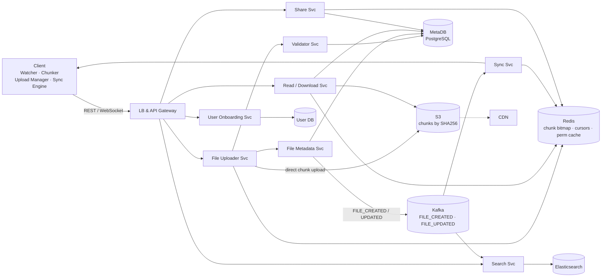
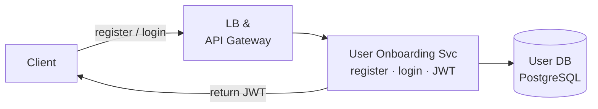
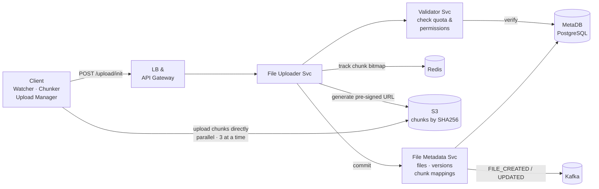
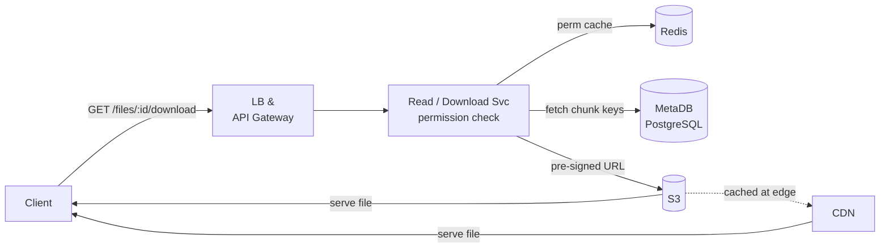
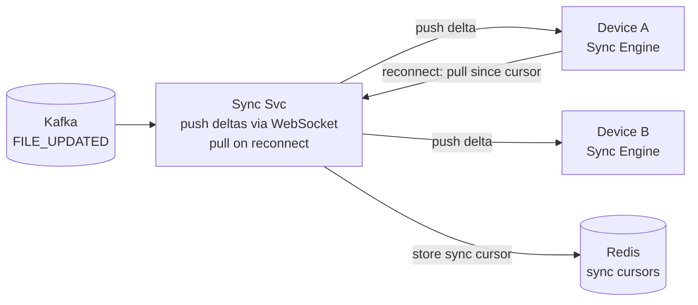
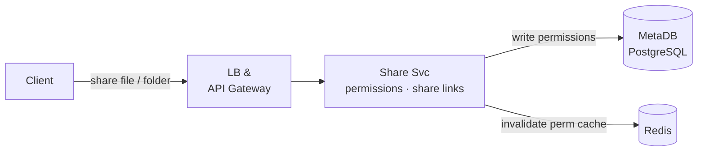
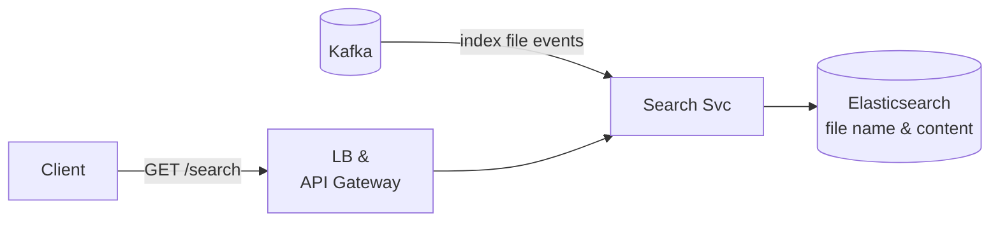

# Google Drive System Design

## System Overview
A cloud file storage and sync service (think Google Drive / Dropbox / OneDrive) where users upload, store, organize, and share files — with chunked parallel uploads, real-time sync across devices, collaborative access, and version history.

## 1. Requirements

### Functional Requirements
- Upload, download, and delete files and folders
- Organize files in folder hierarchy
- File sync across multiple devices (desktop, mobile, web)
- Share files/folders with other users (view / edit permissions)
- Version history — restore previous versions
- Search files by name and content
- Offline access with sync on reconnect

### Non-Functional Requirements
- Availability: 99.99%
- Latency: <200ms for metadata operations; throughput-optimized for file transfers
- Scalability: 1B+ users, exabytes of storage
- Durability: 99.999999999% (11 nines) — files must never be lost
- Consistency: Strong read-after-write for file metadata; eventual for sync

## 2. Back-of-the-Envelope Estimation

### Assumptions
- 1B users, 200M DAU
- Average storage per user: 15GB
- 10M file uploads/day, average file size: 5MB
- 100M file downloads/day
- Read:Write ratio = 10:1

### Traffic
```
Uploads/sec         = 10M / 86400 ≈ 116/sec
Downloads/sec       = 100M / 86400 ≈ 1157/sec → CDN

Upload bandwidth    = 116 × 5MB = 580MB/sec
Download bandwidth  = 1157 × 5MB = 5.8GB/sec → CDN
```

### Storage
```
Total storage       = 1B × 15GB = 15EB
Uploads/day         = 10M × 5MB = 50TB/day
With dedup (30%)    = 35TB/day net new
With 3× replication = 105TB/day
```

## 3. Architecture Diagram

### Client-Side Components

| Component | Role |
|---|---|
| Watcher | Monitors local filesystem for changes; triggers upload pipeline |
| Local Metadata Index | Local DB of file state (name, size, chunk hashes); detects what changed |
| Chunker | Splits files into 5MB chunks; computes SHA256 per chunk |
| Upload Manager | Manages upload state machine; tracks chunks; handles retries |
| Sync Engine | Bidirectional sync — push (receive deltas) and pull (reconnect) |

### Server Components

| Component | Role |
|---|---|
| LB + API Gateway | Auth, rate limiting, routing |
| User Onboarding Service | Registration, login, JWT issuance |
| File Uploader Service | Orchestrates 6-step upload; generates pre-signed S3 URLs |
| Validator Service | Checks quota, permissions before signed URL generation |
| File Metadata Service | Stores file/folder metadata, versions, chunk mappings; publishes to Kafka |
| Read/Download Service | Permission check; generates pre-signed S3 URLs for download |
| Sync Service | Consumes Kafka events; pushes deltas via WebSocket; handles pull on reconnect |
| Share Service | Manages permissions; generates share link tokens |
| Search Service | File name and content search via Elasticsearch |
| MetaDB (PostgreSQL) | File hierarchy, permissions, versions, chunk mappings |
| Redis | Upload chunk bitmap, sync cursors, permission cache, session store |
| S3 | Chunk storage; content-addressed by SHA256 |
| CDN | Caches frequently downloaded files at edge |
| Kafka | File change events for Sync and Search |

### Overview



## 4. Key Flows

### 4.1 Auth



1. Register/login → User Onboarding Service → write to User DB → return JWT
2. API Gateway validates JWT on every request
3. File Metadata Service checks permissions on every file operation

### 4.2 File Upload (6-Step Protocol)



1. `POST /upload/init` with `{fileName, fileSize, chunkSize, existingChunks}` → returns `{uploadId, fileId}`
2. Chunker splits file into N × 5MB chunks, computes SHA256 per chunk; skips chunks already on server (dedup)
3. `POST /upload/chunk-url` per chunk → Validator checks permission → returns pre-signed S3 URL
4. Client uploads chunks directly to S3 in parallel (3 at a time); Redis bitmap tracks progress
5. `POST /uploads/{uploadId}/commit`
6. File Metadata Service writes `file_versions`, `file_version_chunks`, `chunks` records → publishes `FILE_CREATED/UPDATED` to Kafka

### 4.3 File Download



1. Validate permission (Redis cache → MetaDB)
2. Fetch `file_versions → file_version_chunks → chunks` to get all S3 object_keys in order
3. Return pre-signed S3 URLs per chunk (or CDN URL for public files)
4. Client downloads chunks in parallel, reassembles in order

### 4.4 Sync Across Devices



Push (server → client):
1. File Metadata Service publishes `FILE_UPDATED` to Kafka
2. Sync Service pushes delta via WebSocket: `{fileId, newVersionId, changedChunks}`
3. Client downloads only changed chunks

Pull (reconnect):
1. Client sends last sync cursor → Sync Service queries MetaDB for all changes since cursor
2. Returns changed files; client downloads only changed chunks; updates cursor

Conflict: both devices modify same file offline → create conflict copy `filename (Device A's copy).ext` → user resolves manually

### 4.5 Sharing & Permissions



1. Share Service writes to `permissions` table
2. Link sharing: `share_link_token = HMAC(fileId + role + expiry)`
3. Permission check walks up folder hierarchy (file → parent folder → root); cached in Redis (TTL 5min)
4. On permission change: actively invalidate cache

### 4.6 Search



1. CDC from MetaDB → Kafka → Search Service indexes into Elasticsearch
2. Full-text search on file name and content; scoped to userId

## 5. Database Design

### Selection Reasoning

| Store | Why |
|---|---|
| PostgreSQL (MetaDB) | File hierarchy, permissions, versions, chunk mappings — ACID, relational |
| S3 | Exabyte-scale chunk storage, 11 nines durability, CDN integration |
| Redis | Upload chunk bitmap, sync cursors, permission cache |
| Elasticsearch | Full-text search on file names and content |

### PostgreSQL — folders

| Field | Type |
|---|---|
| folder_id | UUID (PK) |
| parent_folder_id | UUID, nullable (null = root) |
| owner_id | UUID |
| name | VARCHAR |
| created_at | TIMESTAMP |
| metadata | JSONB |

### PostgreSQL — files

| Field | Type |
|---|---|
| file_id | UUID (PK) |
| parent_folder_id | UUID (FK → folders) |
| owner_id | UUID |
| name | VARCHAR |
| size_bytes | BIGINT |
| current_version_id | UUID |
| is_deleted | BOOLEAN |
| metadata | JSONB |

### PostgreSQL — file_versions

| Field | Type |
|---|---|
| version_id | UUID (PK) |
| file_id | UUID (FK → files) |
| size_bytes | BIGINT |
| created_by | UUID |
| created_at | TIMESTAMP |

### PostgreSQL — file_version_chunks

| Field | Type |
|---|---|
| version_id | UUID (FK → file_versions) |
| chunk_index | INT (ordering of chunks) |
| chunk_id | UUID (FK → chunks) |

### PostgreSQL — chunks (content-addressed)

| Field | Type |
|---|---|
| chunk_id | UUID (PK) |
| object_key | TEXT (`s3://bucket/{chunkHash}`) |
| size_bytes | INT |
| checksum | VARCHAR (SHA256) |
| created_at | TIMESTAMP |

### PostgreSQL — permissions

| Field | Type |
|---|---|
| permission_id | UUID (PK) |
| resource_type | ENUM (file / folder) |
| resource_id | UUID |
| user_id | UUID |
| role | ENUM (owner / editor / viewer) |
| created_at | TIMESTAMP |
| metadata | JSONB |

### Redis Keys

| Key Pattern | Type | Value | TTL |
|---|---|---|---|
| `upload:{uploadId}` | Hash | `{chunkId_bitmap, retry_count, total_chunks}` | 86400s |
| `sync:cursor:{userId}:{deviceId}` | String | last sync timestamp | 30 days |
| `perm:cache:{fileId}:{userId}` | String | role | 300s |
| `session:{sessionId}` | String | userId | 86400s |

## 6. Key Interview Concepts

### Chunked Upload Protocol
The 6-step protocol (init → chunk → signed URL → parallel S3 upload → commit → metadata) enables:
- Resumable: Redis bitmap tracks completed chunks; resume from last successful chunk
- Parallel: 3 concurrent uploads saturate bandwidth
- Dedup: client sends existing chunk hashes on init; server skips already-stored chunks
- Direct S3 upload: bypasses app servers, reduces load

### Content-Addressed Storage (Chunks Table)
Chunks stored by SHA256 hash in S3. Two files sharing a 5MB chunk store it once. Integrity verified by re-hashing on download. Delta sync reuses unchanged chunk_ids across versions.

### file_version_chunks as the Link Table
Maps `(version_id, chunk_index) → chunk_id`. Enables ordered reassembly on download, delta sync (new version reuses unchanged chunk_ids), and storage efficiency across versions.

### Sync Cursor
Each device maintains a cursor (timestamp of last sync). On reconnect: "give me all changes since my cursor." No need to compare full file lists. Stored in Redis per user per device.

### Permission Inheritance
Sharing a folder shares all contents. Permission check walks up the folder hierarchy. Cached in Redis (TTL 5min). On permission change: actively invalidate cache.

### Pre-signed S3 URLs
Client uploads directly to S3 using time-limited pre-signed URLs. App servers never handle file bytes — only metadata and URL generation. Scales to any upload volume without app server bottleneck.

### Delta Sync (Chunk-Level)
When a file is modified, only changed chunks re-upload:
1. Watcher detects change → Chunker re-chunks → compares SHA256 with Local Metadata Index
2. Only chunks with different hashes uploaded
3. Server creates new `file_version` reusing unchanged chunk_ids

Example: 100MB file, user edits 1MB in the middle → only 1 chunk re-uploaded instead of 20.

## 7. Failure Scenarios

### Upload Interrupted Mid-Chunk
- Recovery: client retries individual chunk using same signed URL (idempotent — same hash = same S3 object); Redis bitmap shows which chunks completed; resume from there
- Prevention: Upload Manager persists state locally; Redis tracks server-side state

### S3 Region Outage
- Impact: uploads and downloads fail
- Recovery: cross-region S3 replication; CDN serves cached files; uploads queued and retried
- Prevention: multi-region S3; CDN absorbs most download traffic

### Sync Conflict
- Scenario: two devices modify same file offline
- Recovery: conflict copy created; user notified; manual resolution
- Prevention: last-write-wins for non-conflicting changes; conflict detection via version comparison

### MetaDB Failure
- Impact: file operations fail; downloads via CDN still work (cached)
- Recovery: promote replica (<30s); Kafka events retained; operations retry after recovery
- Prevention: synchronous replication; automated failover

### Permission Cache Stale
- Scenario: user's access revoked but Redis cache still shows access
- Recovery: short TTL (5min) limits window; on permission change, actively invalidate cache
- Prevention: cache invalidation on permission change; TTL as safety net
