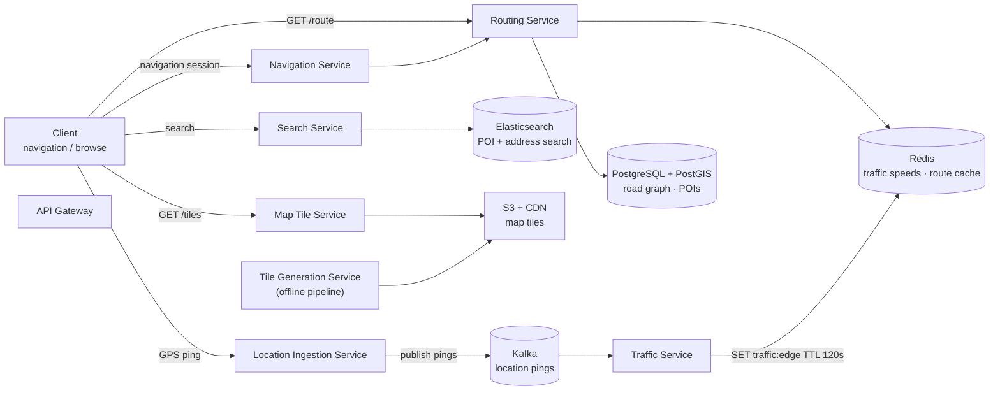
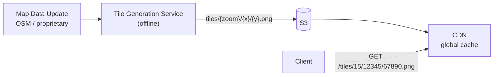
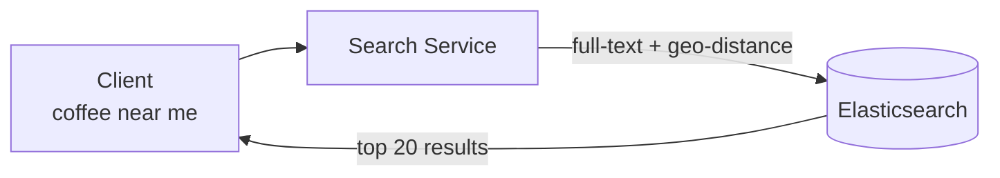
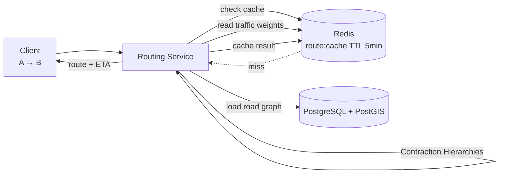
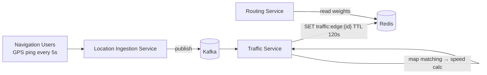
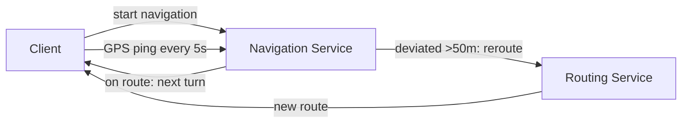

# Google Maps System Design

## System Overview
A mapping and navigation platform that provides map rendering, location search, turn-by-turn navigation with real-time traffic, ETA calculation, and route optimization.

## 1. Requirements

### Functional Requirements
- Display interactive map tiles at any zoom level
- Search for places (restaurants, addresses, POIs)
- Get directions between two points (driving, walking, transit)
- Real-time traffic overlay and ETA
- Turn-by-turn navigation with rerouting
- User location tracking during navigation
- Contribute map data (reviews, photos, corrections)

### Non-Functional Requirements
- Availability: 99.99%
- Latency: <100ms for map tile load; <500ms for route calculation
- Scalability: 1B+ users, 25M+ map tile requests/sec
- Freshness: Traffic data updated every 30–60s; map data updated periodically

## 2. Back-of-the-Envelope Estimation

### Assumptions
- 1B users, 100M DAU
- Each user loads 20 map tiles per session, 5 sessions/day
- 10M route requests/day
- 50M active navigation sessions at peak
- Location ping every 5s during navigation

### Traffic
```
Map tile requests/sec   = 100M × 20 × 5 / 86400 ≈ 115K/sec → CDN
Route requests/sec      = 10M / 86400 ≈ 116/sec
Location pings/sec      = 50M × (1/5s) = 10M/sec
```

### Storage
```
Map tiles (all zoom levels) = ~100TB (pre-rendered, static)
POI database                = 200M POIs × 1KB = 200GB
Road graph                  = ~500GB (nodes + edges)
Traffic data                = rolling 1hr window, ~10GB
```

## 3. Architecture Diagram

### Components

| Component | Role |
|---|---|
| API Gateway | Auth, rate limiting, routing |
| Map Tile Service | Serves pre-rendered tiles by zoom + coordinates; served from CDN |
| Tile Generation Service | Offline pipeline; renders tiles from map data; stores to S3 |
| Search Service | Place and address search via Elasticsearch; autocomplete |
| Routing Service | Computes optimal route; Contraction Hierarchies + real-time traffic weights |
| Traffic Service | Aggregates GPS pings; computes speed per road segment; updates Redis |
| Navigation Service | Manages active sessions; turn-by-turn instructions; detects deviation |
| Location Ingestion Service | Receives GPS pings from navigation users; feeds Traffic Service |
| Map DB (PostgreSQL + PostGIS) | Road graph, POI data, geo-indexed |
| Traffic DB (Redis) | Real-time traffic speed per road segment; short TTL |
| S3 + CDN | Pre-rendered map tiles; static, globally cached |
| Kafka | Location ping stream, traffic aggregation pipeline |

### Overview



## 4. Key Flows

### 4.1 Map Tile Rendering



- Pre-rendered offline at all zoom levels (0–20); 256×256 PNG per tile
- CDN TTL: days/weeks — tiles rarely change
- On map data update: invalidate affected tiles in batches, re-render

### 4.2 Place Search



Elasticsearch query: full-text on `name`, `category` + geo-distance filter + sort by relevance × rating × distance. Autocomplete: prefix search with geo-bias.

### 4.3 Route Calculation



1. Check route cache in Redis (TTL 5min)
2. Load road graph from PostgreSQL (or in-memory for hot regions)
3. Apply real-time traffic weights from Redis (`traffic:edge:{edgeId}`)
4. Run Contraction Hierarchies for fast shortest path
5. ETA = sum of (edge_distance / current_speed) for all route edges

### 4.4 Real-Time Traffic



1. Map GPS coordinates to nearest road segment (map matching via HMM)
2. Calculate speed: distance between consecutive pings / time
3. Aggregate per road segment (rolling 5-min window)
4. Update Redis with TTL 120s

### 4.5 Navigation & Rerouting



## 5. Database Design

### Selection Reasoning

| Store | Why |
|---|---|
| PostgreSQL + PostGIS | Road graph and POI data; geo-indexed; complex spatial queries |
| Redis | Real-time traffic speeds per road segment; sub-ms reads for routing |
| Elasticsearch | Full-text + geo search for places and addresses |
| S3 + CDN | Pre-rendered map tiles; static, globally cached |
| Kafka | Location ping stream for traffic aggregation |

### PostgreSQL — road_graph nodes

| Field | Type |
|---|---|
| node_id | BIGINT (PK) |
| lat | DOUBLE |
| lng | DOUBLE |
| location | POINT (PostGIS) |

### PostgreSQL — road_graph edges

| Field | Type |
|---|---|
| edge_id | BIGINT (PK) |
| from_node | BIGINT (FK → nodes) |
| to_node | BIGINT (FK → nodes) |
| distance_m | INT |
| speed_limit_kmh | INT |
| road_type | VARCHAR (highway / arterial / local) |
| is_one_way | BOOLEAN |

### PostgreSQL — pois

| Field | Type |
|---|---|
| poi_id | UUID (PK) |
| name | VARCHAR |
| category | VARCHAR |
| address | TEXT |
| location | POINT (PostGIS) |
| rating | DECIMAL |
| metadata | JSONB |

### Redis Keys

| Key Pattern | Type | Value | TTL |
|---|---|---|---|
| `traffic:edge:{edgeId}` | String | current speed (km/h) | 120s |
| `route:cache:{hash}` | String | route JSON | 300s |
| `session:{sessionId}` | String | userId | 86400s |

## 6. Key Interview Concepts

### Map Tiles — Pre-render vs On-demand
Pre-rendering offline is the right approach. On-demand rendering at 115K req/sec would require massive compute. Pre-rendered tiles are static, highly cacheable, served entirely from CDN.

### Road Graph Representation
Nodes = intersections, edges = road segments with attributes. Routing algorithms find shortest path by minimizing cost (time = distance / speed). Real-time traffic modifies edge weights dynamically.

### Contraction Hierarchies
Standard Dijkstra on a city-scale graph (millions of nodes) is too slow. Contraction Hierarchies pre-process the graph by contracting less important nodes, creating shortcut edges. Query time: milliseconds. Trade-off: preprocessing takes hours but queries are fast.

### Map Matching
GPS coordinates have noise (±10m). Map matching snaps GPS points to nearest road segment using Hidden Markov Model (HMM) — considers road geometry, heading, and speed.

### Geohash / H3 for Traffic Aggregation
Divide the world into hexagonal cells (H3) or grid cells (geohash). Aggregate traffic data per cell for coarse-grained overlay. Fine-grained per-segment data for routing.

### ETA Accuracy
ETA = sum of (segment_length / current_speed). Accuracy depends on traffic data freshness (30–60s lag) and historical patterns. ML models improve ETA by learning from historical trip data.

## 7. Failure Scenarios

### Traffic Service Failure
- Impact: routing uses historical/default speeds; ETA less accurate
- Recovery: Routing Service falls back to speed limit data; Redis retains last known traffic (TTL 120s)

### Routing Service Overload
- Recovery: route cache in Redis absorbs repeated queries; auto-scale Routing Service
- Prevention: aggressive caching (5min TTL); pre-compute popular routes

### CDN Tile Cache Miss Storm
- Scenario: map data update invalidates millions of tiles simultaneously
- Recovery: staggered tile invalidation; CDN pulls from S3 on miss
- Prevention: invalidate tiles in batches; pre-warm CDN for high-traffic areas after update
