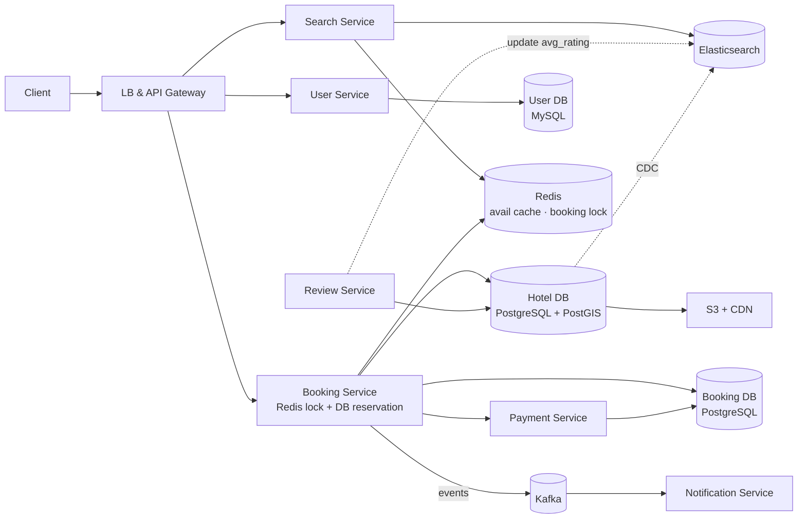
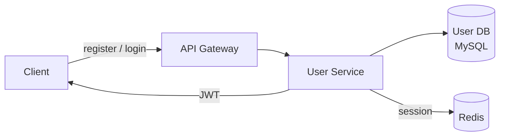
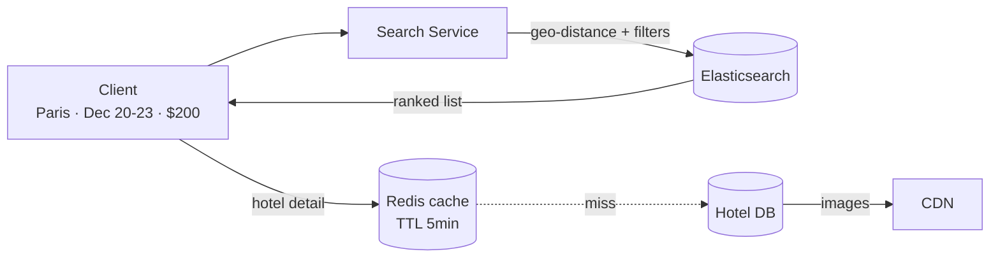
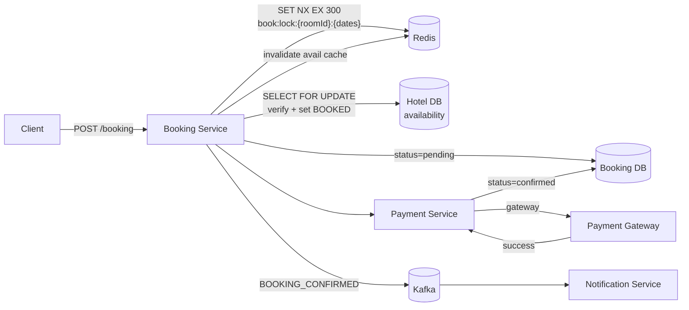
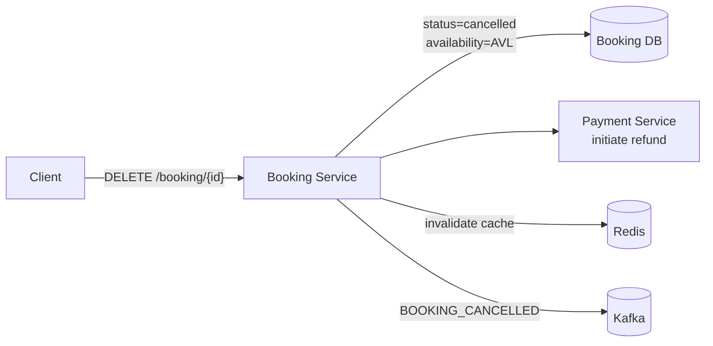
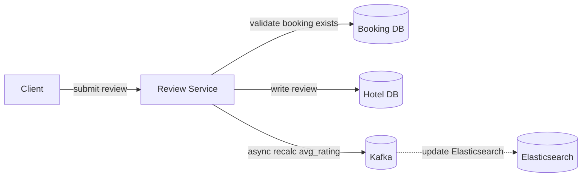

# Hotel Booking System Design

## System Overview
A hotel booking platform (think Booking.com / Airbnb) where users search hotels by location and dates, check room availability, make reservations with payment, and leave reviews — with strong consistency on room availability to prevent double-booking.

## 1. Requirements

### Functional Requirements
- User registration and authentication
- Search hotels by location, dates, price, rating, room type
- View hotel details, room types, pricing, and availability
- Book a room for given dates with payment
- View and manage booking history
- Cancel bookings with refund
- Leave reviews and ratings for hotels
- Hotel management (add/update hotel, rooms, pricing)

### Non-Functional Requirements
- Availability: 99.99% — search and booking must always work
- Latency: <300ms for search; <500ms for booking
- Scalability: Read >> Write — millions search, thousands book simultaneously
- Consistency: Strong consistency for room availability — no double-booking
- Durability: Confirmed bookings must never be lost
- Security: PCI-DSS for payments, auth on all booking operations

## 2. Back-of-the-Envelope Estimation

### Assumptions
- 50M DAU browsing hotels
- 500K bookings/day
- 1M hotels, avg 100 rooms each = 100M rooms
- Read:Write ratio = 1000:1 (search/browse >> book)
- Peak: holiday season, 10× normal booking traffic

### Traffic
```
Search requests/sec   = 50M × 10 / 86400 ≈ 5.8K/sec
Peak search/sec       ≈ 58K/sec (holiday season)

Bookings/sec (avg)    = 500K / 86400 ≈ 6/sec
Bookings/sec (peak)   = 5M / 86400 ≈ 58/sec
```

### Storage
```
Hotels          = 1M × 5KB = 5GB
Availability    = 100M rooms × 365 days × 50B = 1.8TB/year
Bookings/day    = 500K × 2KB = 1GB/day → ~365GB/year
Images          = 1M hotels × 20 images × 500KB = 10TB → S3 + CDN
```

## 3. Architecture Diagram

### Components

| Component | Role |
|---|---|
| LB + API Gateway | Auth, rate limiting, routing |
| User Service | Registration, login, JWT; writes to User DB (MySQL) |
| Search Service | Hotel discovery by location, dates, price, rating via Elasticsearch |
| Booking Service | Core transactional service; Redis lock + DB reservation + payment |
| Room Availability Service | Manages availability per date range; called by Booking Service |
| Payment Service | Gateway integration, idempotent transactions, refunds |
| Review Service | Hotel reviews and ratings; async rating recalculation |
| Notification Service | Kafka consumer; booking confirmations, cancellations, reminders |
| Hotel DB (PostgreSQL) | Hotels, rooms, availability — ACID + PostGIS |
| Booking DB (PostgreSQL) | Confirmed bookings and history |
| Redis | Availability cache, booking lock (TTL 5min), session store |
| Elasticsearch | Geo-distance + full-text hotel search |
| S3 + CDN | Hotel and room images |
| Kafka | Booking events, notifications, CDC |

### Overview



## 4. Key Flows

### 4.1 Auth



Booking and payment endpoints require auth; search and hotel browse are public.

### 4.2 Hotel Search



Elasticsearch query: geo-distance + date availability + price range + full-text + sort by relevance/rating/price. CDC: Hotel DB → Kafka → Elasticsearch (eventual consistency).

### 4.3 Booking Flow (Room Hold & Payment)



Two-gate approach:
1. Redis `SET NX EX 300` — fast atomic gate, prevents two users reaching DB simultaneously
2. PostgreSQL `SELECT FOR UPDATE` — durable correctness guarantee

```
User1: SET book:lock:room101:dec20:dec23 user1 NX EX 300 → OK
User2: SET book:lock:room101:dec20:dec23 user2 NX EX 300 → NIL (blocked)
```

On payment failure: revert `availability.status = AVL`, cancel booking, release lock.

### 4.4 Booking Cancellation



### 4.5 Reviews



## 5. Database Design

### Selection Reasoning

| Store | Why |
|---|---|
| PostgreSQL (Hotel DB) | Hotels, rooms, availability — ACID, row-level locking, PostGIS for geo |
| MySQL (User DB) | Structured user data, ACID |
| PostgreSQL (Booking DB) | ACID transactions for booking creation |
| Redis | Availability cache (TTL 60s), booking lock (TTL 5min), sessions |
| Elasticsearch | Geo-distance search, full-text, faceted filters |
| S3 + CDN | Hotel and room images |

### PostgreSQL — hotels

| Field | Type |
|---|---|
| hotel_id | UUID (PK) |
| name | VARCHAR |
| address | TEXT |
| geo_location | POINT (PostGIS indexed) |
| avg_rating | DECIMAL |
| metadata | JSONB (amenities, policies) |
| created_at | TIMESTAMP |

### PostgreSQL — availability

| Field | Type |
|---|---|
| hotel_id | UUID |
| room_id | UUID |
| start_date | DATE |
| end_date | DATE |
| status | ENUM (AVL / BOOKED / MAINTENANCE) |

### PostgreSQL — bookings

| Field | Type |
|---|---|
| booking_id | UUID (PK) |
| user_id | UUID |
| hotel_id | UUID |
| room_id | UUID |
| check_in | DATE |
| check_out | DATE |
| status | ENUM (pending / confirmed / cancelled) |
| total_amount | DECIMAL |
| payment_id | UUID |
| idempotency_key | VARCHAR, unique |
| created_at | TIMESTAMP |

### Redis Keys

| Key Pattern | Type | Value | TTL |
|---|---|---|---|
| `hotel:meta:{hotelId}` | String | hotel metadata JSON | 300s |
| `avail:{hotelId}:{date}` | String | available room count | 60s |
| `book:lock:{roomId}:{checkIn}:{checkOut}` | String | userId (NX EX) | 300s |
| `session:{sessionId}` | String | userId | 86400s |

## 6. Key Interview Concepts

### Preventing Double Booking
1. Redis `SET NX EX` lock on `{roomId}:{checkIn}:{checkOut}` — fast atomic gate
2. PostgreSQL `SELECT FOR UPDATE` on availability rows — durable correctness
3. Date range overlap check: `newStart < existingEnd AND newEnd > existingStart`

### Availability Table Design
Storing as date ranges (start_date, end_date, status) vs one row per day. 100M rooms × 365 days = 36.5B rows as daily records. As date ranges, most rooms have just a few records. Storage is orders of magnitude smaller.

### Redis Lock TTL (5 Minutes)
Gives users time to complete payment without holding the room indefinitely. If payment takes >5min, lock expires and room becomes available again. PostgreSQL is the ultimate correctness guarantee.

### CDC for Search Sync
Hotel DB → Debezium → Kafka → Elasticsearch. Hotel updates propagate asynchronously. Slight staleness acceptable for browse; actual price confirmed at booking time.

### Saga Pattern
`ROOM_HELD → PAYMENT_SUCCESS → confirm booking` / `PAYMENT_FAILED → release availability → cancel booking`. Compensating actions ensure no room permanently blocked by failed payment.

This is a **choreography-based saga**: Booking Service holds the room and publishes `ROOM_HELD`, Payment Service consumes it and charges the customer, then publishes `PAYMENT_SUCCESS` or `PAYMENT_FAILED`. Booking Service consumes the result and either confirms the booking (keeping availability as `BOOKED`) or releases the room back to `AVL` and cancels the booking.

**Outbox pattern** applies here too: Booking Service writes the booking record and the `ROOM_HELD` event to an `outbox` table in the same PostgreSQL transaction. CDC publishes to Kafka. If Booking Service crashes after the DB write, the CDC poller ensures the event is still published — preventing the room from being silently held forever with no payment triggered.

## 7. Failure Scenarios

### Double Booking Race Condition
- Prevention: Redis `SET NX EX` + PostgreSQL `SELECT FOR UPDATE`
- If Redis is down: fall back to PostgreSQL `SELECT FOR UPDATE` only

### Redis Lock Lost Mid-Booking
- Recovery: PostgreSQL `SELECT FOR UPDATE` prevents actual double-booking at DB level
- Prevention: Redis Cluster + AOF; PostgreSQL is the ultimate correctness guarantee

### Payment Gateway Timeout
- Recovery: retry with same `idempotency_key`; after 3 retries, release availability, cancel booking
- Prevention: async webhook callback as fallback

### PostgreSQL Primary Failure
- Impact: availability checks and booking writes fail; search continues working
- Recovery: promote replica (<30s); Redis cache continues serving reads during failover

### Availability Cache Stale
- Recovery: user reaches booking step, DB check shows unavailable → "room no longer available"
- Prevention: invalidate `avail:{hotelId}:{date}` on booking confirmation and cancellation; TTL 60s
