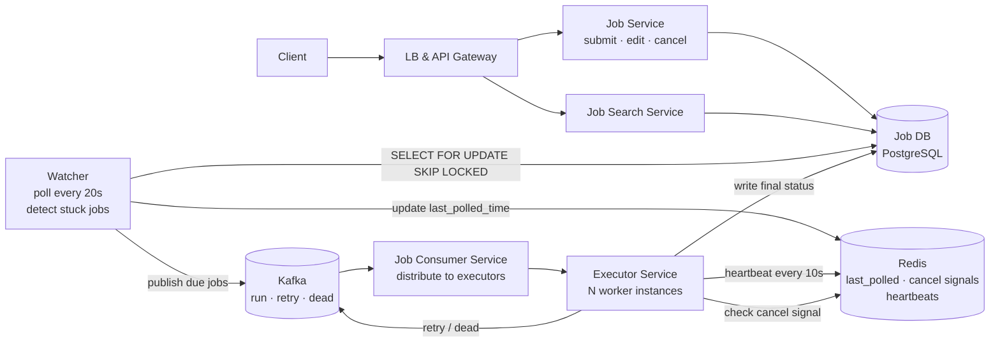
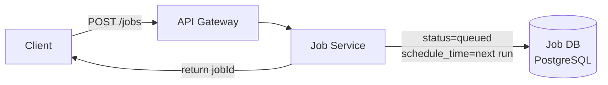
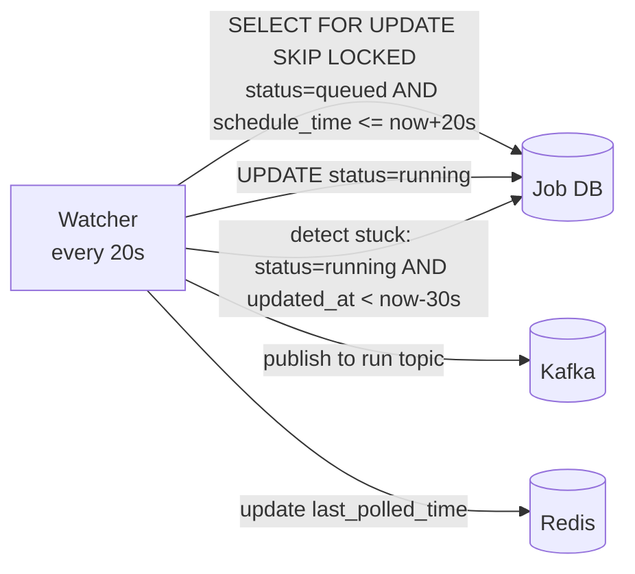
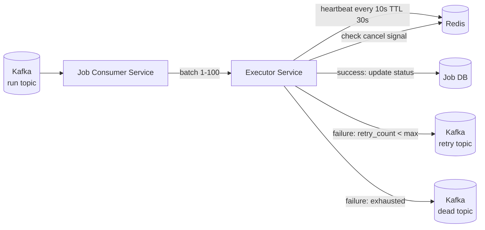
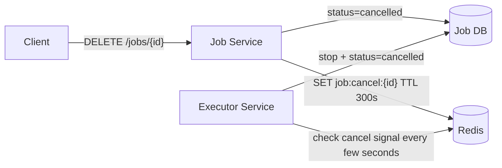

# Job Scheduler System Design

## System Overview
A distributed job scheduling system that allows clients to submit one-time or recurring jobs (cron-style), executes them reliably at the scheduled time, handles retries on failure, and provides job status visibility — similar to AWS EventBridge Scheduler or Quartz Scheduler at scale.

## 1. Requirements

### Functional Requirements
- Submit, edit, and cancel jobs
- Schedule jobs for a specific time (one-time) or on a recurring schedule (cron expression)
- Execute jobs reliably at or near the scheduled time
- Retry failed jobs with configurable retry count
- Track job status (queued / running / success / failed / dead)
- Search and filter jobs by status, type, schedule
- Cancel a running job

### Non-Functional Requirements
- Availability: 99.99% — jobs must never be silently dropped
- Latency: Jobs should execute within a few seconds of their scheduled time
- Scalability: Millions of jobs scheduled, thousands executing concurrently
- Durability: Job definitions and state must survive any single component failure
- Idempotency: A job must not execute more than once per scheduled trigger
- At-least-once delivery: A job must execute at least once even if executor crashes

## 2. Back-of-the-Envelope Estimation

### Assumptions
- 10M active scheduled jobs
- 100K job executions/day on average
- Peak: 10K jobs due at the same second (midnight cron spike)
- Average job payload: 1KB

### Traffic
```
Job executions/sec (avg)  = 100K / 86400 ≈ 1.2/sec
Peak executions/sec       = 10K (midnight spike)

Watcher poll interval     = every 20s
Jobs fetched per poll     = up to 10K jobs per cycle
```

### Storage
```
Job definitions   = 10M × 1KB = 10GB
Job run history   = 100K/day × 30 days × 2KB = 6GB rolling
Total             = ~16GB (fits in a single DB)
```

## 3. Architecture Diagram

### Components

| Component | Role |
|---|---|
| LB + API Gateway | Auth, rate limiting, routing |
| Job Service | Submit, edit, cancel job definitions; writes to Job DB |
| Job Search Service | Search/filter jobs by status, type, schedule |
| Watcher | Scheduler brain; polls Job DB every 20s; publishes due jobs to Kafka; detects stuck jobs |
| Job Consumer Service | Kafka consumer; distributes jobs to Executor instances |
| Executor Service | Pool of workers; executes job logic; heartbeat to Redis; writes final status to Job DB |
| Job DB (PostgreSQL) | Source of truth for all job definitions and run history |
| Redis | `last_polled_time`, cancel signals (TTL), executor heartbeats |
| Kafka | Three topics: `run`, `retry`, `dead` |

### Overview



## 4. Key Flows

### 4.1 Job Submission



1. Validate: schedule time in future, valid cron expression if recurring
2. Write to Job DB with `status = queued`, `schedule_time = next execution time`
3. For recurring jobs: after each execution, compute next `schedule_time` from cron expression, reset `status = queued`

### 4.2 Watcher — The Scheduler Brain



```sql
SELECT * FROM jobs
WHERE status = 'queued'
  AND schedule_time <= now() + interval '20s'
FOR UPDATE SKIP LOCKED;
-- then atomically:
UPDATE jobs SET status = 'running' WHERE job_id IN (...);
```

`SKIP LOCKED` ensures multiple Watcher instances never pick up the same job.

### 4.3 Job Execution



1. Executor runs job logic (HTTP call, script, function invocation)
2. Every 10s: `SET executor:heartbeat:{executorId}:{jobId} {ts} EX 30`
3. On success: update `jobs.status = success`; if recurring, compute next `schedule_time`
4. On failure: if `retry_count < max_retries` → publish to `retry` topic with backoff; else → `dead` topic

### 4.4 Job Cancellation



If job is queued: Watcher skips it (status no longer `queued`). If running: Executor detects cancel signal in Redis and stops.

## 5. Database Design

### Selection Reasoning

| Store | Why |
|---|---|
| PostgreSQL (Job DB) | ACID for job state transitions; `SELECT FOR UPDATE SKIP LOCKED` prevents duplicate execution |
| Redis | Ephemeral coordination: `last_polled_time`, cancel signals (TTL), heartbeats |
| Kafka | Durable dispatch queue; decouples Watcher from Executors; topic-per-state |

### PostgreSQL — jobs

| Field | Type |
|---|---|
| job_id | UUID (PK) |
| job_name | VARCHAR |
| job_type | VARCHAR (one-time / recurring) |
| schedule_time | TIMESTAMP (next execution time) |
| cron_expression | VARCHAR, nullable |
| payload | JSONB |
| status | ENUM (queued / running / success / failed / dead / cancelled) |
| retry_count | INT |
| max_retries | INT |
| created_at | TIMESTAMP |
| updated_at | TIMESTAMP |

### PostgreSQL — job_runs

| Field | Type |
|---|---|
| run_id | UUID (PK) |
| job_id | UUID (FK → jobs) |
| status | ENUM (running / success / failed / cancelled) |
| start_time | TIMESTAMP |
| end_time | TIMESTAMP, nullable |
| executor_id | VARCHAR |
| attempt_number | INT |
| error_msg | TEXT, nullable |

### Redis Keys

| Key Pattern | Type | Value | TTL |
|---|---|---|---|
| `watcher:last_polled` | String | TIMESTAMP | — |
| `job:cancel:{jobId}` | String | "cancel" | 300s |
| `executor:heartbeat:{executorId}:{jobId}` | String | timestamp | 30s |

## 6. Key Interview Concepts

### Preventing Duplicate Execution
Atomic status transition:
```sql
UPDATE jobs SET status = 'running', updated_at = now()
WHERE job_id = ? AND status = 'queued'
RETURNING *
```
Only one update succeeds. If Watcher publishes to Kafka then crashes, job is already `running` in DB — on restart, Watcher won't pick it up again.

### At-Least-Once vs Exactly-Once
This design provides at-least-once. Job owners should design jobs to be idempotent. For critical non-idempotent jobs: use a deduplication key in the payload and check before executing.

### Watcher Polling Alternatives
- Current (DB poll every 20s): simple, reliable, ±20s precision
- Redis Sorted Set: `ZADD scheduled_jobs {timestamp} {jobId}` → sub-second precision, but Redis is not source of truth
- SQS delay queues: managed service, 15min delay limit

### Stuck Job Detection
Watcher checks jobs where `status = running AND updated_at < now - 30s` (heartbeat expired). Re-queues them. Heartbeat interval (10s) and stuck threshold (30s) are tunable.

### Kafka Topic Design
- `run`: new jobs ready to execute
- `retry`: failed jobs with backoff
- `dead`: exhausted retries — ops team inspects and manually re-triggers

### CAP Trade-off
Favors Consistency — worse to run a job twice than delay it. PostgreSQL with row-level locking ensures exactly one Watcher claims each job. Redis is AP — used only for ephemeral coordination.

## 7. Failure Scenarios

### Watcher Crash Mid-Poll
- Recovery: on restart, jobs already `running` in DB are skipped; no duplicate execution
- Prevention: update `last_polled_time` only after successful Kafka publish

### Executor Crash Mid-Execution
- Detection: heartbeat expires (no update for 30s); Watcher detects stale `updated_at`
- Recovery: Watcher re-queues job; retry count incremented

### Kafka Unavailable
- Impact: executions delayed; jobs remain `queued` in DB (not lost)
- Recovery: Watcher retries publish; when Kafka recovers, resumes normally

### PostgreSQL Primary Failure
- Recovery: promote replica (<30s); in-flight Executor jobs continue (only need DB at completion)
- Prevention: synchronous replication; automated failover

### Job Never Executes (Missed Schedule)
- Recovery: on restart, Watcher queries `status = queued AND schedule_time < now` — catches up on all missed jobs
- Prevention: multiple Watcher instances with `SKIP LOCKED`

### Executor Pool Exhausted
- Recovery: jobs queue in Kafka; execute slightly late but not lost
- Prevention: auto-scale Executors based on Kafka consumer lag; pre-scale before midnight cron spike
