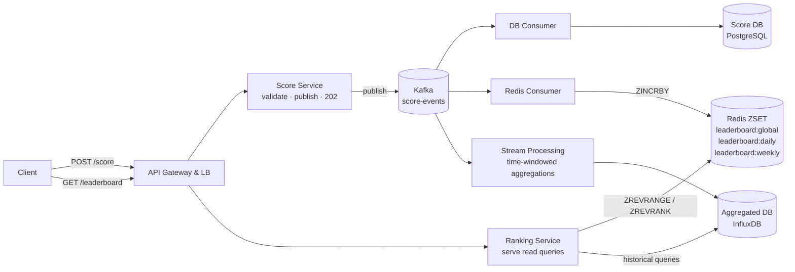
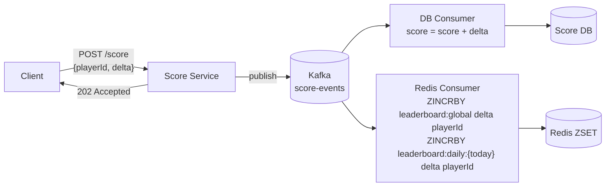
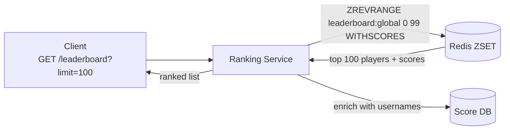
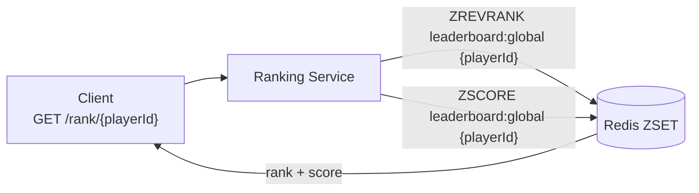
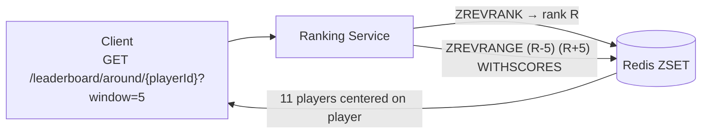

# Leaderboard System Design

## System Overview
A real-time leaderboard system (think game rankings, competitive coding, fantasy sports) that ingests score events, ranks players globally and within segments, and serves low-latency rank queries at scale.

## 1. Requirements

### Functional Requirements
- Submit/update a player's score
- Fetch global leaderboard (top N players)
- Fetch a player's current rank and score
- Fetch players around a given player (±K neighbors)
- Support leaderboards scoped by time window (daily, weekly, all-time)

### Non-Functional Requirements
- Availability: 99.99%
- Latency: <10ms for rank reads; <50ms for score updates to reflect in ranking
- Scalability: 100M+ players, millions of score updates/sec during peak events
- Consistency: Eventual consistency acceptable — slight ranking lag is fine
- Durability: Raw scores must never be lost

## 2. Back-of-the-Envelope Estimation

### Assumptions
- 100M active players
- Peak score updates: 5M/sec (live game events, tournaments)
- Leaderboard reads: 50M/sec (much more read-heavy)
- Read:Write ratio = 10:1

### Traffic
```
Score writes/sec  = 5M (peak)
Rank reads/sec    = 50M (peak)
Kafka throughput  = 5M × 100B = 500MB/sec ingestion
```

### Storage
```
Score DB          = 100M × 200B = 20GB (fits in memory)
Redis ZSET        = 100M × 50B × 3 windows = 15GB (easily fits)
Score events/day  = 5M × 86400 × 100B = 43TB/day (short retention)
```

## 3. Architecture Diagram

### Components

| Component | Role |
|---|---|
| API Gateway & LB | Auth, rate limiting, routing |
| Score Service | Receives score events; validates; publishes to Kafka; returns 202 immediately |
| Kafka | Durable event bus; fan-out to DB Consumer and Redis Consumer |
| DB Consumer Service | Persists raw/aggregated scores to Score DB |
| Redis Consumer Service | Updates Redis ZSET with latest player scores |
| Stream Processing Service | Computes time-windowed aggregations; writes to Aggregated DB |
| Ranking Service | Serves all leaderboard read queries from Redis ZSET |
| Redis ZSET | In-memory ranked data structure; O(log N) insert and rank lookup |
| Score DB (PostgreSQL) | Persistent raw scores; source of truth for recovery |
| Aggregated DB (InfluxDB) | Pre-computed score aggregations per time window |

### Overview



## 4. Key Flows

### 4.1 Score Update



1. Score Service validates event, publishes to Kafka, returns 202 immediately
2. DB Consumer: `UPDATE player_scores SET score = score + delta WHERE player_id = ?`
3. Redis Consumer: `ZINCRBY leaderboard:global {delta} {playerId}` + time-windowed ZSETs

### 4.2 Top N Leaderboard



`ZREVRANGE` is O(log N + M) — effectively constant time even with 100M players.

### 4.3 Player Rank Lookup



`ZREVRANK` is O(log N). With 100M players, log₂(100M) ≈ 27 operations.

### 4.4 Players Around Me (±K Neighbors)



### 4.5 Time-Windowed Leaderboard

Real-time (today): read from `leaderboard:daily:{today}` ZSET — same O(log N) operations; TTL auto-expires at end of day

Historical (yesterday, last week): query InfluxDB — `SELECT player_id, aggregated_score WHERE window='daily' AND time='{date}' ORDER BY score DESC LIMIT 100`

## 5. Database Design

### Selection Reasoning

| Store | Why |
|---|---|
| Redis ZSET | O(log N) rank operations, in-memory speed (<1ms), native sorted set |
| PostgreSQL (Score DB) | Durable raw scores; source of truth for recovery and historical queries |
| InfluxDB | Optimized for time-bucketed aggregations; efficient range queries by time window |
| Kafka | High-throughput event ingestion; durable log; fan-out to multiple consumers |

### PostgreSQL — player_scores

| Field | Type |
|---|---|
| player_id | UUID (PK) |
| username | VARCHAR |
| score | BIGINT |
| last_updated | TIMESTAMP |

### PostgreSQL — score_events (raw log, short retention)

| Field | Type |
|---|---|
| event_id | UUID (PK) |
| player_id | UUID |
| delta | BIGINT |
| game_id | UUID, nullable |
| event_time | TIMESTAMP |

### Redis Data Structures

| Key Pattern | Type | Value |
|---|---|---|
| `leaderboard:global` | ZSET | member=playerId, score=totalScore |
| `leaderboard:daily:{YYYY-MM-DD}` | ZSET | member=playerId, score=dailyScore |
| `leaderboard:weekly:{YYYY-WW}` | ZSET | member=playerId, score=weeklyScore |

## 6. Key Interview Concepts

### Redis Sorted Set (ZSET) — The Core Data Structure
Key operations:
- `ZADD key score member` — insert or update, O(log N)
- `ZINCRBY key delta member` — atomic increment, O(log N)
- `ZREVRANK key member` — get rank from top, O(log N)
- `ZREVRANGE key start stop` — get range by rank, O(log N + M)
- `ZSCORE key member` — get score, O(1)

With 100M players: log₂(100M) ≈ 27 operations — effectively constant time.

### Why Kafka Between Score Service and Consumers
Score Service publishes and returns 202 immediately. Benefits:
- Score Service stays stateless and fast
- DB and Redis consumers scale independently
- If Redis Consumer crashes, it replays from Kafka — no score lost
- Kafka buffers during traffic spikes (5M/sec bursts)

### Why Two Separate Consumers
DB Consumer and Redis Consumer read the same Kafka topic independently (different consumer groups). DB write failure doesn't affect Redis update. Redis ZSET can be fully rebuilt from Score DB if needed.

### Time-Series DB for Historical Rankings
InfluxDB is purpose-built for time-stamped data with tag-based indexing. Querying "top 100 players for week of Jan 13" is a simple range + sort query. Doing this on PostgreSQL with 100M rows would be slow without heavy pre-aggregation.

### Leaderboard Segmentation
Multiple leaderboards (global, by region, by game mode) = separate ZSET keys. Multiple `ZINCRBY` calls per score event — still O(log N) each, easily pipelined.

### Rebuilding Redis from Score DB
If Redis is wiped: batch `ZADD` all player scores from Score DB. 100M records × 50B = 5GB — loads in minutes. During rebuild, serve reads from Score DB (slower but correct).

### CAP Trade-off
Leaderboard favors AP. A player seeing rank 1,342 instead of 1,341 for a few seconds is acceptable. Redis ZSET is the fast AP layer; Score DB is the CP source of truth.

## 7. Failure Scenarios

### Redis Failure
- Impact: real-time rank reads unavailable; score updates still flow through Kafka → Score DB
- Recovery: Redis Sentinel failover (<30s); rebuild ZSET from Score DB (batch ZADD)
- Prevention: Redis Cluster + AOF; ZSET can be rebuilt so persistence is a performance optimization

### Kafka Consumer Lag (Redis Consumer)
- Impact: Redis ZSET falls behind; rankings slightly stale
- Recovery: consumer catches up automatically; Kafka retains events
- Prevention: monitor consumer lag; scale up Redis Consumer instances

### Duplicate Score Events
- Scenario: client retries → same event published twice
- Recovery: DB Consumer uses `event_id` as idempotency key; Redis Consumer: `ZINCRBY` is additive so duplicate delta inflates score
- Prevention: Score Service deduplicates on `event_id` before publishing

### Hot Player / Hot Key in Redis
- Scenario: celebrity player queried millions of times/sec
- Recovery: read replicas for Redis; cache top-N results at API Gateway (TTL 1s)
- Prevention: Redis Cluster shards ZSETs across nodes
