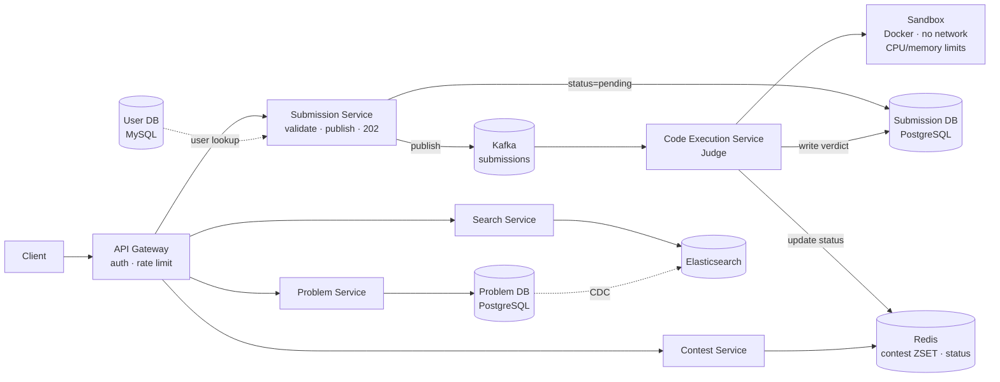
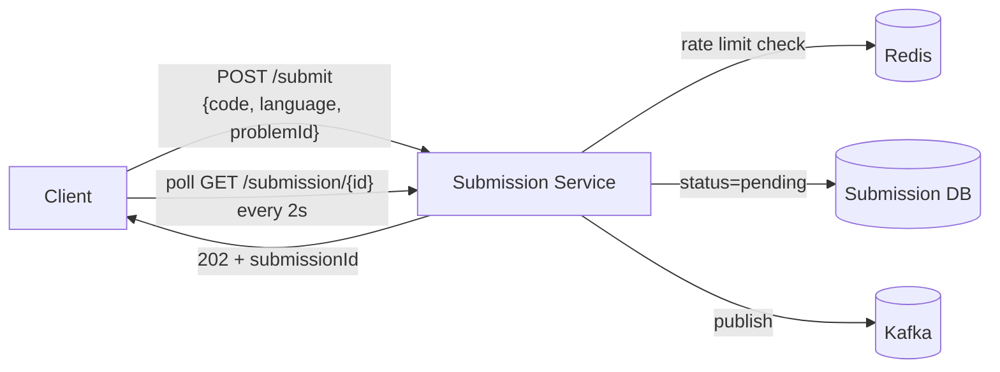
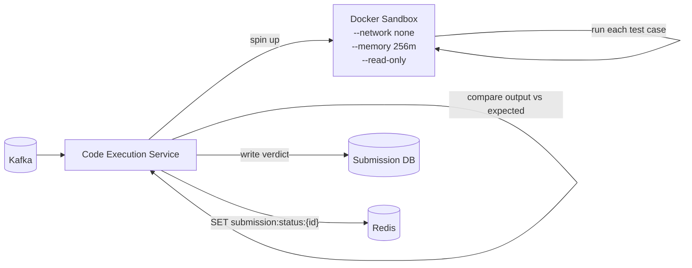
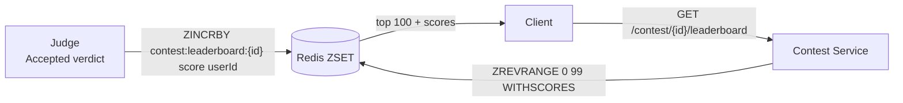

# Leetcode (Online Judge) System Design

## System Overview
An online coding platform where users solve programming problems, submit code that is compiled and executed in a sandboxed environment, and receive verdicts (Accepted, Wrong Answer, Time Limit Exceeded, etc.) — with a leaderboard, contests, and discussion forums.

## 1. Requirements

### Functional Requirements
- User registration and authentication
- Browse and search problems (by difficulty, tag, company)
- Write and submit code in multiple languages (Python, Java, C++, etc.)
- Execute code against test cases; return verdict and output
- Run custom test cases (without submitting)
- View submission history and accepted solutions
- Contests with real-time leaderboard
- Discussion forum per problem

### Non-Functional Requirements
- Availability: 99.9%
- Latency: Code execution result within 5s for most submissions
- Scalability: 5M+ users, 1M+ submissions/day
- Security: Code must run in isolated sandbox — no access to host system, network, or other users' data
- Fairness: Consistent execution environment for all users

## 2. Back-of-the-Envelope Estimation

### Assumptions
- 5M users, 500K DAU
- 1M submissions/day, 100K during contest peaks
- Average execution time: 1–2s
- 10 test cases per problem avg

### Traffic
```
Submissions/sec (avg)   = 1M / 86400 ≈ 12/sec
Submissions/sec (peak)  = 100K / 3600 ≈ 28/sec (contest hour)
Execution jobs/sec      = 28 × 10 test cases = 280 jobs/sec (peak)
```

### Storage
```
Problems        = 3000 × 10KB = 30MB
Submissions/day = 1M × 3KB = 3GB/day → ~1TB/year
Test cases      = 3000 × 10 cases × 10KB = 300MB
```

## 3. Architecture Diagram

### Components

| Component | Role |
|---|---|
| API Gateway | Auth, rate limiting (prevent submission spam), routing |
| Problem Service | Problem CRUD, test case management |
| Submission Service | Receives code; validates; publishes to Kafka; returns submissionId async |
| Code Execution Service (Judge) | Pulls from Kafka; runs code in sandbox; evaluates against test cases; writes verdict |
| Sandbox | Isolated Docker container per submission; resource limits; no network |
| Contest Service | Contest lifecycle, scoring, real-time leaderboard (Redis ZSET) |
| Discussion Service | Forum threads per problem |
| Search Service | Problem search via Elasticsearch |
| Problem DB (PostgreSQL) | Problems, test cases, editorial |
| Submission DB (PostgreSQL) | Submission records, verdicts, code |
| User DB (MySQL) | Users, solved problems, stats |
| Redis | Contest leaderboard (ZSET), submission status, session store |
| Kafka | Submission queue, result events |

### Overview



## 4. Key Flows

### 4.1 Code Submission



1. Rate limit: 5 submissions/min per user
2. Write submission record with `status = pending`
3. Publish to Kafka → return `submissionId` immediately (async)
4. Client polls for result every 2s (or WebSocket push)

### 4.2 Code Execution (Judge)



Verdict determination:
```
Compile Error → return CE
For each test case:
  TLE (time > limit) → return TLE
  MLE (memory > limit) → return MLE
  Runtime Error → return RE
  Wrong Answer → return WA
All pass → Accepted
```

Sandbox constraints:
- `--network none` (no network)
- `--memory 256m --cpus 0.5`
- `--read-only` filesystem with tmpfs for /tmp
- `seccomp` profile to restrict syscalls
- Run as non-root user; killed after time limit

### 4.3 Contest Leaderboard



Score = problems solved × penalty time formula. Real-time updates pushed via WebSocket.

### 4.4 Custom Test Run

Same flow as submission but:
- Uses user-provided input instead of hidden test cases
- Not stored in submission history
- Lower priority in execution queue

## 5. Database Design

### PostgreSQL — problems

| Field | Type |
|---|---|
| problem_id | UUID (PK) |
| title | VARCHAR |
| description | TEXT |
| difficulty | ENUM (easy / medium / hard) |
| tags | ARRAY\<VARCHAR\> |
| companies | ARRAY\<VARCHAR\> |
| acceptance_rate | DECIMAL |
| created_at | TIMESTAMP |

### PostgreSQL — test_cases

| Field | Type |
|---|---|
| test_id | UUID (PK) |
| problem_id | UUID (FK → problems) |
| input | TEXT |
| expected_output | TEXT |
| is_sample | BOOLEAN |
| time_limit_ms | INT |
| memory_limit_mb | INT |

### PostgreSQL — submissions

| Field | Type |
|---|---|
| submission_id | UUID (PK) |
| user_id | UUID |
| problem_id | UUID |
| language | VARCHAR |
| code | TEXT |
| status | ENUM (pending / running / accepted / wrong_answer / tle / mle / runtime_error / compile_error) |
| runtime_ms | INT, nullable |
| memory_mb | INT, nullable |
| submitted_at | TIMESTAMP |

### Redis Keys

| Key Pattern | Type | Value | TTL |
|---|---|---|---|
| `submission:status:{submissionId}` | String | verdict JSON | 300s |
| `contest:leaderboard:{contestId}` | ZSET | userId → score | while contest active |
| `session:{sessionId}` | String | userId | 86400s |
| `rate:{userId}` | Counter | submission count | 60s |

## 6. Key Interview Concepts

### Sandbox Security
Code must not access other users' data, make network calls, or exhaust host resources. Docker container with:
- `--network none` — no network
- `--memory 256m --cpus 0.5` — resource limits
- `--read-only` filesystem with tmpfs for /tmp
- `seccomp` profile to restrict syscalls
- Non-root user; killed after time limit

### Async Execution
Code execution takes 1–5s. Synchronous HTTP would hold connections open. Return `submissionId` immediately; client polls or receives WebSocket push. Kafka queue absorbs submission bursts (contest start spike).

### Execution Queue Scaling
Contest start: 10K users submit simultaneously. Kafka buffers submissions. Code Execution Service scales horizontally — each instance handles one submission at a time (one Docker container). With 100 executor instances: 100 concurrent executions.

### Test Case Isolation
Each test case runs in a fresh process — prevents state leakage between test cases.

### Plagiarism Detection
Post-submission async job: compare accepted solutions using code similarity algorithms (token-based, AST-based). Not in critical path.

## 7. Failure Scenarios

### Code Execution Service Crash Mid-Execution
- Detection: Kafka message not acknowledged
- Recovery: Kafka redelivers to another executor; idempotent execution (submissionId dedup)
- Submission status remains `pending` until reprocessed

### Sandbox Escape Attempt
- Prevention: seccomp profile, non-root user, read-only filesystem, no network
- Detection: anomaly monitoring on container syscalls

### Execution Queue Backup (Contest Spike)
- Detection: Kafka consumer lag grows; results delayed
- Recovery: auto-scale executor instances; users see "pending" status longer
- Prevention: pre-scale before known contest start times

### Wrong Verdict (Judge Bug)
- Recovery: re-judge all submissions for affected problem; update verdicts
- Prevention: extensive test case validation; multiple judge instances cross-check results
