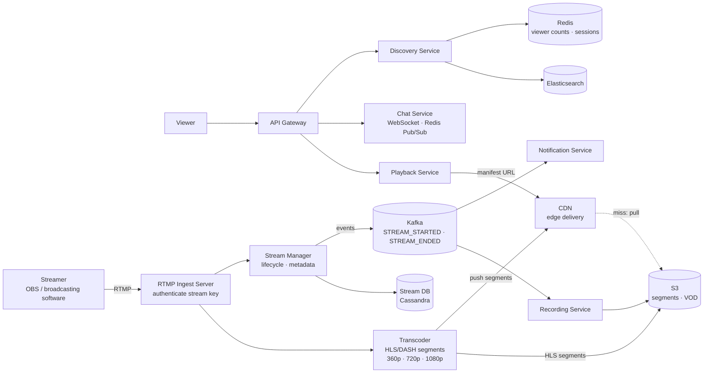
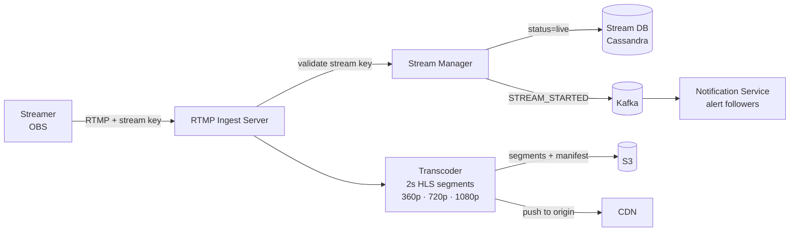
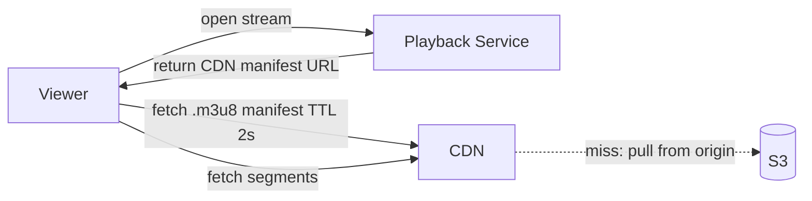
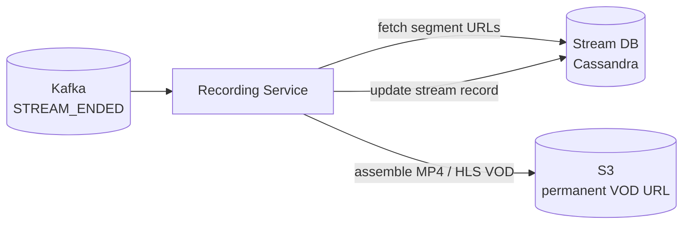

# Live Streaming System Design

## System Overview
A live video streaming platform (think Twitch / YouTube Live) where streamers broadcast real-time video to potentially millions of concurrent viewers with low latency, adaptive quality, and real-time chat.

## 1. Requirements

### Functional Requirements
- Streamer starts/stops a live stream
- Viewers watch live stream with <10s latency
- Adaptive bitrate based on viewer's network
- Real-time chat during stream
- Stream recording and VOD after stream ends
- Stream discovery (browse live streams by category, viewers)
- Notifications when followed streamer goes live

### Non-Functional Requirements
- Availability: 99.99%
- Latency: <10s end-to-end (streamer to viewer)
- Scalability: 1M+ concurrent streams, 100M+ concurrent viewers
- Durability: Stream recordings must not be lost

## 2. Back-of-the-Envelope Estimation

### Assumptions
- 1M concurrent live streams, average 100 viewers per stream = 100M concurrent viewers
- Streamer bitrate: 6Mbps (1080p); Viewer bitrate: 4Mbps avg
- Stream duration: 2hr avg

### Traffic
```
Ingest bandwidth    = 1M streams × 6Mbps = 6 Tbps
Delivery bandwidth  = 100M viewers × 4Mbps = 400 Tbps → CDN

Segments/sec        = 1M streams × (1 segment/2s) = 500K segments/sec
Chat messages/sec   = 100M viewers × 0.1 msg/sec = 10M msg/sec
```

### Storage
```
Encoded variants    = 5 qualities × 3GB avg = 15GB per stream
1M streams/day      = 1M × 15GB = 15PB/day (only record fraction)
```

## 3. Architecture Diagram

### Components

| Component | Role |
|---|---|
| RTMP Ingest Server | Receives live stream from OBS/broadcasting software via RTMP; authenticates stream key |
| Transcoder | Converts RTMP to HLS/DASH segments in real-time; produces 360p/720p/1080p variants |
| Stream Manager | Manages stream lifecycle; writes metadata to Stream DB; publishes events to Kafka |
| CDN | Delivers HLS/DASH segments globally; live segments have 2–4s TTL |
| Playback Service | Returns manifest URL and CDN endpoint to viewers |
| Chat Service | Real-time chat via WebSocket; Redis Pub/Sub per stream channel |
| Discovery Service | Browse live streams by category, viewer count via Elasticsearch |
| Recording Service | Kafka consumer; assembles segments into VOD after stream ends |
| Notification Service | Kafka consumer; alerts followers when streamer goes live |
| Stream DB (Cassandra) | Stream metadata, viewer counts, segment index |
| S3 | Live segment origin, VOD recordings |
| Kafka | Stream events, recording triggers, notification fan-out |

### Overview



## 4. Key Flows

### 4.1 Stream Start



1. Streamer's OBS connects to RTMP Ingest Server with stream key
2. Stream Manager creates stream record (`status = live`), publishes `STREAM_STARTED`
3. Transcoder splits RTMP into 2s HLS segments, encodes to multiple qualities
4. Segments pushed to S3 (origin) and CDN; manifest updated every 2s

### 4.2 Viewer Playback



Latency breakdown:
```
Streamer encodes → RTMP ingest → Transcoder (2s segment) → CDN origin → CDN edge → Viewer
≈ 0.5s + 2s + 0.5s + 1s + 0.5s ≈ 4.5s minimum
With CDN propagation: 6–10s typical
```

ABR: client measures download speed per segment; adjusts quality at segment boundaries; maintains 30s buffer.

### 4.3 Stream Recording → VOD



### 4.4 Chat

WebSocket connections per viewer; Redis Pub/Sub channel per stream (`chat:{streamId}`). At 10M msg/sec, fan-out to all viewers in a stream: Chat Service instances subscribe to stream channel, deliver to their connected viewers.

## 5. Database Design

### Cassandra — streams

| Field | Type |
|---|---|
| stream_id | UUID (PK) |
| streamer_id | UUID |
| title | VARCHAR |
| category | VARCHAR |
| status | ENUM (live / ended) |
| viewer_count | COUNTER |
| started_at | TIMESTAMP |
| ended_at | TIMESTAMP, nullable |
| manifest_url | TEXT |

### Cassandra — stream_segments

Partition key: `stream_id`, Clustering: `segment_seq ASC`

| Field | Type |
|---|---|
| stream_id | UUID (partition key) |
| segment_seq | BIGINT (clustering) |
| s3_url | TEXT |
| duration_ms | INT |
| created_at | TIMESTAMP |

### Redis Keys

| Key Pattern | Type | Value | TTL |
|---|---|---|---|
| `stream:live:{streamerId}` | String | stream metadata JSON | while live |
| `stream:viewers:{streamId}` | Counter | viewer count | while live |
| `session:{sessionId}` | String | userId | 86400s |

## 6. Key Interview Concepts

### RTMP vs WebRTC for Ingest
- RTMP: mature, widely supported by OBS, higher latency (2–5s), reliable for one-to-many
- WebRTC: sub-second latency, browser-native, complex for server-side processing
- Most platforms use RTMP for ingest and HLS/DASH for delivery

### HLS Segment TTL
Live segments have 2–4s TTL on CDN. CDN constantly pulls fresh segments from origin. For 1M streams × 3 quality variants = 1.5M segment requests/sec to origin. CDN must be sized for this pull rate.

### Viewer Count at Scale
100M viewers updating count = massive write load. Solution: approximate counting — each CDN edge reports viewer count to aggregator every 30s. Aggregator sums and updates Redis. Slight staleness (30s) is acceptable.

### Low-Latency Streaming (LL-HLS)
Standard HLS: 6–30s latency. LL-HLS: 2–5s latency using partial segments (200ms chunks) and HTTP/2 push. Trade-off: more complex, higher origin load.

## 7. Failure Scenarios

### RTMP Ingest Server Failure
- Recovery: streamer's software reconnects to backup ingest server; brief stream interruption (<5s)
- Prevention: multiple ingest servers per region; DNS failover

### Transcoder Failure
- Recovery: Stream Manager detects stale manifest, restarts transcoder, reconnects to RTMP stream
- Prevention: multiple transcoder instances; health monitoring

### CDN Overload (Viral Stream)
- Recovery: CDN auto-scales edge capacity; origin pull rate bounded by segment size
- Prevention: CDN with auto-scaling; pre-warm for known large events
