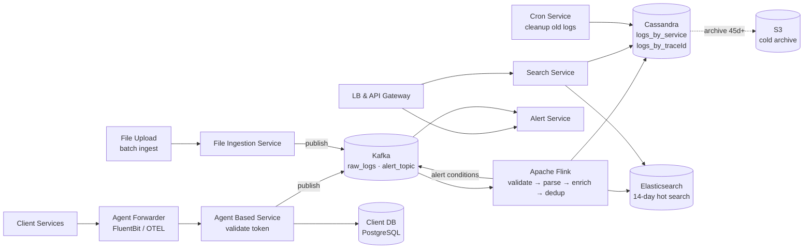
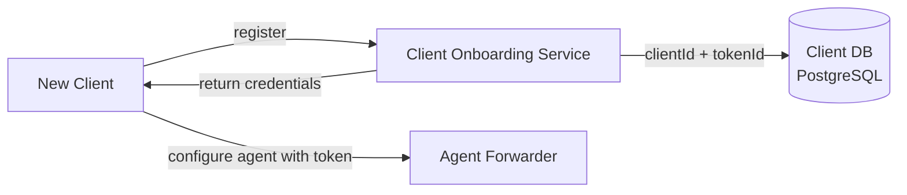
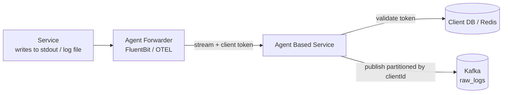
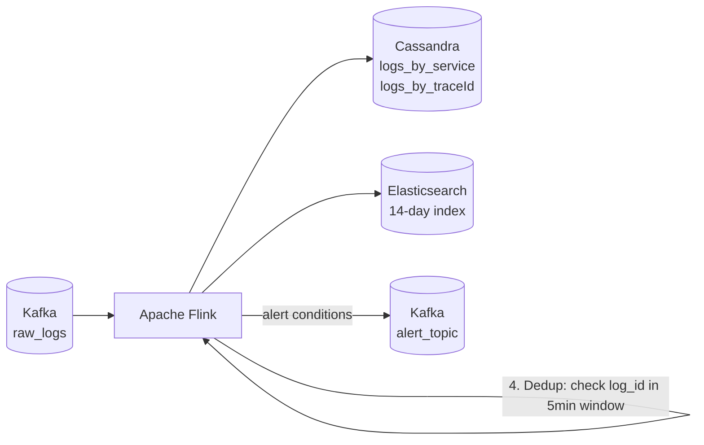
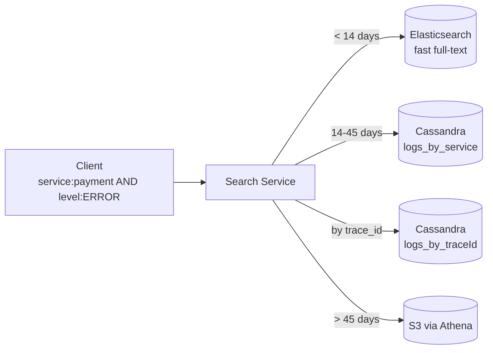
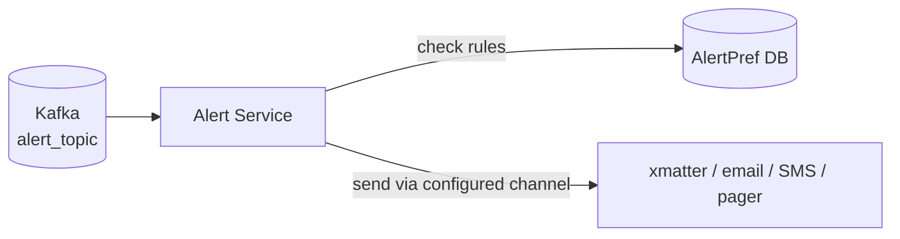

# Log Aggregation System Design (Logstash / ELK Stack)

## System Overview
A centralized log aggregation platform (think Datadog / Splunk / a custom ELK stack) that collects logs from distributed services, processes and indexes them via a stream processing pipeline, and provides search, alerting, and dashboards for observability. Designed as a multi-tenant service.

## 1. Requirements

### Functional Requirements
- Client onboarding with token-based authentication
- Collect logs via two paths: real-time agent streaming and batch file upload
- Parse, enrich, normalize, and deduplicate log entries
- Full-text search across logs with filters (service, level, time range, trace_id)
- Real-time alerting on error patterns (e.g., error rate > 1%)
- Alert preference management per client
- Log retention policy (hot: 14 days in Elasticsearch; warm: 45 days in Cassandra; cold: S3)
- Distributed tracing correlation (trace_id across services)

### Non-Functional Requirements
- Throughput: 1M+ log events/sec
- Latency: logs searchable within 30s of generation
- Availability: 99.9%
- Scalability: petabytes of log data, multiple tenants
- Durability: logs must not be lost (at-least-once delivery)

## 2. Back-of-the-Envelope Estimation

### Assumptions
- 1000 client services, each generating 1K log lines/sec = 1M log lines/sec
- Average log line: 500B

### Traffic
```
Log ingestion/sec   = 1M lines/sec
Ingestion bandwidth = 1M × 500B = 500MB/sec
Search queries/sec  = 1K/sec
```

### Storage
```
Logs/day            = 1M × 500B × 86400 = 43TB/day
Elasticsearch (14d) = 43TB × 14 = 602TB
Cassandra (45d)     = 43TB × 45 = 1.9PB
S3 (cold, 1yr)      = 43TB × 365 ≈ 15.7PB → compressed ~3PB
```

## 3. Architecture Diagram

### Components

| Component | Role |
|---|---|
| LB + API Gateway | Auth (token validation), rate limiting, routing |
| Client Onboarding Service | Registers clients; issues clientId + tokenId; writes to Client DB |
| Agent Forwarder (FluentBit/OTEL) | Lightweight agent on each service host; tails logs; forwards to Agent Based Service |
| Agent Based Service | Receives real-time log streams; validates token; publishes to Kafka `raw_logs` |
| File Ingestion Service | Receives batch file uploads; parses; publishes to Kafka `raw_logs` |
| Apache Flink | Stateful stream processor: validate → parse → enrich → deduplicate |
| Search Service | Handles search queries; Elasticsearch for recent; Cassandra for older |
| Alert Service | Consumes Kafka `alert_topic`; evaluates rules; sends via configured channels |
| Cron Service | Deletes logs older than 45 days from Cassandra |
| Log DB (Cassandra) | Primary durable log store; 45-day retention |
| Elasticsearch | Search layer for recent logs (14-day retention) |
| S3 | Cold archive for all logs beyond 45 days |
| Client DB (PostgreSQL) | Client registry: clientId, token, preferences |
| Kafka | `raw_logs` and `alert_topic` |

### Overview



## 4. Key Flows

### 4.1 Client Onboarding



### 4.2 Real-Time Log Ingestion



### 4.3 Stream Processing (Apache Flink)



Four steps per log event:
1. Validation — check required fields; drop malformed events
2. Parse & normalize — extract structured fields; normalize timestamp to UTC
3. Enrich — add host, env, namespace, pod_name from service metadata
4. Deduplicate — check `log_id` in sliding 5-min window; drop duplicates

### 4.4 Log Search



- Recent (<14 days): Elasticsearch — fast full-text search
- Older (14–45 days): Cassandra `logs_by_service` with time range filter
- By trace_id: Cassandra `logs_by_traceId` — all logs for a request across all services
- Cold (>45 days): S3 via Athena — compliance audits

### 4.5 Alerting



Flink evaluates alert rules on the stream (e.g., error rate > 1% in 5-min window) → publishes to `alert_topic`. Alert Service deduplicates: suppress repeated alerts for same condition within 15 min.

## 5. Database Design

### Selection Reasoning

| Store | Why |
|---|---|
| Cassandra (Log DB) | Primary log store; high write throughput (1M/sec); partition by service_name + date |
| Elasticsearch | Full-text search on recent logs (14 days); inverted index |
| S3 | Cost-effective cold archive; Athena for compliance queries |
| PostgreSQL (Client DB) | Multi-tenant client registry; ACID |
| Kafka | Durable ingestion buffer; decouples agents from Flink |

### Cassandra — logs_by_service

Partition key: `service_name + log_date`, Clustering: `timestamp DESC`

| Field | Type |
|---|---|
| service_name | VARCHAR (partition key) |
| log_date | DATE (partition key) |
| timestamp | TIMESTAMP (clustering DESC) |
| log_id | UUID |
| log_level | VARCHAR (INFO / WARN / ERROR / DEBUG) |
| host | VARCHAR |
| env | VARCHAR |
| message | TEXT |
| trace_id | UUID |
| namespace | VARCHAR |
| pod_name | VARCHAR |

### Cassandra — logs_by_traceId

Partition key: `trace_id`, Clustering: `timestamp ASC`

| Field | Type |
|---|---|
| trace_id | UUID (partition key) |
| timestamp | TIMESTAMP (clustering) |
| log_id | UUID |
| service_name | VARCHAR |
| log_level | VARCHAR |
| message | TEXT |

### PostgreSQL — clients

| Field | Type |
|---|---|
| client_id | UUID (PK) |
| client_name | VARCHAR |
| token | VARCHAR |
| token_ttl | TIMESTAMP |
| env | VARCHAR |
| pref | JSONB |
| metadata | JSONB |

## 6. Key Interview Concepts

### Why Cassandra as Primary Store (Not Elasticsearch)
Elasticsearch struggles with write throughput at 1M events/sec sustained. Cassandra handles this easily — append-only writes, partition by service_name + date. Elasticsearch is kept as a 14-day search layer only.

### Two Cassandra Table Designs
Two common query patterns require two tables (denormalization):
- "Show all ERROR logs for payment-service today" → `logs_by_service`
- "Show all logs for trace_id abc123 across all services" → `logs_by_traceId`

Same data written to both tables by Flink. Standard Cassandra pattern — model tables around query patterns.

### Apache Flink vs Logstash
Logstash is stateless — can't do stateful deduplication or windowed aggregations. Flink is stateful — maintains deduplication window, computes error rates over time windows for alerting, handles exactly-once processing.

### Kafka as Ingestion Buffer
Without Kafka: if Flink is slow, agents back up → service disk fills → service crashes. Kafka acts as a durable buffer — agents write fast, Flink reads at its own pace. Kafka retains 24hr of logs.

### Distributed Tracing via trace_id
Each request gets a `trace_id` at the entry point. All services propagate it in their logs. `logs_by_traceId` table makes this query O(1) — all logs for a request in one partition, ordered by timestamp.

### Hot-Warm-Cold Tiering
- Hot (Elasticsearch, 14 days): fast full-text search, SSD, expensive
- Warm (Cassandra, 45 days): structured queries by service/trace, cheaper
- Cold (S3, indefinite): compliance archive, very cheap, queryable via Athena

## 7. Failure Scenarios

### Flink Crash
- Detection: Kafka consumer lag grows on `raw_logs`
- Recovery: Flink restarts from last checkpoint; Kafka retains messages (24hr); catches up
- Prevention: Flink checkpointing every 30s; multiple task managers; auto-restart

### Cassandra Node Failure
- Recovery: RF=3, QUORUM writes continue; hinted handoff replays on recovery
- Prevention: multi-AZ deployment; Elasticsearch still serves recent log search during Cassandra degradation

### Elasticsearch Overload
- Recovery: reduce indexing rate (backpressure from Flink); scale Elasticsearch cluster
- Prevention: Elasticsearch only handles 14-day window — bounded dataset

### Alert Storm
- Scenario: 1000 services all error simultaneously → 1000 alerts in 1 min
- Recovery: Alert Service deduplicates by condition + client; sends summary alert
- Prevention: 15-min dedup TTL; alert grouping rules
