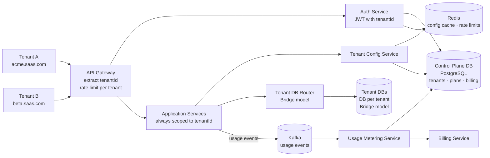
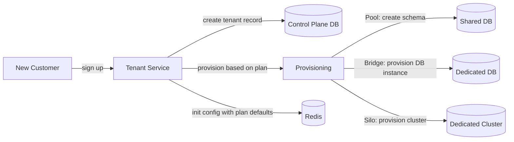
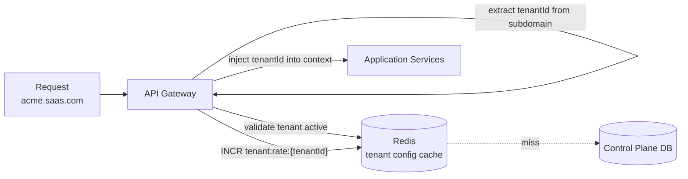
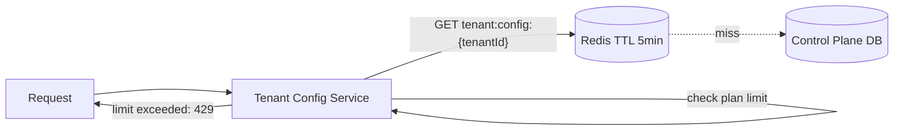
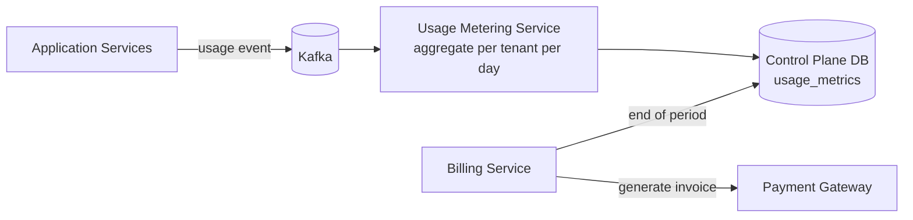

# Multi-tenant SaaS System Design

## System Overview
A multi-tenant SaaS platform architecture where multiple customers (tenants) share the same infrastructure while having isolated data, configurations, and experiences — covering the three tenancy models, data isolation strategies, and operational concerns.

## 1. Requirements

### Functional Requirements
- Tenant onboarding and provisioning
- Tenant-specific configuration and customization
- Data isolation between tenants
- Tenant-specific feature flags and plan limits
- Usage metering and billing per tenant
- Admin portal for tenant management

### Non-Functional Requirements
- Isolation: one tenant's data must never be accessible to another
- Availability: 99.9% per tenant (noisy neighbor protection)
- Scalability: support 10K+ tenants, from small (10 users) to enterprise (100K users)
- Security: tenant data encrypted at rest and in transit
- Compliance: GDPR, SOC2 — tenant data residency requirements

## 2. Tenancy Models

### Model 1 — Silo (Dedicated per Tenant)
Each tenant gets dedicated infrastructure (DB, compute, storage).

Pros: maximum isolation, easy compliance, tenant-specific scaling
Cons: high cost, operational overhead, resource waste for small tenants
Best for: enterprise/large tenants with strict compliance

### Model 2 — Pool (Shared Everything)
All tenants share the same DB, differentiated by `tenant_id` column.

Pros: low cost, easy to operate, efficient resource utilization
Cons: noisy neighbor, harder GDPR deletion, cross-tenant leak risk
Best for: SMB/startup tenants with low compliance requirements

### Model 3 — Bridge (Shared Compute, Isolated DB)
Shared application servers but separate DB per tenant (or schema per tenant).

Pros: balance of cost and isolation, easier compliance than pool
Cons: complex connection pooling, schema migrations across all tenant DBs
Best for: mid-market tenants; most common SaaS architecture

## 3. Architecture Diagram

### Components

| Component | Role |
|---|---|
| API Gateway | Auth, rate limiting per tenant, routing; extracts tenantId from JWT or subdomain |
| Tenant Service | Tenant CRUD, provisioning, plan management, feature flags |
| Auth Service | Multi-tenant auth; JWT contains tenantId + userId |
| Application Services | Business logic; always scoped to tenantId; never cross-tenant queries |
| Tenant Config Service | Per-tenant config, feature flags; cached in Redis |
| Usage Metering Service | Tracks API calls, storage, users per tenant; feeds billing |
| Billing Service | Subscription management, invoice generation, payment processing |
| Tenant DB Router | Routes DB connections to correct tenant DB/schema (Bridge model) |
| Control Plane DB (PostgreSQL) | Tenant registry, plans, billing, config — shared across all tenants |
| Redis | Tenant config cache, rate limiting per tenant, session store |
| Kafka | Usage events, billing events, async operations |

### Overview



## 4. Key Flows

### 4.1 Tenant Onboarding



1. Create tenant record in Control Plane DB
2. Provision based on plan: Free/Starter (Pool schema) → Pro (Bridge DB) → Enterprise (Silo cluster)
3. Create default admin user; send welcome email

### 4.2 Request Routing & Tenant Identification



Every request scoped to a tenant via subdomain (`acme.saas.com`), JWT (`{tenantId, userId}`), or API key.

### 4.3 Data Access with Tenant Isolation

Pool model — always include tenant_id:
```sql
-- CORRECT
SELECT * FROM users WHERE tenant_id = ? AND user_id = ?
-- NEVER (cross-tenant leak risk)
SELECT * FROM users WHERE user_id = ?
```

Bridge model — DB Router connects to tenant-specific DB; no tenant_id filter needed in queries.

### 4.4 Feature Flags & Plan Limits



### 4.5 Usage Metering & Billing



### 4.6 Schema Migrations (Bridge/Pool)

1. Migration Runner fetches all active tenant DB connections from Control Plane DB
2. Runs migration on each tenant DB sequentially or in parallel batches
3. Tracks migration status per tenant
4. On failure: mark tenant as migration-failed, alert ops, retry

Zero-downtime: expand-contract pattern — add new column (nullable), backfill, make required, drop old column.

## 5. Database Design

### Control Plane — tenants

| Field | Type |
|---|---|
| tenant_id | UUID (PK) |
| name | VARCHAR |
| subdomain | VARCHAR, unique |
| plan | ENUM (free / starter / pro / enterprise) |
| status | ENUM (active / suspended / churned) |
| db_connection_string | TEXT (Bridge/Silo model) |
| region | VARCHAR |
| created_at | TIMESTAMP |

### Control Plane — tenant_config

| Field | Type |
|---|---|
| tenant_id | UUID (PK) |
| feature_flags | JSONB |
| limits | JSONB (max_users, api_rate_limit, storage_gb) |
| custom_domain | VARCHAR, nullable |
| sso_config | JSONB, nullable |
| updated_at | TIMESTAMP |

### Control Plane — usage_metrics

| Field | Type |
|---|---|
| tenant_id | UUID |
| metric_type | VARCHAR (api_calls / storage_gb / active_users) |
| value | BIGINT |
| period | DATE |
| updated_at | TIMESTAMP |

### Redis Keys

| Key Pattern | Type | Value | TTL |
|---|---|---|---|
| `tenant:config:{tenantId}` | String | config JSON | 300s |
| `tenant:rate:{tenantId}` | Counter | API calls in window | 60s |
| `session:{tenantId}:{sessionId}` | String | userId | 86400s |

## 6. Key Interview Concepts

### Noisy Neighbor Problem
In Pool model, one tenant's heavy queries degrade all others. Solutions: query timeout per tenant, rate limiting at DB level, move heavy tenants to Bridge/Silo, read replicas for reporting.

### Cross-Tenant Data Leak Prevention
- Pool model: PostgreSQL Row-Level Security (RLS) — DB enforces tenant_id filter automatically
- All queries must include `tenant_id` in WHERE clause — enforced by ORM/middleware
- Integration tests that verify cross-tenant isolation

### GDPR Right to Erasure
- Silo/Bridge: drop tenant DB/schema — clean and complete
- Pool: delete all rows with `tenant_id = X` across all tables — complex, must be thorough

### Connection Pooling at Scale
Bridge model with 10K tenants = 10K DB connections. Solutions: PgBouncer per tenant group, lazy connection (only open when tenant is active), connection limits per tenant based on plan.

### Tenant Isolation in Caching
Always prefix Redis keys with `tenantId`. Never cache data that could be served to wrong tenant. Separate Redis instances for enterprise tenants (Silo model).

## 7. Failure Scenarios

### Tenant DB Failure (Bridge/Silo)
- Impact: only that tenant affected; other tenants unaffected
- Recovery: promote replica; tenant sees brief unavailability
- Prevention: per-tenant DB replication; automated failover

### Shared DB Failure (Pool)
- Impact: all tenants affected — main risk of Pool model
- Recovery: promote replica; all tenants recover together
- Prevention: high-availability DB cluster

### Noisy Tenant Overloading Shared Resources
- Detection: latency spikes for other tenants
- Recovery: throttle offending tenant; move to dedicated infrastructure
- Prevention: per-tenant rate limits; resource quotas; monitoring per tenant

### Cross-Tenant Data Leak Bug
- Recovery: immediate incident response; identify affected tenants; notify per GDPR
- Prevention: row-level security; automated cross-tenant isolation tests; code review for all DB queries
