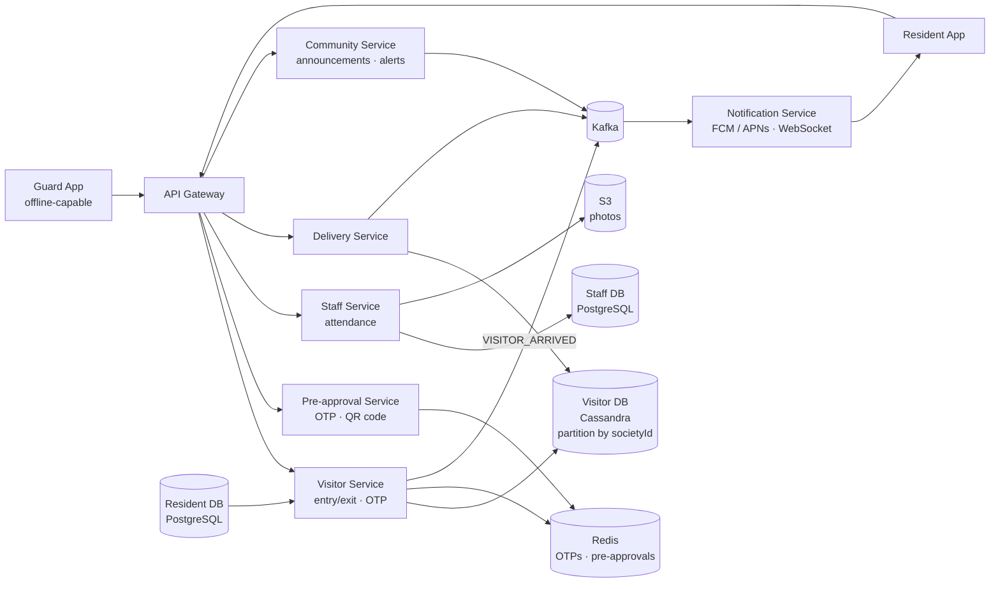
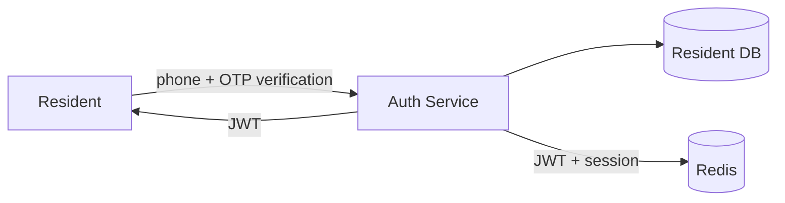
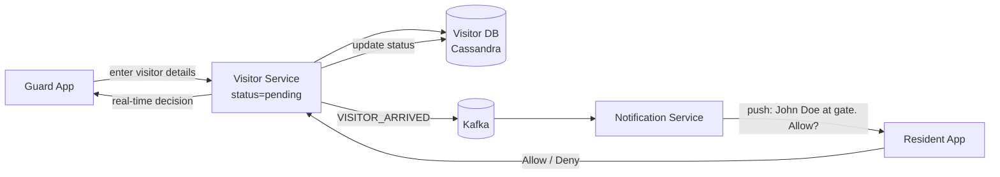
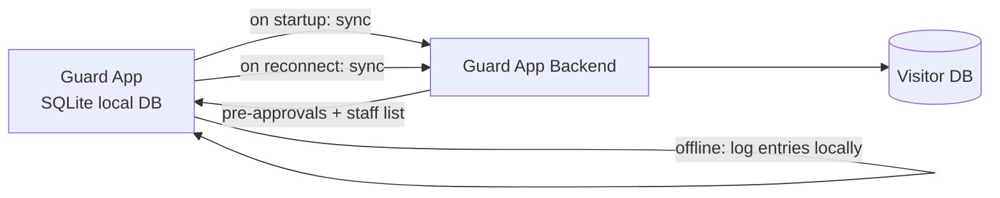
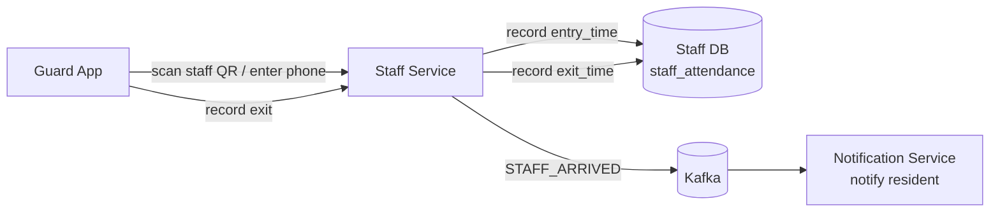

# MyGate (Gated Community Management) System Design

## System Overview
A gated community management platform (think MyGate / NoBrokerHood) that manages visitor entry/exit, resident notifications, delivery management, staff attendance, and community communication for apartment complexes and gated societies.

## 1. Requirements

### Functional Requirements
- Resident registration and apartment mapping
- Visitor pre-approval and entry management (guard app)
- Real-time notification to resident when visitor arrives
- Resident approves/denies entry via app
- Delivery management (package tracking)
- Domestic staff management (maid, cook, driver) with attendance
- Community announcements and notices
- Emergency alerts
- Visitor log and history

### Non-Functional Requirements
- Availability: 99.99% — gate entry must always work (even offline)
- Latency: <2s for visitor notification to reach resident
- Scalability: 10K+ societies, 5M+ residents
- Offline resilience: Guard app must work even without internet
- Security: Visitor data privacy, OTP-based entry

## 2. Back-of-the-Envelope Estimation

### Assumptions
- 10K societies, avg 500 apartments = 5M residents
- 20 visitor entries/society/day = 200K entries/day
- 50 delivery entries/society/day = 500K deliveries/day
- Peak: morning (8–10am) and evening (5–8pm) — 5× normal

### Traffic
```
Entry events/sec (avg)  = 700K / 86400 ≈ 8/sec
Entry events/sec (peak) = 40/sec
Notifications/sec       = 16/sec (trivial)
```

### Storage
```
Residents           = 5M × 1KB = 5GB
Visitor logs/day    = 700K × 500B = 350MB/day → ~128GB/year
Photos (visitor)    = 700K/day × 100KB = 70GB/day → S3
```

## 3. Architecture Diagram

### Components

| Component | Role |
|---|---|
| API Gateway | Auth, rate limiting, routing |
| Resident Service | Resident registration, apartment mapping, profile management |
| Visitor Service | Visitor entry/exit management; OTP generation; entry log |
| Guard App Backend | Serves guard-facing app; handles offline sync; entry/exit recording |
| Notification Service | Real-time push notifications (FCM/APNs); WebSocket for in-app alerts |
| Delivery Service | Package tracking, delivery agent management, resident notification |
| Staff Service | Domestic staff registration, attendance tracking |
| Community Service | Announcements, notices, polls, emergency alerts |
| Pre-approval Service | Residents pre-approve visitors; generates OTP or QR code |
| Resident DB (PostgreSQL) | Residents, apartments, societies, admin roles |
| Visitor DB (Cassandra) | Visitor logs — high write throughput, time-series, partition by societyId |
| Staff DB (PostgreSQL) | Staff profiles, attendance records |
| Redis | Active OTPs (TTL), pre-approvals, session store |
| S3 | Visitor photos, staff photos, community documents |
| Kafka | Entry events, notification fan-out, analytics |

### Overview



## 4. Key Flows

### 4.1 Auth



Resident registers with phone number → OTP verification → account created. Society admin maps resident to apartment.

### 4.2 Visitor Entry Flow



1. Guard enters visitor name + phone (or scans QR pre-approval)
2. Visitor Service creates entry (`status = pending`) → publishes `VISITOR_ARRIVED`
3. Resident receives push notification → taps Allow/Deny
4. Guard app receives real-time update via WebSocket

OTP-based entry (pre-approved):
1. Resident pre-approves → Pre-approval Service generates OTP stored in Redis (TTL 5min or 24hr)
2. Visitor shows OTP at gate → Guard validates from Redis → auto-approve without resident notification

### 4.3 Offline Guard App



Critical requirement: gate must work even without internet.
- Pre-approvals and staff list synced to local SQLite on startup
- OTP check against local cache when offline
- New entries logged locally; synced on reconnect

### 4.4 Staff Attendance



### 4.5 Community Announcements

Society admin posts announcement → Community Service → Kafka event → Notification Service sends push to all residents in society.

## 5. Database Design

### PostgreSQL — residents

| Field | Type |
|---|---|
| resident_id | UUID (PK) |
| apartment_id | UUID (FK → apartments) |
| name | VARCHAR |
| phone | VARCHAR, unique |
| email | VARCHAR |
| role | ENUM (owner / tenant / family) |
| created_at | TIMESTAMP |

### Cassandra — visitor_log

Partition key: `society_id`, Clustering: `entry_time DESC`

| Field | Type |
|---|---|
| society_id | UUID (partition key) |
| entry_time | TIMESTAMP (clustering) |
| visitor_id | UUID |
| visitor_name | VARCHAR |
| visitor_phone | VARCHAR |
| apartment_id | UUID |
| resident_id | UUID |
| entry_type | TEXT (visitor / delivery / staff) |
| status | TEXT (pending / approved / denied / exited) |
| photo_url | TEXT |
| otp | VARCHAR, nullable |
| exit_time | TIMESTAMP, nullable |

### PostgreSQL — staff_attendance

| Field | Type |
|---|---|
| attendance_id | UUID (PK) |
| staff_id | UUID (FK → staff) |
| apartment_id | UUID |
| entry_time | TIMESTAMP |
| exit_time | TIMESTAMP, nullable |
| date | DATE |

### Redis Keys

| Key Pattern | Type | Value | TTL |
|---|---|---|---|
| `otp:{societyId}:{phone}` | String | OTP code | 300s |
| `preapproval:{token}` | String | `{residentId, visitorName, validUntil}` | 86400s |
| `session:{sessionId}` | String | userId | 86400s |
| `entry:pending:{apartmentId}` | String | visitor entry JSON | 120s |

## 6. Key Interview Concepts

### Offline-First Guard App
The guard app is the most critical component — if it fails, the gate can't function. Offline-first design: pre-approvals and staff list synced to local SQLite on app start; all entry/exit events written locally first, synced to server when online; conflict resolution: last-write-wins for status updates, append-only for new entries.

### OTP vs QR Code for Pre-approval
- OTP: 6-digit code, easy to communicate verbally, stored in Redis with TTL
- QR code: scannable, no verbal communication needed, contains signed token
- Both stored in Redis with TTL; validated at gate without resident notification

### Visitor Log Partitioning
Cassandra partition by `society_id` — all entries for a society on one partition. Efficient for "show all visitors today for this society." Clustering by `entry_time DESC` for chronological display. Hot partition risk for very large societies — shard by `society_id + date` if needed.

### Real-time Notification Latency
Path: Guard app → API → Kafka → Notification Service → FCM → Resident phone. FCM delivery: typically <1s. Total: 1–2s. Acceptable.

## 7. Failure Scenarios

### Push Notification Failure (FCM/APNs)
- Recovery: fallback to SMS; guard can call resident directly; entry held as pending
- Prevention: retry push 3 times; SMS as fallback after 30s

### Guard App Offline
- Recovery: offline mode with local SQLite; pre-approvals work; entries synced on reconnect
- Prevention: offline-first is the primary design, not a fallback

### Redis Failure (OTP Store Lost)
- Impact: OTP-based pre-approvals fail; residents must manually approve
- Recovery: Redis Sentinel failover (<30s); OTP loss is a minor UX issue, not a safety issue
- Prevention: Redis Cluster + AOF

### Cassandra Node Failure
- Recovery: RF=3, QUORUM writes continue; hinted handoff replays on recovery
- Prevention: multi-AZ deployment
