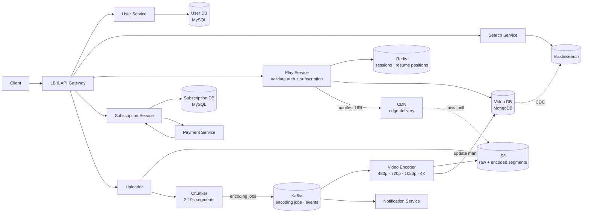
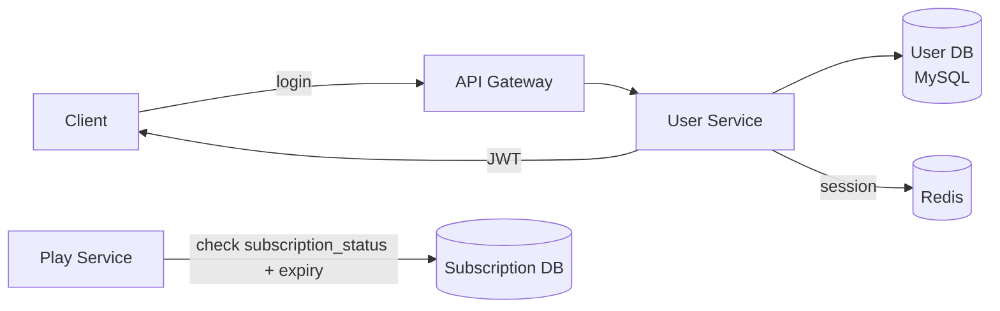
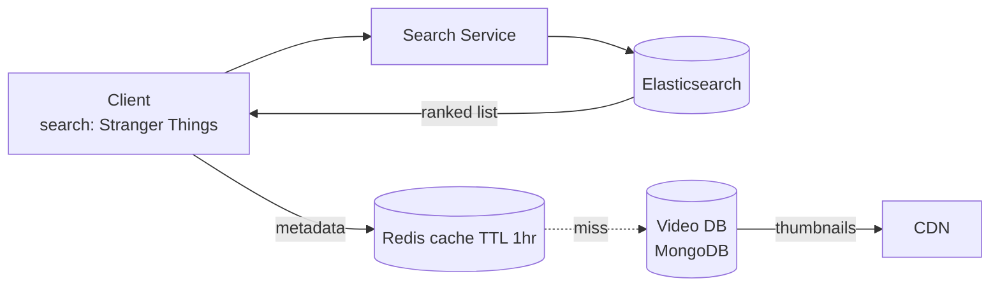
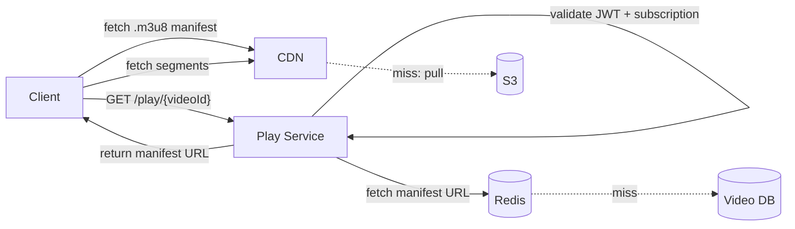
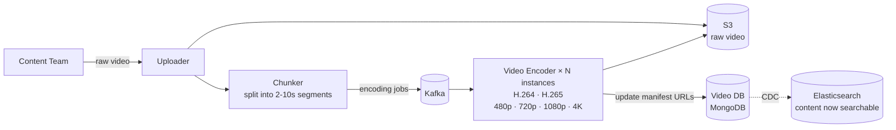

# Netflix System Design

## System Overview
A video streaming platform where users subscribe, browse and search content, and stream high-quality video on demand — with adaptive bitrate streaming, a global CDN, and a content upload/encoding pipeline.

## 1. Requirements

### Functional Requirements
- User registration, authentication, and subscription management
- Browse and search movies/shows
- Stream video with adaptive quality based on network speed
- Resume playback from where user left off
- Content upload, processing, and encoding pipeline (internal)
- Payment and subscription billing

### Non-Functional Requirements
- Availability: 99.99% — streaming must always work
- Latency: <200ms to start playback; seamless adaptive quality switching
- Scalability: 200M+ subscribers, 100M+ concurrent streams at peak
- Throughput: petabytes of video served daily
- Security: DRM, auth on all streaming requests

## 2. Back-of-the-Envelope Estimation

### Assumptions
- 200M subscribers, 100M DAU
- 100M concurrent streams at peak (2hr avg watch time)
- Average bitrate: 5 Mbps
- Video catalog: 10K titles, 10 variants each (5 resolutions × 2 codecs)
- Average video size per variant: 4GB (2hr movie)

### Traffic
```
Concurrent streams       = 100M
Bandwidth required       = 100M × 5 Mbps = 500 Tbps → CDN
CDN origin pull          = ~1% = 5 Tbps

Search/browse requests   = 100M × 10 / 86400 ≈ 11.5K/sec
```

### Storage
```
Per video (all variants) = 10 variants × 4GB = 40GB
Full catalog             = 10K × 40GB = 400TB
New uploads/day          = 100 videos × 40GB = 4TB/day
```

## 3. Architecture Diagram

### Components

| Component | Role |
|---|---|
| LB + API Gateway | Routing, auth, rate limiting |
| User Service | Registration, login, JWT, profile; User DB (MySQL) |
| Subscription Service | Plans, validity, status; integrates with Payment Service |
| Payment Service | Billing, gateway integration, invoices |
| Search Service | Content discovery via Elasticsearch; CDC from Video DB |
| Play Service | Validates auth + subscription; returns CDN manifest URL |
| Uploader | Receives raw video uploads; stores to S3; triggers Chunker |
| Chunker | Splits video into 2–10s segments; generates manifest; publishes to Kafka |
| Video Encoder | Kafka consumer; encodes each chunk to multiple bitrates + codecs; stores to S3 |
| Notification Service | Kafka consumer; emails/push for billing, new content |
| Video DB (MongoDB) | Video metadata, manifest URLs, available resolutions |
| S3 | Raw uploads + all encoded segments and manifests |
| CDN | Serves video segments globally; primary delivery mechanism |
| Elasticsearch | Full-text search; synced from Video DB via CDC |
| Kafka | Video processing pipeline, event fan-out |

### Overview



## 4. Key Flows

### 4.1 Auth & Subscription Check



Expired subscription → 403 before serving any content.

### 4.2 Content Search & Browse



CDC: Video DB → Kafka → Elasticsearch (eventual consistency).

### 4.3 Video Playback (Play Service)



### 4.4 Adaptive Bitrate Streaming (ABR)

Video pre-encoded at multiple bitrates: 480p (1Mbps), 720p (3Mbps), 1080p (5Mbps), 4K (15Mbps). Each quality split into 2–10s segments. Manifest file lists all segments at all quality levels.

HLS manifest example:
```
#EXTM3U
#EXT-X-STREAM-INF:BANDWIDTH=1000000,RESOLUTION=640x360
http://cdn.example.com/low.m3u8
#EXT-X-STREAM-INF:BANDWIDTH=5000000,RESOLUTION=1920x1080
http://cdn.example.com/high.m3u8
```

ABR algorithm (client-side):
1. Measure download speed of each segment
2. Maintain 30s buffer of pre-downloaded video
3. Buffer healthy + high speed → request higher quality
4. Buffer draining (slow network) → drop to lower quality
5. Quality switches at segment boundaries — seamless to user

### 4.5 Video Upload & Encoding Pipeline



A 2hr movie generates thousands of encoding jobs (segments × quality levels × codecs). Kafka distributes jobs across N encoder instances in parallel — encoding time scales with number of encoders.

### 4.6 Resume Playback

1. User stops at 45:32 → Play Service writes `user:resume:{userId}:{videoId} = 2732` to Redis (TTL 30 days)
2. Consumer Service flushes Redis resume positions to MySQL `watch_history` every 5 min
3. User reopens video → Play Service reads resume position from Redis → client seeks to position

## 5. Database Design

### Selection Reasoning

| Store | Why |
|---|---|
| MongoDB (Video DB) | Flexible schema for video metadata, nested manifest info, varying attributes |
| MySQL (User/Subscription/Payment DB) | ACID for auth, billing correctness, PCI-DSS compliance |
| Elasticsearch | Full-text search on title/description/cast, faceted filtering |
| S3 | Petabyte-scale video storage, high durability, CDN integration |
| Redis | Sessions, hot metadata cache, resume positions |
| Kafka | Video processing pipeline, event fan-out |

### MongoDB — videos

| Field | Type |
|---|---|
| video_id | ObjectId (PK) |
| title | STRING |
| description | TEXT |
| manifest_file | STRING (S3 URL to .m3u8) |
| available_resolutions | ARRAY\<STRING\> |
| available_codecs | ARRAY\<STRING\> |
| duration_seconds | INT |
| genre | ARRAY\<STRING\> |
| cast | ARRAY\<STRING\> |
| thumbnail_url | STRING |
| created_at | TIMESTAMP |

### MySQL — users

| Field | Type |
|---|---|
| user_id | UUID (PK) |
| name | VARCHAR |
| email | VARCHAR, unique |
| password_hash | VARCHAR |
| subscription_status | ENUM (active / inactive / trial) |
| expiry_date | TIMESTAMP |
| created_at | TIMESTAMP |

### MySQL — watch_history

| Field | Type |
|---|---|
| id | UUID (PK) |
| user_id | UUID |
| video_id | VARCHAR |
| watched_duration_sec | INT |
| last_watched_at | TIMESTAMP |

### Redis Keys

| Key Pattern | Type | Value | TTL |
|---|---|---|---|
| `session:{sessionId}` | String | `{userId, deviceId}` | 86400s |
| `video:meta:{videoId}` | String | video metadata JSON | 3600s |
| `user:resume:{userId}:{videoId}` | String | last watched position (seconds) | 30 days |

## 6. Key Interview Concepts

### Why CDN is Everything
500 Tbps cannot come from origin servers. CDN edge nodes cache segments close to users — a user in Mumbai gets segments from a Mumbai edge node. CDN hit rate for popular content is >99%.

### HLS vs DASH
Both are adaptive bitrate streaming protocols. HLS: Apple standard, `.m3u8` manifest, native on iOS/Safari. DASH: open standard, `.mpd` manifest, used on Android/browsers. Architecture is identical — only manifest format differs.

### Segment Size Trade-off
- Smaller segments (2s): faster quality switching, more HTTP requests
- Larger segments (10s): fewer requests, slower to react to network changes
Netflix uses 2–4s segments for responsive ABR.

### Why Kafka for Encoding Pipeline
Thousands of encoding jobs per movie. Kafka distributes across N encoder instances in parallel. Adding more encoders reduces total encoding time linearly.

### MongoDB for Video Metadata
Flexible nested structure — manifest URLs, multiple resolutions, cast arrays. No joins needed — single document fetch returns everything for playback.

### Watch History Write Optimization
100M users updating position every few seconds = massive write load. Write to Redis first, batch flush to MySQL every 5 min. Acceptable to lose last 5 min of position on Redis failure.

### DRM (Digital Rights Management)
Video segments are encrypted. Client must obtain a license key from DRM server (Widevine for Android/Chrome, FairPlay for Apple) before decryption. License tied to subscription status — expired subscription = no license = can't decrypt.

## 7. Failure Scenarios

### CDN Node Failure
- Recovery: CDN reroutes to next nearest edge node; ABR drops quality to compensate for higher latency
- Prevention: CDN provider has redundant PoPs; S3 origin always available as fallback

### S3 Region Outage
- Recovery: cross-region S3 replication; CDN serves from cache for popular content
- Prevention: multi-region S3 replication; CDN cache TTL long enough to survive brief S3 outage

### Video Encoder Failure Mid-Job
- Recovery: Kafka redelivers to another encoder; idempotent encoding (same segment = same output)
- Prevention: multiple encoder instances; dead letter queue for repeatedly failing jobs

### Subscription Check Inconsistency
- Scenario: user cancels but Play Service serves stale cached status
- Recovery: short cache TTL (60s); on cancellation, actively invalidate cache
- Prevention: subscription changes publish invalidation event → Play Service clears cache

### Payment Failure on Renewal
- Recovery: retry 3 times over 3 days; notify user; after grace period, set `subscription_status = inactive`
- Prevention: idempotency key on renewal; dunning management with escalating notifications
