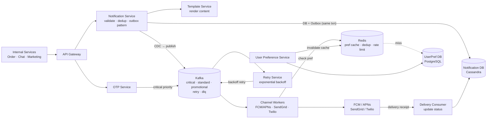
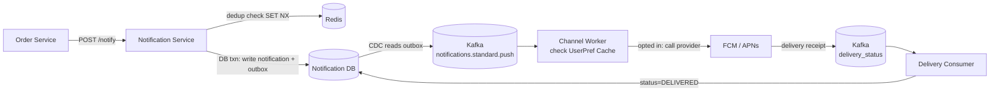
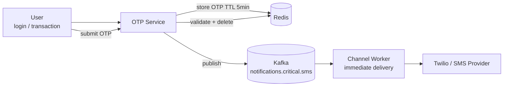

# Notification System Design

## System Overview
A scalable notification delivery system that sends push notifications, emails, and SMS to users across multiple channels — handling high throughput, user preferences, deduplication, retry logic, and delivery tracking. Used as an internal platform service by other systems (order updates, chat messages, marketing campaigns).

## 1. Requirements

### Functional Requirements
- Send notifications via multiple channels: push (FCM/APNs), email, SMS
- Support notification types: transactional (order confirmed) and marketing (promotions)
- User notification preferences (opt-in/out per channel per type)
- Deduplication — same notification not sent twice
- Retry on delivery failure
- Delivery status tracking (sent / delivered / failed / opened)
- Scheduled and bulk notifications (marketing campaigns)
- Rate limiting per user (no spam)
- Template management for notification content

### Non-Functional Requirements
- Throughput: 1M+ notifications/sec for bulk campaigns
- Latency: <1s for transactional notifications; minutes acceptable for marketing
- Availability: 99.99%
- Durability: No notification lost before delivery attempt
- Scalability: 1B+ users, multiple notification channels

## 2. Back-of-the-Envelope Estimation

### Assumptions
- 1B users
- 10M transactional + 100M marketing notifications/day
- Channel split: 60% push, 30% email, 10% SMS

### Traffic
```
Total notifications/day     = 110M
Campaign burst              = 100M in 1hr = 27.8K/sec

Push/sec                    = 27.8K × 0.6 = 16.7K/sec
Email/sec                   = 27.8K × 0.3 = 8.3K/sec
SMS/sec                     = 27.8K × 0.1 = 2.8K/sec
```

### Storage
```
Notification records/day    = 110M × 300B = 33GB/day → ~12TB/year
User preferences            = 1B × 500B = 500GB
Delivery logs               = 110M × 200B = 22GB/day
```

## 3. Architecture Diagram

### Components

| Component | Role |
|---|---|
| API Gateway | Auth, rate limiting, routing |
| Notification Service | Receives requests; validates; writes to DB + Outbox atomically; CDC publishes to Kafka |
| Template Service | Manages versioned templates; renders content with user variables |
| User Preference Service | Manages per-channel per-type preferences; publishes changes to Kafka |
| OTP Service | Generates and validates OTPs; uses critical priority channel |
| Channel Workers | Consume from Kafka; check user prefs; call providers (FCM/APNs/SendGrid/Twilio) |
| Delivery Consumer | Consumes delivery receipts from providers; updates Notification DB status |
| Retry Service | Monitors failed notifications; re-queues with exponential backoff |
| Notification DB (Cassandra) | Notification records and delivery status; partition by client_id |
| Template DB (PostgreSQL) | Versioned templates with is_active flag |
| UserPref DB (PostgreSQL) | User preferences per channel |
| UserPref Cache (Redis) | Cached preferences; checked before every send |
| Kafka | Three-tier priority × channel topic matrix |

### Overview



## 4. Key Flows

### 4.1 Transactional Notification (e.g., Order Confirmed)



1. Caller sends `POST /notify` with `{userId, templateId, channel, priority, idempotencyKey}`
2. Dedup check: `SET dedup:{key} 1 NX EX 86400` — if exists, return cached result
3. DB transaction: write to Notification DB (`status = PENDING`) + write to Outbox atomically
4. CDC reads Outbox → publishes to Kafka topic based on `priority × channel`
5. Channel Worker checks UserPref Cache → if opted out, skip; if opted in, render template + call provider
6. Provider delivers → receipt published to `delivery_status` topic → Delivery Consumer updates status

### 4.2 Outbox Pattern — Why It Matters

Without outbox: Notification Service writes to DB, then crashes before publishing to Kafka → notification record exists but never sent.

With outbox: DB write + Outbox write are in the same transaction. CDC reads the Outbox and publishes to Kafka independently. Even if service crashes after DB write, CDC will still publish. Guarantees at-least-once delivery.

### 4.3 Three-Tier Kafka Topics

```
notifications.critical.push/sms/email   ← OTP, security alerts
notifications.standard.push/sms/email   ← order updates, receipts
notifications.promotional.push/sms/email ← marketing campaigns
notifications.bulk.email                 ← bulk sends
notifications.retry                      ← failed, pending retry
notifications.dlq                        ← dead letter (exhausted retries)
```

Workers drain `critical` before `standard` before `promotional`. OTPs are never delayed by a marketing campaign burst.

### 4.4 OTP Flow



### 4.5 Bulk Campaign

1. Marketing team creates campaign with template, segment, schedule
2. At scheduled time: campaign job publishes user batches to `notifications.promotional.*`
3. Channel workers process at their own rate (rate-limited to avoid provider throttling)
4. Progress tracked via Reporting Service

### 4.6 Retry Logic

Failed notification → `notifications.retry` topic → Retry Service applies exponential backoff (1min, 5min, 30min, 2hr) → after max retries (3) → `notifications.dlq` → alert ops

## 5. Database Design

### Selection Reasoning

| Store | Why |
|---|---|
| Cassandra (Notification DB) | High write throughput; time-series; partition by client_id |
| PostgreSQL (UserPref DB) | Structured preferences per channel — ACID |
| PostgreSQL (Template DB) | Versioned templates, is_active flag |
| Redis (UserPref Cache) | Sub-ms preference lookup on every send |
| Kafka | Three-tier priority × channel matrix; durable queue |

### Cassandra — notifications

Partition key: `client_id`

| Field | Type |
|---|---|
| notification_id | UUID (PK) |
| client_id | UUID (partition key) |
| external_user_id | UUID |
| template_id | UUID |
| channel | ENUM (push / email / sms / in_app) |
| payload | JSONB |
| status | ENUM (PENDING / SENT / DELIVERED / FAILED / CANCELLED) |
| priority | ENUM (high / normal / low) |
| scheduled_at | TIMESTAMP, nullable |
| last_updated_at | TIMESTAMP |

### PostgreSQL — user_preferences

| Field | Type |
|---|---|
| id | UUID (PK) |
| client_id | UUID |
| external_user_id | UUID |
| preferences | JSONB (`{"email": true, "sms": false, "push": true}`) |
| updated_at | TIMESTAMP |

### PostgreSQL — templates

| Field | Type |
|---|---|
| template_id | UUID (PK) |
| name | VARCHAR |
| type | ENUM (transactional / promotional) |
| channel | ENUM (push / email / sms) |
| content | TEXT |
| variables | JSONB |
| version | INT |
| is_active | BOOLEAN |
| created_at | TIMESTAMP |

### Redis Keys

| Key Pattern | Type | Value | TTL |
|---|---|---|---|
| `userpref:{userId}` | String | preferences JSON | 300s |
| `dedup:{idempotencyKey}` | String | notificationId | 86400s |
| `rate:{userId}` | Counter | notifications sent in window | 3600s |

## 6. Key Interview Concepts

### Outbox Pattern
Classic problem: service writes to DB, crashes before publishing to Kafka → event lost. Solution: write to DB and Outbox table in same transaction; CDC publishes to Kafka independently. Guarantees at-least-once delivery without distributed transactions.

### Three-Tier Priority × Channel Topics
Flat topic structure means a marketing campaign burst delays OTPs. Priority × channel matrix solves this: workers drain `critical` before `standard` before `promotional`. Each topic scales independently.

### Idempotency
`idempotency_key = hash(sourceEventId + userId + channel)` checked in Redis before processing. If key exists: return original result. TTL = 24hr covers the retry window.

### Channel Abstraction
Callers specify `{userId, templateId, priority}` — not the channel. Notification Service decides channels based on user preferences. Decouples callers from channel implementation. Adding WhatsApp requires no changes to callers.

### Template Versioning
Templates have `version` field and `is_active` flag. Allows A/B testing of notification copy and safe rollback.

### Rate Limiting Per User
Max N notifications/hr per user. Redis counter: `INCR rate:{userId}` with 1hr TTL. Transactional and critical notifications bypass rate limit; promotional are rate-limited.

## 7. Failure Scenarios

### Notification Service Crash After DB Write
- Without outbox: notification never sent
- With outbox: CDC catches up and publishes to Kafka regardless of service state

### FCM/APNs Outage
- Recovery: retry queue with backoff; fall back to SMS/email if configured
- Prevention: circuit breaker on push worker; monitor provider status

### Kafka Consumer Lag
- Recovery: scale up channel workers; critical topics prioritized
- Prevention: monitor consumer lag per topic; auto-scale on lag threshold

### User Preference Cache Stale
- Scenario: user opts out but Redis cache shows opted-in → notification sent
- Recovery: short TTL (5min); on opt-out, actively invalidate cache
- Prevention: cache invalidation on preference change; TTL as safety net
