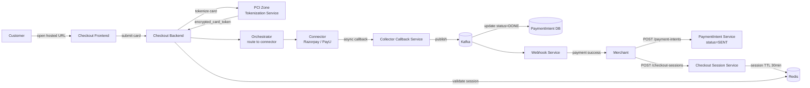
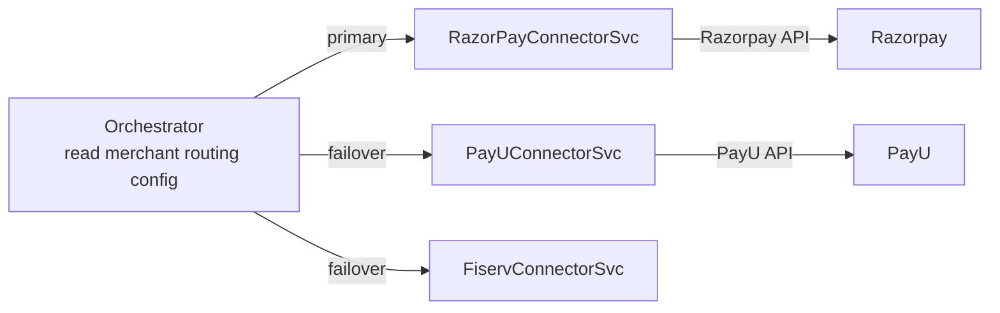
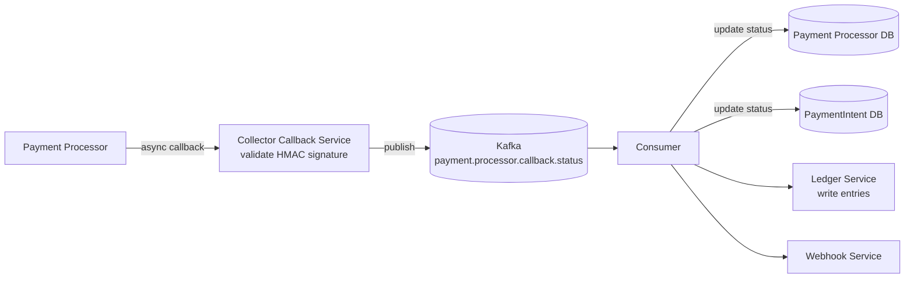

# Payment System Design

## System Overview
A payment gateway platform (think Stripe / Razorpay) that processes card payments through a PaymentIntent → Checkout Session → PCI-scoped tokenization → Processor Connector pipeline — handling authorization, capture, settlement, refunds, and fraud detection with strong consistency and PCI-DSS compliance.

## 1. Requirements

### Functional Requirements
- Merchant onboarding and API key management
- Create payment intents and hosted checkout sessions
- Accept card payments with PCI-compliant tokenization
- Route payments to multiple processor connectors (Razorpay, PayU, Fiserv)
- Payment authorization and capture
- Async callback handling from processors
- Refunds (full and partial)
- Recurring payments / subscriptions
- Payment status tracking and webhooks to merchants
- Reconciliation with processors (T+1)

### Non-Functional Requirements
- Availability: 99.999% — payment downtime = revenue loss
- Latency: <500ms for payment authorization
- Consistency: Strong — no double charge, no missed payment
- Durability: Every payment event permanently recorded
- Security: PCI-DSS Level 1 compliance, HSM-backed tokenization, TLS everywhere
- Idempotency: Retried payments must not result in double charge

## 2. Back-of-the-Envelope Estimation

### Assumptions
- 100M merchants, 1B end users
- 10M transactions/day average; 100M during peak (Black Friday)
- Average transaction: $50

### Traffic
```
Transactions/sec (avg)  = 10M / 86400 ≈ 116/sec
Transactions/sec (peak) = 100M / 86400 ≈ 1157/sec
```

### Storage
```
Transactions/day    = 10M × 1KB = 10GB/day → ~3.6TB/year
Ledger entries      = 10M × 3 entries × 300B = 9GB/day
```

## 3. Architecture Diagram

### Components

| Component | Role |
|---|---|
| API Gateway & LB | Auth (API key / JWT), rate limiting, TLS termination; PCI-DSS boundary |
| PaymentIntent Service | Merchant creates payment intent; returns payment_intent_id |
| Checkout Session Service | Creates session tied to intent; stores in Redis (TTL 30min); returns hosted URL |
| Checkout Frontend Service | Serves hosted checkout HTML/JS; card form never on merchant's servers |
| Checkout Backend Service | Handles form submission; validates session; calls Tokenization Service + Orchestrator |
| PCI Zone — Tokenization Service | Isolated zone; validate → fingerprint → vault in HSM → return encrypted_card_token |
| Orchestrator Service | Routes payment to correct processor connector based on merchant config |
| Processor Gateway | Abstraction layer over multiple processors |
| Connector Services | Adapters: RazorPayConnectorSvc, PayUConnectorSvc, FiservConnectorSvc |
| Collector Callback Service | Receives async callbacks from processors; publishes to Kafka |
| Fraud Detection Service | Real-time scoring; blocks high-risk payments |
| Refund Service | Processes full/partial refunds via connectors |
| Ledger Service | Double-entry bookkeeping; immutable |
| Webhook Service | Delivers payment status updates to merchants |
| PaymentIntent DB (PostgreSQL) | payment_intent_id, status, amount, currency, card_token |
| Payment Processor DB (PostgreSQL) | Processor-level records for reconciliation |
| Card DB (HSM-backed Vault) | Encrypted card data; isolated in PCI Zone |
| Redis | Checkout session state (TTL), idempotency keys, fraud velocity signals |
| Kafka | Async processor callbacks, T+1 settlement events |

### Overview

```mermaid
flowchart LR
    merchant["Merchant"]
    customer["Customer"]
    apigw["API Gateway & LB<br/>PCI-DSS boundary"]

    intentSvc["PaymentIntent Service"]
    sessionSvc["Checkout Session Service"]
    checkoutFE["Checkout Frontend<br/>hosted card form"]
    checkoutBE["Checkout Backend<br/>validate session"]
    pciZone["PCI Zone<br/>Tokenization Service<br/>HSM-backed Card Vault"]
    orchestrator["Orchestrator Service<br/>route to connector"]
    connectors["Connector Services<br/>Razorpay · PayU · Fiserv"]
    callbackSvc["Collector Callback Service"]
    fraud["Fraud Detection Service"]
    ledger["Ledger Service"]
    webhookSvc["Webhook Service"]

    intentDB[("PaymentIntent DB<br/>PostgreSQL")]
    processorDB[("Payment Processor DB<br/>PostgreSQL")]
    redis[("Redis<br/>session · idempotency · fraud")]
    kafka[("Kafka<br/>callbacks · settlement")]

    merchant --> apigw
    apigw --> intentSvc
    intentSvc --> intentDB
    intentSvc -->|"payment_intent_id"| merchant
    merchant -->|"create session"| sessionSvc
    sessionSvc -->|"session state TTL 30min"| redis
    sessionSvc -->|"hosted URL"| merchant

    customer -->|"open checkout URL"| checkoutFE
    checkoutFE -->|"submit card"| checkoutBE
    checkoutBE -->|"validate session"| redis
    checkoutBE --> pciZone
    pciZone -->|"encrypted_card_token"| checkoutBE
    checkoutBE --> fraud
    checkoutBE --> orchestrator
    orchestrator --> connectors
    connectors -->|"async callback"| callbackSvc
    callbackSvc -->|"publish"| kafka
    kafka --> processorDB
    kafka --> intentDB
    kafka --> ledger
    kafka --> webhookSvc
    webhookSvc --> merchant
```



## 4. Key Flows

### 4.1 Full Payment Flow (Card)



Session validation before processing:
- Session exists in Redis (not expired)
- `intent_id` matches request
- `merchant_id` matches API key
- Session `state = ACTIVE` (not already used)

### 4.2 PCI Zone — Tokenization

Isolated network segment; only Checkout Backend can call in. Steps:
1. Validate request
2. Generate card fingerprint: `SHA256(PAN + expiry)` — dedup without storing PAN
3. Vault: store encrypted PAN in HSM-backed Card DB
4. Return `encrypted_card_token`

Raw PAN never leaves the PCI Zone. All other systems use tokens.

### 4.3 Processor Connector Pattern



Orchestrator selects connector based on merchant config, payment method, currency. Each connector is an independent service — adding a new processor = new connector, no Orchestrator changes.

### 4.4 Async Callback Handling



### 4.5 Refund Flow

1. Merchant calls `POST /payments/{intentId}/refund`
2. Refund Service validates: intent is DONE, refund amount ≤ original
3. Calls appropriate Connector to initiate refund at processor
4. Processor confirms → update records, write ledger credit entry
5. Webhook to merchant

## 5. Database Design

### Selection Reasoning

| Store | Why |
|---|---|
| PostgreSQL (PaymentIntent DB) | ACID for intent state transitions |
| PostgreSQL (Payment Processor DB) | Processor-level records; reconciliation queries |
| PostgreSQL (Ledger DB) | Immutable double-entry; financial compliance |
| HSM-backed Card Vault | PCI-DSS requirement; hardware encryption; isolated network zone |
| Redis | Session state (TTL), idempotency keys, fraud velocity checks |
| Kafka | Async processor callbacks; T+1 settlement events |

### PostgreSQL — payment_intents

| Field | Type |
|---|---|
| payment_intent_id | UUID (PK) |
| status | ENUM (SENT / DONE / FAILED / CANCELLED) |
| amount | DECIMAL(18,2) |
| currency | VARCHAR(3) |
| merchant_id | UUID |
| payment_method | ENUM (CARD / UPI / BANK / WALLET) |
| order_id | UUID |
| customer | JSONB |
| card_token | VARCHAR, nullable |
| metadata | JSONB |
| created_at | TIMESTAMP |

### PostgreSQL — ledger (immutable)

| Field | Type |
|---|---|
| entry_id | UUID (PK) |
| txn_id | UUID |
| account_type | ENUM (customer / merchant / platform / processor) |
| entry_type | ENUM (debit / credit) |
| amount | DECIMAL(18,2) |
| event_type | VARCHAR (authorization / capture / refund / fee) |
| created_at | TIMESTAMP |

### Redis Keys

| Key Pattern | Type | Value | TTL |
|---|---|---|---|
| `checkout:session:{sessionId}` | String | session state JSON | 1800s |
| `idempotency:{key}` | String | txn_id | 86400s |
| `fraud:velocity:{customerId}` | Counter | txn count in window | 3600s |

## 6. Key Interview Concepts

### PaymentIntent Pattern
Separates "intent to pay" from "actual payment". Merchant creates intent server-side without exposing API keys to frontend. Intent can be updated before checkout. Idempotent: same intent can be retried without duplicate charges.

### Hosted Checkout (PCI Scope Reduction)
Card form served from payment gateway's domain. Merchant's servers never see raw card data. Merchant is out of PCI scope. This is how Stripe Checkout and Razorpay's hosted page work.

### PCI Zone Isolation
Tokenization Service and Card DB in strictly isolated network zone. Only Checkout Backend can call in. HSM handles all encryption/decryption. Raw PAN never leaves the PCI Zone.

### Connector Pattern for Multi-Processor
Each connector translates to processor-specific protocol. Adding a new processor = new connector, no Orchestrator changes. Failover: Orchestrator retries on different connector if one fails.

### Idempotency
Merchant generates `idempotency_key` before first attempt. Stored in Redis (24hr TTL) and DB (unique constraint). On retry: same key → return original result, no new charge. Connectors pass idempotency key to processors.

### Double-Entry Ledger
```
Card payment $100:
  DEBIT  customer_account    $100
  CREDIT platform_holding    $100

On settlement:
  DEBIT  platform_holding    $97   (after 3% fee)
  CREDIT merchant_account    $97
```

### Authorization vs Capture
Authorization: funds held, not transferred. Capture: transfer the funds. Two-step allows pre-authorization for hotels/car rentals, capture only on shipment, partial capture.

## 7. Failure Scenarios

### Processor Timeout (Async Callback Not Received)
- Recovery: poll processor status API; if confirmed, update DB; if not, mark failed and retry
- Prevention: idempotency key prevents double charge on retry

### Checkout Session Expired
- Recovery: return session expired error; merchant creates new session
- Prevention: 30-min TTL is generous; warn customer at 25 min

### Tokenization Service (PCI Zone) Failure
- Recovery: HSM-backed vault is highly available (multi-AZ); brief unavailability → queue checkout requests
- Prevention: multiple HSM instances; geographic redundancy

### Reconciliation Discrepancy
- Recovery: Reconciliation Service flags it; finance team investigates
- Prevention: retain raw processor callbacks; compare against settlement report; alert on discrepancy rate > 0.1%
