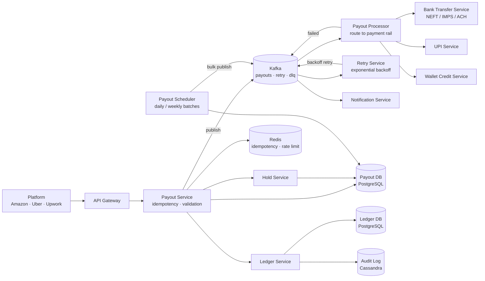
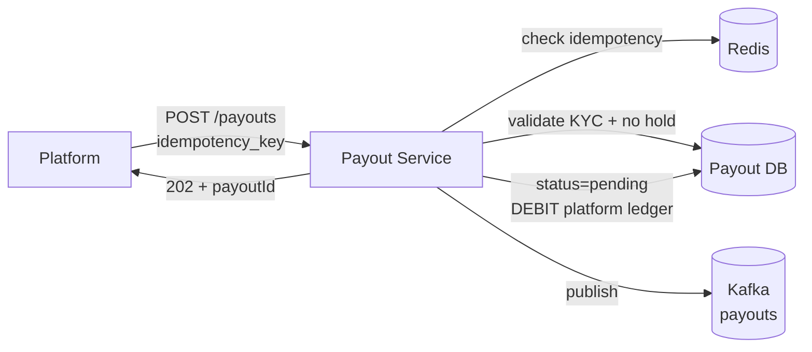
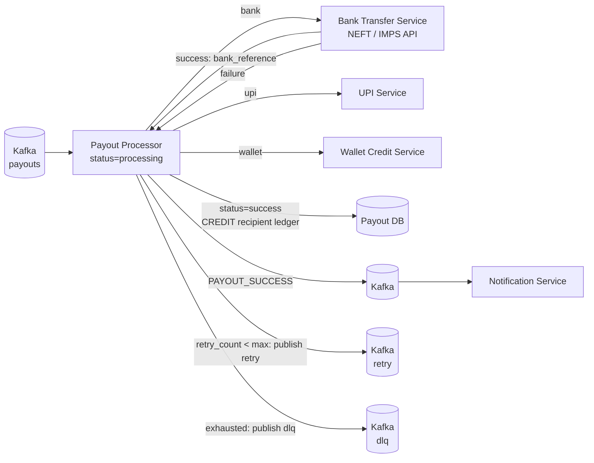
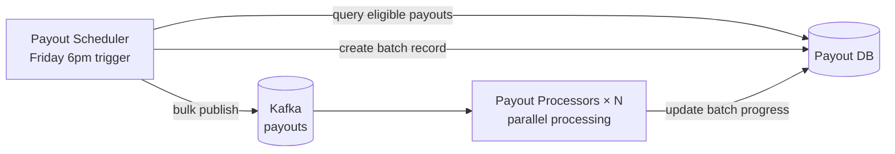

# Payout System Design

## System Overview
A payout system that disburses money from a platform to multiple recipients (sellers, drivers, freelancers, affiliates) — handling bulk payouts, bank transfers, UPI/wallet credits, scheduling, failure retries, and reconciliation.

## 1. Requirements

### Functional Requirements
- Schedule and initiate payouts to recipients (bank transfer, UPI, wallet)
- Bulk payout processing (thousands of recipients in one batch)
- Payout status tracking (pending / processing / success / failed)
- Retry failed payouts automatically
- Hold/release payouts (fraud hold, compliance review)
- Payout history and statements for recipients
- Reconciliation with bank/payment gateway

### Non-Functional Requirements
- Availability: 99.99%
- Consistency: Strong — no double payout, no missed payout
- Durability: Every payout instruction must be persisted before processing
- Idempotency: Retried payouts must not result in double disbursement
- Auditability: Complete audit trail for every payout action

## 2. Back-of-the-Envelope Estimation

### Assumptions
- 1M recipients, 5M payouts/day
- Peak: end of week/month settlement — 10× normal
- Payout methods: 60% bank transfer, 30% UPI, 10% wallet

### Traffic
```
Payouts/sec (avg)   = 5M / 86400 ≈ 58/sec
Payouts/sec (peak)  = 580/sec (settlement day)
Bank API calls/sec  = 58 × 0.6 = 35/sec (rate-limited by bank)
```

### Storage
```
Payout records/day  = 5M × 1KB = 5GB/day → ~1.8TB/year
Ledger entries      = 5M × 2 entries × 300B = 3GB/day
```

## 3. Architecture Diagram

### Components

| Component | Role |
|---|---|
| API Gateway | Auth, rate limiting, routing |
| Payout Service | Core orchestrator; creates payout instructions; idempotency enforcement |
| Payout Scheduler | Triggers scheduled payout batches; publishes to Kafka |
| Payout Processor | Kafka consumer; routes to payment rail; updates status |
| Bank Transfer Service | Integrates with NEFT/RTGS/IMPS/ACH APIs |
| UPI Service | Integrates with UPI payment rails; VPA validation |
| Wallet Credit Service | Credits internal wallet balance; direct DB update |
| Retry Service | Monitors failed payouts; exponential backoff retry |
| Hold Service | Manages payout holds (fraud, compliance) |
| Ledger Service | Double-entry bookkeeping; immutable |
| Reconciliation Service | Matches payout records with bank/gateway confirmations |
| Notification Service | Kafka consumer; notifies recipients of payout status |
| Payout DB (PostgreSQL) | Payout instructions, status, recipient details |
| Ledger DB (PostgreSQL) | Double-entry ledger, immutable |
| Audit Log (Cassandra) | Immutable audit trail |
| Redis | Idempotency keys, payout state cache, bank API rate limiting |
| Kafka | Payout job queue, retry queue, dead letter queue |

### Overview



## 4. Key Flows

### 4.1 Single Payout Initiation



1. Platform sends `idempotency_key = hash(recipientId + amount + date)`
2. Check Redis — if key exists, return existing `payoutId` (no duplicate)
3. Validate: recipient KYC verified, no hold, sufficient platform balance
4. Write payout record (`status = pending`) + ledger debit entry
5. Publish to Kafka → return `payoutId` immediately

### 4.2 Payout Processing



### 4.3 Bulk Payout (Batch)



### 4.4 Retry Flow

Failed payout → `retry` topic → Retry Service applies backoff (5min, 30min, 2hr, 24hr) → after max retries → `dead_letter` topic → alert ops team

### 4.5 Payout Hold

Fraud/compliance flags recipient → Hold Service sets `payout_hold = true` → Payout Processor skips held payouts → on hold release, status reset to `pending`, re-published to Kafka

## 5. Database Design

### PostgreSQL — payouts

| Field | Type |
|---|---|
| payout_id | UUID (PK) |
| recipient_id | UUID |
| amount | DECIMAL(18,2) |
| currency | VARCHAR |
| method | ENUM (bank / upi / wallet) |
| status | ENUM (pending / processing / success / failed / held / cancelled) |
| idempotency_key | VARCHAR, unique |
| bank_reference | VARCHAR, nullable |
| retry_count | INT |
| max_retries | INT |
| scheduled_at | TIMESTAMP |
| processed_at | TIMESTAMP, nullable |
| failure_reason | TEXT, nullable |
| batch_id | UUID, nullable |

### PostgreSQL — recipients

| Field | Type |
|---|---|
| recipient_id | UUID (PK) |
| name | VARCHAR |
| bank_account | VARCHAR (encrypted) |
| ifsc_code | VARCHAR |
| upi_vpa | VARCHAR, nullable |
| kyc_status | ENUM (pending / verified / rejected) |
| payout_hold | BOOLEAN |
| created_at | TIMESTAMP |

### PostgreSQL — ledger (double-entry, immutable)

| Field | Type |
|---|---|
| entry_id | UUID (PK) |
| payout_id | UUID |
| account_id | VARCHAR |
| entry_type | ENUM (debit / credit) |
| amount | DECIMAL(18,2) |
| balance_after | DECIMAL |
| created_at | TIMESTAMP |

### Redis Keys

| Key Pattern | Type | Value | TTL |
|---|---|---|---|
| `idempotency:{key}` | String | payout_id | 86400s |
| `payout:status:{payoutId}` | String | status | 300s |
| `bank:rate:{bankCode}` | Counter | API calls in window | 60s |

## 6. Key Interview Concepts

### Idempotency is Critical
Bank APIs can time out. Retrying without idempotency = double payout. Platform generates `idempotency_key` before first attempt. Bank APIs also support idempotency keys — pass through to prevent double transfer.

### Double-Entry Ledger
```
Payout $100 to seller:
  DEBIT  platform_account  $100
  CREDIT seller_account    $100
```
Sum of all entries = 0. Enables reconciliation and audit.

### Bank API Rate Limits
Banks rate-limit API calls (e.g., 100 NEFT requests/sec). Redis counter per bank: `INCR bank:rate:{bankCode}` with 60s window. If rate exceeded: queue payout for next window.

### Payout Timing Windows
NEFT: batch processing, 30-min settlement windows. IMPS: 24/7, instant. RTGS: large amounts, business hours. Payout Processor selects appropriate rail based on amount, urgency, and time of day.

### KYC Validation
Always check `kyc_status = verified` before processing. Payouts to unverified recipients are held until KYC completes.

## 7. Failure Scenarios

### Bank API Timeout
- Recovery: retry with same idempotency key; bank returns same result if already processed
- Prevention: idempotency key prevents double transfer

### Payout Processor Crash Mid-Processing
- Detection: Kafka message not acknowledged
- Recovery: Kafka redelivers; Processor checks current status in DB — if already `success`, skip
- Prevention: idempotency key prevents double processing

### PostgreSQL Failure
- Recovery: promote replica; Payout Processor retries after DB recovery; Kafka retains messages
- Prevention: synchronous replication; automated failover

### Insufficient Platform Balance
- Detection: ledger balance check before payout initiation
- Recovery: hold all pending payouts; alert finance team
- Prevention: minimum balance alerts; auto top-up from reserve account
