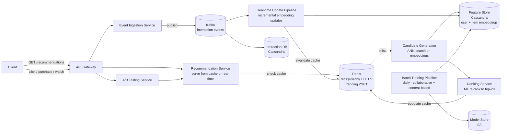
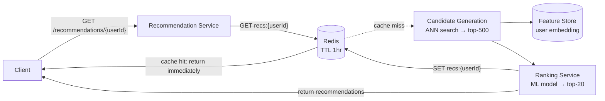
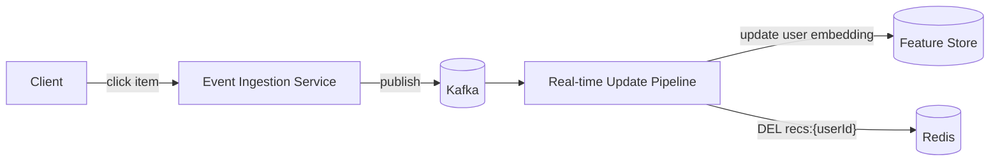
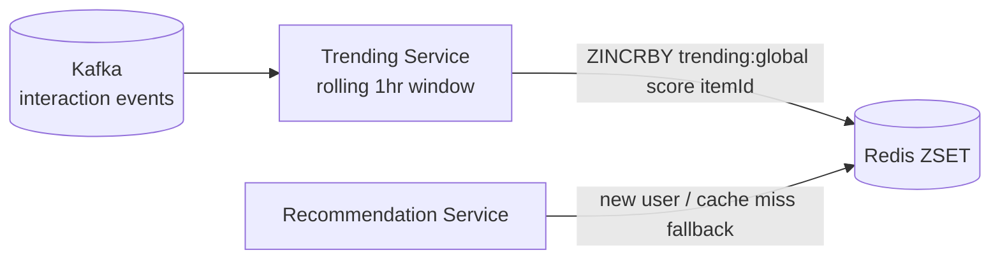

# Recommendation System Design

## System Overview
A recommendation engine that suggests relevant items (products, videos, articles, friends) to users based on their behavior, preferences, and similarity to other users — used across ecommerce, streaming, social media, and content platforms.

## 1. Requirements

### Functional Requirements
- Generate personalized item recommendations for each user
- Support multiple recommendation types: collaborative filtering, content-based, trending, similar items
- Real-time updates based on recent user actions (clicks, purchases, watches)
- A/B testing of recommendation algorithms
- Explain recommendations ("Because you watched X")

### Non-Functional Requirements
- Latency: <100ms for recommendation serving
- Scalability: 1B+ users, 500M+ items
- Freshness: Recommendations updated within minutes of user action
- Availability: 99.99% — fall back to trending if personalization unavailable

## 2. Back-of-the-Envelope Estimation

### Assumptions
- 1B users, 500M items
- 100M DAU, each requests recommendations 10 times/day
- User interaction events: 1B/day

### Traffic
```
Recommendation requests/sec = 100M × 10 / 86400 ≈ 11.6K/sec
Interaction events/sec      = 1B / 86400 ≈ 11.6K/sec
```

### Storage
```
Item embeddings              = 500M × 128 dim × 4B = 256GB
User embeddings              = 1B × 128 dim × 4B = 512GB
Pre-computed recommendations = 1B users × 20 items × 8B = 160GB (Redis)
```

## 3. Architecture Diagram

### Components

| Component | Role |
|---|---|
| API Gateway | Auth, rate limiting, routing |
| Recommendation Service | Serves recommendations; reads from pre-computed cache; falls back to real-time |
| Event Ingestion Service | Receives user interaction events; publishes to Kafka |
| Feature Store | Stores user and item embeddings; serves features to models |
| Batch Training Pipeline | Daily job; trains collaborative filtering + content-based models; generates embeddings |
| Real-time Update Pipeline | Kafka consumer; updates user embeddings incrementally; refreshes cache for active users |
| Candidate Generation Service | ANN search on embeddings; retrieves top-500 candidates |
| Ranking Service | Re-ranks 500 candidates using ML model; produces final top-20 |
| A/B Testing Service | Routes users to different algorithms; tracks metrics per variant |
| Pre-computed Cache (Redis) | Stores top-20 recommendations per user; TTL 1hr |
| Feature Store DB (Cassandra) | User and item embeddings, behavioral features |
| Interaction DB (Cassandra) | Raw interaction events, user history |
| Model Store (S3) | Trained model artifacts |
| Kafka | Interaction event stream, real-time update triggers |

### Overview



## 4. Key Flows

### 4.1 Recommendation Serving



Cache hit: <1ms. Cache miss: ~50–100ms (ANN search + ranking).

### 4.2 Two-Stage Pipeline

Stage 1 — Candidate Generation (Recall):
- Goal: retrieve ~500 relevant candidates from 500M items fast
- Method: ANN search on user embedding (FAISS, ScaNN, Pinecone)
- Speed: <10ms for 500M items

Stage 2 — Ranking (Precision):
- Goal: rank 500 candidates to top-20 using rich features
- Method: gradient boosted trees or neural ranking model
- Features: user-item affinity, recency, diversity, business rules
- Speed: <50ms for 500 candidates

This two-stage approach is used by YouTube, Netflix, Amazon, TikTok.

### 4.3 Real-Time Updates



Next recommendation request triggers fresh generation with updated embedding.

### 4.4 Collaborative Filtering

"Users who liked X also liked Y."

Matrix Factorization: factorize user-item interaction matrix into user embeddings (U) and item embeddings (V). Predicted affinity = U[user] · V[item] (dot product). Users with similar embeddings have similar tastes.

Training: daily batch job on full interaction history (Spark / distributed training). Inference: ANN search on pre-computed embeddings.

### 4.5 Content-Based Filtering

"You liked X, here are items similar to X."

Item features: category, tags, description embeddings (BERT/sentence transformers). User profile: weighted average of features of items user interacted with. Recommend items with high cosine similarity to user profile.

### 4.6 Trending Recommendations (Cold Start Fallback)



## 5. Database Design

### Cassandra — user_interactions

Partition key: `user_id`, Clustering: `event_time DESC`

| Field | Type |
|---|---|
| user_id | UUID (partition key) |
| event_time | TIMESTAMP (clustering) |
| item_id | UUID |
| event_type | TEXT (click / purchase / watch / like / skip) |
| context | TEXT (JSON) |

### Cassandra — user_features

| Field | Type |
|---|---|
| user_id | UUID (PK) |
| embedding | BLOB (128-dim float vector) |
| top_categories | LIST\<VARCHAR\> |
| recent_items | LIST\<UUID\> (last 100) |
| updated_at | TIMESTAMP |

### Cassandra — item_features

| Field | Type |
|---|---|
| item_id | UUID (PK) |
| category | VARCHAR |
| tags | LIST\<VARCHAR\> |
| embedding | BLOB (128-dim float vector) |
| popularity_score | FLOAT |
| updated_at | TIMESTAMP |

### Redis Keys

| Key Pattern | Type | Value | TTL |
|---|---|---|---|
| `recs:{userId}` | List | ordered itemIds (top 20) | 3600s |
| `trending:global` | ZSET | itemId → score | 300s |
| `trending:{category}` | ZSET | itemId → score | 300s |
| `similar:{itemId}` | List | similar itemIds | 86400s |

## 6. Key Interview Concepts

### Cold Start Problem
New user: no interaction history → no personalized recommendations. Solutions: onboarding (ask interests), demographic-based, trending fallback, gradually personalize as user interacts.

New item: no interactions → not recommended by collaborative filtering. Solutions: content-based (use item features), exploration (occasionally show new items).

### ANN (Approximate Nearest Neighbor) Search
Finding exact nearest neighbors in 128-dim space across 500M items is too slow (O(N)). ANN algorithms (HNSW, IVF) trade small accuracy loss for massive speed gain — O(log N). FAISS (Facebook) and ScaNN (Google) are standard tools.

### Diversity vs Relevance
Pure relevance leads to filter bubbles. Solution: diversity constraints in ranking (max 3 items from same category in top-20). Serendipity: occasionally recommend slightly outside user's comfort zone.

### Implicit vs Explicit Feedback
- Explicit: ratings, likes — clear signal but rare
- Implicit: clicks, watch time, purchases, skips — abundant but noisy
- Watch time is a stronger signal than click

### Exploration vs Exploitation
Exploitation: recommend items you know the user likes. Exploration: occasionally recommend new items to learn preferences. Solution: epsilon-greedy or Thompson Sampling.

## 7. Failure Scenarios

### Feature Store Failure
- Impact: real-time generation fails; cache misses return trending
- Recovery: Recommendation Service falls back to trending/popular items
- Prevention: Redis cache absorbs most traffic; Feature Store only hit on cache miss

### Model Training Failure
- Impact: recommendations become stale (yesterday's model)
- Recovery: keep last N model versions; roll back to previous version
- Prevention: model validation before deployment; canary rollout

### Cache Miss Storm (Redis Failure)
- Impact: all requests hit Candidate Generation + Ranking — high latency
- Recovery: Redis Sentinel failover; cache rebuilds as requests come in
- Prevention: Redis Cluster; pre-warm cache for top 10M active users after recovery

### Recommendation Bias / Feedback Loop
- Scenario: model recommends popular items → users click → items become more popular → filter bubble
- Recovery: diversity constraints; periodic re-exploration; inject random items
- Prevention: monitor recommendation diversity metrics
