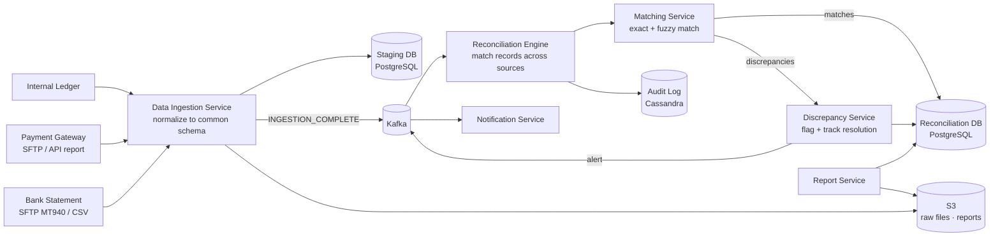
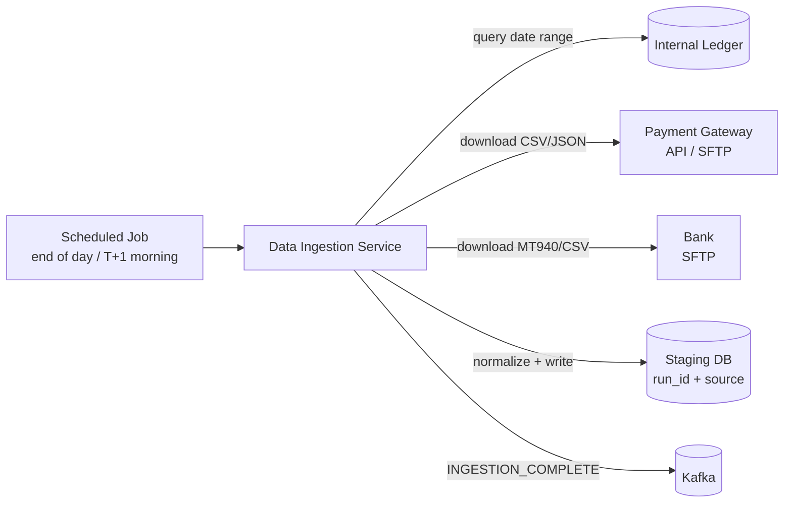
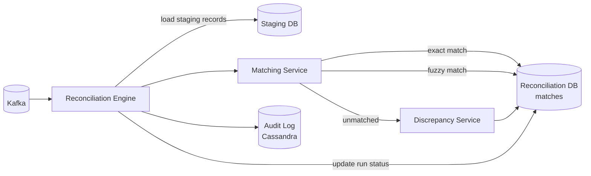
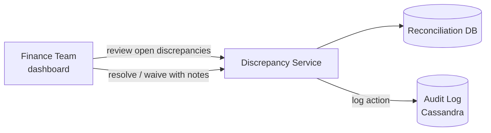

# Reconciliation System Design

## System Overview
A financial reconciliation system that compares transaction records across multiple systems (internal ledger, payment gateway, bank statements) to detect discrepancies, flag mismatches, and ensure financial data integrity — critical for fintech, payments, and banking platforms.

## 1. Requirements

### Functional Requirements
- Ingest transaction data from multiple sources (internal DB, payment gateway reports, bank statements)
- Match transactions across sources by amount, reference ID, timestamp
- Detect and flag discrepancies (missing transactions, amount mismatches, duplicates)
- Generate reconciliation reports (daily, weekly)
- Alert finance team on unresolved discrepancies
- Manual resolution workflow for flagged items
- Audit trail of all reconciliation runs

### Non-Functional Requirements
- Accuracy: 100% — every discrepancy must be detected
- Latency: Reconciliation run completes within 1hr for daily batch
- Scalability: 10M+ transactions/day
- Durability: Reconciliation results and audit logs must never be lost
- Idempotency: Re-running reconciliation must not create duplicate records

## 2. Back-of-the-Envelope Estimation

### Assumptions
- 10M transactions/day across all sources
- 3 data sources: internal ledger, payment gateway, bank
- Discrepancy rate: ~0.1% = 10K discrepancies/day

### Traffic
```
Records to process  = 10M × 3 sources = 30M records/day
Processing rate     = 30M / 3600s = 8.3K records/sec
Discrepancies/day   = 10K records to flag
```

### Storage
```
Transaction records = 30M × 500B = 15GB/day
Reconciliation runs = 365 × 15GB = 5.5TB/year
```

## 3. Architecture Diagram

### Components

| Component | Role |
|---|---|
| API Gateway | Auth, routing for manual resolution UI and report APIs |
| Data Ingestion Service | Pulls/receives data from each source; normalizes to common schema; writes to Staging DB |
| Reconciliation Engine | Core batch processor; reads from Staging DB; matches records; writes results |
| Matching Service | Exact match (same reference ID + amount) and fuzzy match (amount + time window) |
| Discrepancy Service | Manages flagged discrepancies; tracks resolution status; notifies finance team |
| Report Service | Generates daily/weekly reports; exports to CSV/PDF; stores to S3 |
| Notification Service | Alerts finance team on unresolved discrepancies |
| Staging DB (PostgreSQL) | Normalized transaction records from all sources per run |
| Reconciliation DB (PostgreSQL) | Match results, discrepancy records, resolution history |
| Audit Log (Cassandra) | Immutable log of every reconciliation run and action |
| S3 | Raw source files, generated reports |
| Kafka | Triggers reconciliation runs, discrepancy alerts |

### Overview



## 4. Key Flows

### 4.1 Data Ingestion



Normalize all records to common schema: `reference_id, amount, currency, timestamp, source`.

### 4.2 Reconciliation Engine



Matching algorithm:
```
Phase 1 - Exact match:
  For each internal txn:
    IF gateway[ref_id] AND bank[ref_id] exist AND amounts match → EXACT_MATCH
    IF amounts differ → AMOUNT_MISMATCH discrepancy

Phase 2 - Fuzzy match (unmatched records):
  Find gateway records with same amount ± $0.01 within ±1hr
  If found → FUZZY_MATCH (flag for human review)

Phase 3 - Unmatched:
  Remaining records → MISSING discrepancies
```

### 4.3 Discrepancy Resolution



Resolution options: resolved (matched after investigation), waived (expected difference, e.g., bank fee), investigating (pending more info).

### 4.4 Report Generation

Report Service queries Reconciliation DB → generates summary (total transactions, match rate, discrepancy breakdown) → exports to CSV/PDF → stores to S3 → emails finance team.

## 5. Database Design

### PostgreSQL — staging_transactions

| Field | Type |
|---|---|
| staging_id | UUID (PK) |
| run_id | UUID |
| source | ENUM (internal / gateway / bank) |
| reference_id | VARCHAR |
| amount | DECIMAL(18,2) |
| currency | VARCHAR |
| transaction_time | TIMESTAMP |
| status | VARCHAR |
| raw_data | JSONB |

### PostgreSQL — reconciliation_runs

| Field | Type |
|---|---|
| run_id | UUID (PK) |
| run_date | DATE |
| status | ENUM (running / completed / failed) |
| total_records | INT |
| matched_count | INT |
| discrepancy_count | INT |
| started_at | TIMESTAMP |
| completed_at | TIMESTAMP |

### PostgreSQL — discrepancies

| Field | Type |
|---|---|
| discrepancy_id | UUID (PK) |
| run_id | UUID |
| type | ENUM (missing_in_gateway / missing_in_bank / amount_mismatch / duplicate) |
| reference_id | VARCHAR |
| internal_amount | DECIMAL, nullable |
| gateway_amount | DECIMAL, nullable |
| bank_amount | DECIMAL, nullable |
| status | ENUM (open / investigating / resolved / waived) |
| resolved_by | UUID, nullable |
| resolved_at | TIMESTAMP, nullable |
| notes | TEXT |

### Cassandra — audit_log

| Field | Type |
|---|---|
| run_id | UUID (partition key) |
| event_time | TIMESTAMP (clustering) |
| event_type | TEXT |
| actor_id | UUID |
| details | TEXT (JSON) |

## 6. Key Interview Concepts

### Why Reconciliation is Hard
Data comes from multiple independent systems with different reference ID formats, timestamps (different timezones, settlement vs transaction time), amount precision, and latency (bank statement may be T+1 or T+2).

### Exact vs Fuzzy Matching
Exact match (same reference ID) is fast and reliable. Fuzzy match (same amount + time window) is needed when reference IDs don't align across systems. Fuzzy matches are flagged for human review — automated resolution is risky for financial data.

### Idempotency of Reconciliation Runs
Re-running for the same date must not create duplicate records. `run_id = hash(date + sources)`. Before processing, check if `run_id` already exists. If completed, skip. If failed, re-run from last checkpoint.

### T+1 / T+2 Settlement
Bank statements often reflect settlement date, not transaction date. A Monday transaction may appear in Tuesday's bank statement. Reconciliation must handle this by matching across a rolling window (±2 days) for bank matching.

### Double-Entry Verification
For internal ledger: sum of all debits must equal sum of all credits for any time period. Quick sanity check before external reconciliation. If internal books don't balance, there's a bug in the payment system itself.

## 7. Failure Scenarios

### Data Source Unavailable (Gateway/Bank)
- Recovery: retry ingestion with backoff; run partial reconciliation with available sources; flag missing source in report
- Prevention: multiple retry attempts; alert if source unavailable after 3 retries

### Reconciliation Engine Crash Mid-Run
- Recovery: idempotent run design — restart from beginning; staging data already loaded; re-processing produces same results
- Prevention: checkpoint progress to DB; resume from last checkpoint on restart

### Amount Mismatch Due to FX
- Recovery: normalize all amounts to base currency using exchange rate at transaction time
- Prevention: always store original currency + amount; normalize separately

### Large Discrepancy Volume
- Scenario: system bug causes 100K discrepancies in one run
- Recovery: alert finance team immediately; pause auto-resolution; manual review required
- Prevention: anomaly detection — alert if discrepancy rate > 1% (normal is 0.1%)
