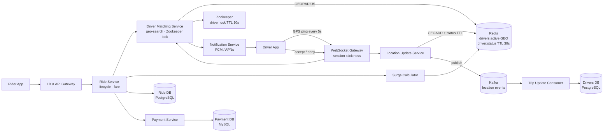
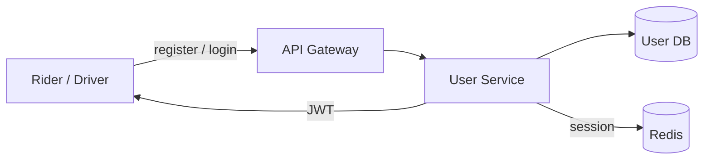
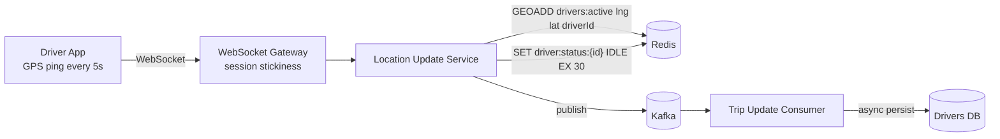
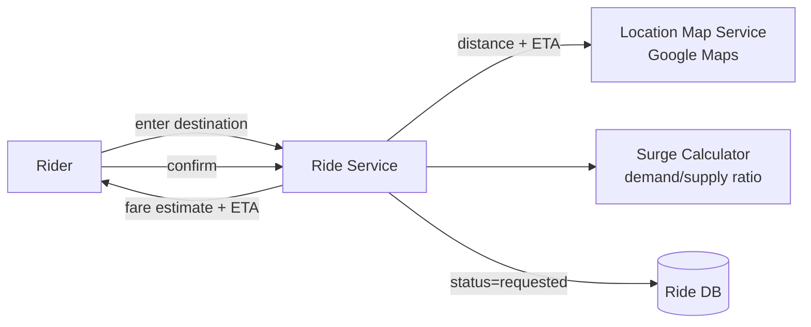
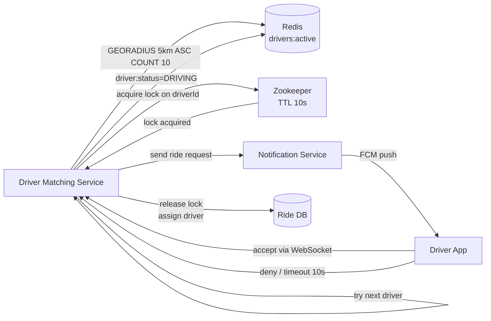
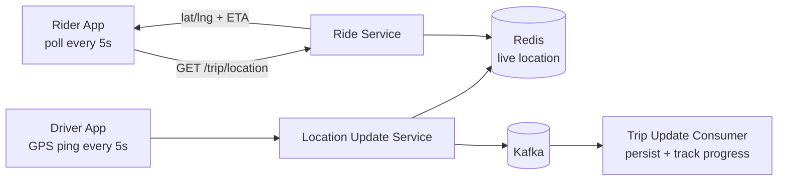
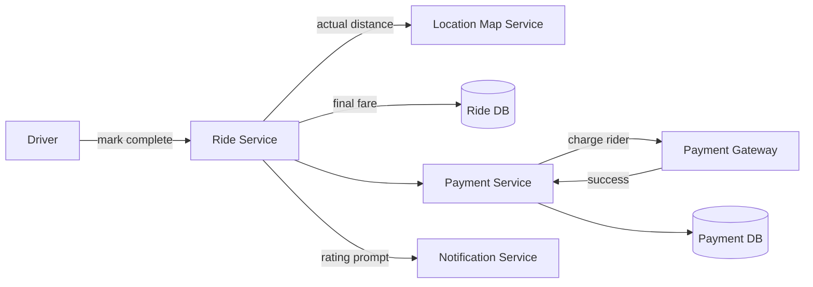

# Ride Booking System Design

## System Overview
A ride-hailing platform (think Uber / Ola) connecting riders with nearby drivers — handling real-time location tracking, driver matching, fare calculation, trip management, and payments with strong consistency on driver assignment.

## 1. Requirements

### Functional Requirements
- User and driver registration and authentication
- Rider requests a ride (vehicle type, pickup, destination)
- Match rider with nearest available driver
- Driver accepts or denies ride request
- Real-time location tracking of driver during trip
- Fare calculation (distance + wait time + surge pricing)
- Payment processing post-trip
- Ratings for rider and driver after trip
- Trip history

### Non-Functional Requirements
- Availability: 99.99%
- Latency: <500ms for driver matching; <5s for driver to receive request
- Scalability: 10M+ DAU, 1M+ concurrent active drivers
- Consistency: Strong consistency on driver assignment — one driver per ride
- Location freshness: Driver location updated every 5–10s

## 2. Back-of-the-Envelope Estimation

### Assumptions
- 10M DAU (riders), 1M active drivers at peak
- 5M rides/day; average trip: 20 min, 10 km
- Driver location update every 5s while active

### Traffic
```
Rides/sec (avg)         = 5M / 86400 ≈ 58/sec
Peak rides/sec          ≈ 580/sec (rush hour)
Driver location pings   = 1M × (1/5s) = 200K pings/sec
```

### Storage
```
Rides/day               = 5M × 2KB = 10GB/day → ~3.6TB/year
Driver location history = retain 30 days = ~52TB rolling
```

## 3. Architecture Diagram

### Components

| Component | Role |
|---|---|
| LB + API Gateway | Auth, rate limiting, routing |
| WebSocket Gateway | Persistent connections for drivers; session stickiness; receives location updates |
| Ride Service | Core ride lifecycle; fare calculation; creates ride records |
| Driver Matching Service | Geo-proximity search; sends ride request to driver; Zookeeper lock per driver |
| Location Update Service | Receives driver GPS pings; updates Redis geo-index; publishes to Kafka |
| Trip Update Consumer | Kafka consumer; persists driver location to Drivers DB; tracks trip progress |
| Surge Calculator Service | Calculates surge multiplier based on demand/supply ratio per geo cell |
| Rating Service | Post-trip ratings; Aggregator computes rolling averages |
| Payment Service | Post-trip payment processing |
| Notification Service | Sends ride requests to drivers (FCM/APNs); status updates to riders |
| Zookeeper | Distributed lock per driverId; ensures one ride request per driver at a time |
| Redis | Active driver geo-index (GEOADD/GEORADIUS), driver status TTL, sessions |
| Kafka | Location update stream, trip events |
| Ride DB (PostgreSQL) | Full ride/trip records with fare, route, status |
| Drivers DB (PostgreSQL) | Driver profiles, location, status, vehicle info, ratings |
| Payment DB (MySQL) | Payment records, fare breakdown |

### Overview



## 4. Key Flows

### 4.1 Auth



Drivers and riders have separate roles. Driver WebSocket connection validated on connect.

### 4.2 Driver Location Updates



Driver goes offline: TTL on `driver:status` expires → auto-removed from active pool.

### 4.3 Ride Request & Fare Estimation



Fare = (distance × rate/km + wait_time × rate/min) × surge_multiplier

### 4.4 Driver Matching — The Core Flow



1. `GEORADIUS drivers:active {lat} {lng} 5km ASC COUNT 10` — get nearest IDLE drivers
2. For top candidate: Zookeeper acquires lock on `driverId` (TTL 10s)
3. Send ride request via FCM; wait for accept/deny via WebSocket
4. Accept → assign driver, update ride status, notify rider
5. Deny or timeout → release lock, try next candidate
6. No candidates → expand radius; if still none → "no drivers available"

### 4.5 Active Trip Tracking



### 4.6 Trip Completion & Payment



## 5. Database Design

### Selection Reasoning

| Store | Why |
|---|---|
| PostgreSQL (Ride DB) | ACID for trip records, fare, payment linkage |
| PostgreSQL (Drivers DB) | Driver profiles + location; PostGIS for geo queries as fallback |
| MySQL (Payment DB) | PCI-DSS compliance, ACID, audit trail |
| Redis | Active driver geo-index (GEOADD/GEORADIUS), TTL-based presence |
| Zookeeper | Distributed lock per driverId — ensures single ride request per driver |
| Kafka | Location update stream, trip event log |

### PostgreSQL — rides

| Field | Type |
|---|---|
| ride_id | UUID (PK) |
| rider_id | UUID |
| driver_id | UUID, nullable |
| pickup | POINT (lat/lng) |
| destination | POINT (lat/lng) |
| status | ENUM (requested / accepted / in_progress / completed / cancelled) |
| vehicle_type | VARCHAR |
| fare | DECIMAL, nullable |
| placed_at | TIMESTAMP |

### Redis Keys

| Key Pattern | Type | Value | TTL |
|---|---|---|---|
| `drivers:active` | GEO | driverId → lat/lng | — |
| `driver:status:{driverId}` | String | IDLE / DRIVING | 30s |
| `ride:active:{rideId}` | String | ride state JSON | until completed |
| `session:{sessionId}` | String | `{userId, role}` | 86400s |

## 6. Key Interview Concepts

### Zookeeper for Driver Lock
Two ride requests must not go to the same driver simultaneously. Zookeeper provides a distributed lock per `driverId`:
- `SETNX lock:{driverId} {rideId}` — only one request acquires the lock
- TTL = 10s — auto-released if driver doesn't respond (no deadlock)

Why Zookeeper over Redis? Zookeeper provides stronger consistency guarantees (ZAB consensus protocol), purpose-built for distributed coordination. For a critical lock (driver assignment), Zookeeper is the safer choice.

### Redis GEO for Driver Proximity
`GEOADD` stores driver locations in a geo-indexed sorted set. `GEORADIUS` returns drivers within X km sorted by distance — O(N+log M). With 1M active drivers, fast enough for real-time matching.

### Session Stickiness on WebSocket Gateway
Consistent hashing on `driverId` ensures the same driver always connects to the same WebSocket Gateway instance. Driver's accept/deny response reaches the same instance that sent the request.

### Surge Pricing
Surge Calculator monitors demand/supply ratio per geographic cell (H3 hexagonal grid):
```
surge = f(active_ride_requests / available_drivers in area)
surge = 1.0 (normal) → 2.5× (high demand)
```
Recalculated every 30–60s.

### Location Update at Scale
200K pings/sec: Redis handles this easily (in-memory). Kafka absorbs the stream for async DB persistence. TTL on Redis driver status (30s) auto-cleans offline drivers.

### CAP Trade-off
- Driver assignment: CP — Zookeeper lock ensures one driver per ride
- Location tracking: AP — slight staleness acceptable, Redis TTL handles offline detection
- Fare/payment: CP — ACID transactions

## 7. Failure Scenarios

### No Driver Accepts
- Recovery: expand search radius (5km → 10km → 15km); if still none, notify rider
- Prevention: surge pricing incentivizes more drivers in high-demand areas

### Zookeeper Lock Not Released
- Recovery: lock TTL (10s) expires automatically; no manual intervention needed
- Prevention: TTL on all Zookeeper locks; never hold indefinitely

### Redis Failure (Active Driver Index Lost)
- Recovery: Redis Sentinel failover (<30s); active drivers rebuild index from next location ping (within 5–10s)
- Prevention: Redis Cluster + AOF; driver index rebuilds quickly from live pings

### Driver Goes Offline Mid-Trip
- Detection: no location ping for 30s (TTL expires)
- Recovery: alert ops; rider notified of delay; if driver reconnects, trip continues
- Prevention: driver app retries WebSocket connection aggressively

### Payment Failure Post-Trip
- Recovery: retry 3 times; if persistent, mark payment pending, notify rider to update payment method
- Prevention: idempotency key on payment; fallback to cash option
