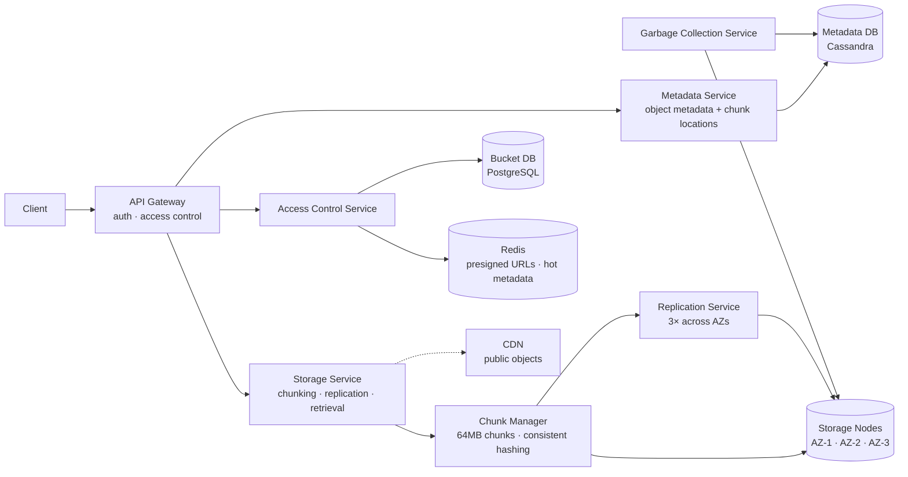
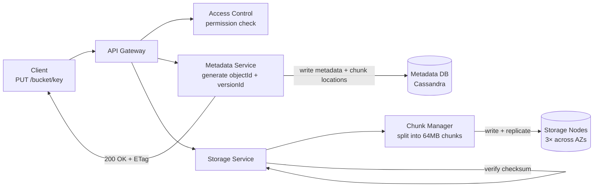
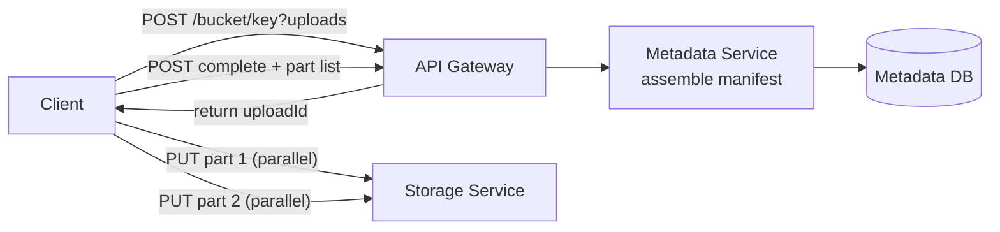
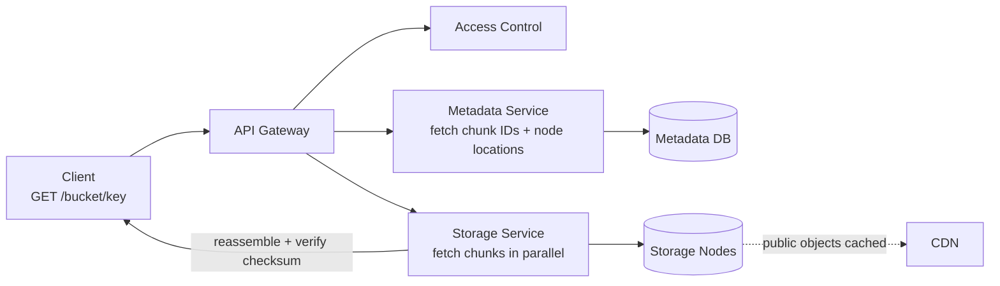
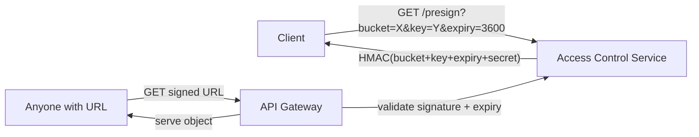

# S3-like Object Storage System Design

## System Overview
A distributed object storage service (think AWS S3 / Google Cloud Storage) that stores arbitrary files (objects) in buckets, provides high durability and availability, and serves objects at scale via a simple HTTP API.

## 1. Requirements

### Functional Requirements
- Create and delete buckets
- Upload, download, and delete objects (files of any size)
- List objects in a bucket
- Object versioning
- Access control (public / private / IAM policies)
- Pre-signed URLs for temporary access
- Multipart upload for large files

### Non-Functional Requirements
- Durability: 99.999999999% (11 nines) — data must never be lost
- Availability: 99.99%
- Latency: <100ms for small object reads; throughput-optimized for large files
- Scalability: Exabytes of storage, billions of objects
- Consistency: Strong read-after-write consistency

## 2. Back-of-the-Envelope Estimation

### Assumptions
- 1B objects stored, average size 1MB
- 100M uploads/day, 1B downloads/day
- Read:Write ratio = 10:1

### Traffic
```
Uploads/sec     = 100M / 86400 ≈ 1160/sec
Downloads/sec   = 1B / 86400   ≈ 11.6K/sec
Peak (3×)       ≈ 35K downloads/sec
```

### Storage
```
Total objects       = 1B × 1MB = 1PB
With 3× replication = 3PB
Growth/day          = 100M × 1MB = 100TB/day
```

## 3. Architecture Diagram

### Components

| Component | Role |
|---|---|
| API Gateway | Auth, rate limiting, routing; validates bucket/object access permissions |
| Metadata Service | Stores object metadata (bucket, key, size, checksum, chunk locations, version); does NOT store object data |
| Storage Service | Manages actual object data storage across storage nodes; handles chunking, replication, retrieval |
| Storage Nodes | Physical/virtual machines with large disks; store object chunks; replicated across AZs |
| Chunk Manager | Splits large objects into 64MB chunks; tracks chunk-to-object mapping; manages replication |
| Replication Service | Ensures each chunk is replicated to 3 nodes across different AZs; handles re-replication on node failure |
| Garbage Collection Service | Cleans up deleted objects and orphaned chunks asynchronously |
| Access Control Service | Evaluates bucket policies, IAM permissions, pre-signed URL validity |
| Metadata DB (Cassandra) | Object metadata: bucket, key, version, chunk locations, checksum, size |
| Bucket DB (PostgreSQL) | Bucket metadata, ownership, policies, versioning config |
| Redis | Pre-signed URL cache, hot metadata cache, rate limiting |
| CDN | Caches frequently accessed public objects at edge |

### Overview



## 4. Key Flows

### 4.1 Object Upload (Single-Part)



1. Access Control validates permission
2. Metadata Service generates `objectId`, `versionId`
3. Storage Service splits data into 64MB chunks
4. Chunk Manager assigns each chunk to 3 storage nodes (across AZs) via consistent hashing
5. Data written to primary node, replicated to 2 replicas; write quorum = 2/3
6. Checksum computed and verified
7. Metadata Service writes object metadata to Cassandra (chunk locations, checksum, size)
8. Return 200 OK with `ETag` (checksum)

### 4.2 Multipart Upload (Large Files)



1. Initiate: `POST /bucket/key?uploads` → returns `uploadId`
2. Upload parts in parallel: `PUT /bucket/key?partNumber=N&uploadId=X`
3. Complete: `POST /bucket/key?uploadId=X` with part list
4. Metadata Service assembles manifest; writes final object record
5. Parts cleaned up after assembly

### 4.3 Object Download



### 4.4 Pre-signed URLs



### 4.5 Replication & Durability

Each chunk replicated to 3 nodes across 3 AZs. Write quorum: 2/3 nodes must acknowledge. On node failure: Replication Service detects (heartbeat), re-replicates affected chunks to a new node. Cross-region replication: optional async copy for disaster recovery.

## 5. Database Design

### Selection Reasoning

| Store | Why |
|---|---|
| Cassandra (Metadata DB) | Billions of object metadata records; high read/write throughput; partition by bucket+key |
| PostgreSQL (Bucket DB) | Small number of buckets; ACID for policy/config changes |
| Redis | Pre-signed URL validation, hot metadata cache |
| Raw disk (Storage Nodes) | Actual object data — custom storage engine, not a DB |

### Cassandra — object_metadata

Partition key: `bucket_id`, Clustering: `object_key`

| Field | Type |
|---|---|
| bucket_id | UUID (partition key) |
| object_key | VARCHAR (clustering) |
| version_id | UUID |
| size_bytes | BIGINT |
| checksum_md5 | VARCHAR |
| content_type | VARCHAR |
| chunk_ids | LIST\<UUID\> |
| storage_class | VARCHAR (standard / infrequent / archive) |
| created_at | TIMESTAMP |
| deleted_at | TIMESTAMP, nullable |

### PostgreSQL — buckets

| Field | Type |
|---|---|
| bucket_id | UUID (PK) |
| owner_id | UUID |
| bucket_name | VARCHAR, unique |
| region | VARCHAR |
| versioning_enabled | BOOLEAN |
| access_policy | JSONB |
| created_at | TIMESTAMP |

## 6. Key Interview Concepts

### Why 11 Nines Durability
Achieved through: 3× replication across AZs, checksums on every chunk (detect corruption), erasure coding for archive storage, cross-region replication for disaster recovery.

### Erasure Coding vs Replication
- Replication (3×): store 3 full copies. Simple, fast reads. 200% storage overhead.
- Erasure coding (e.g., 6+3): split into 6 data + 3 parity chunks. Reconstruct from any 6 of 9. 50% storage overhead. More CPU. Used for cold/archive storage.

### Consistent Hashing for Storage Nodes
Chunk Manager uses consistent hashing to assign chunks to storage nodes. On node addition/removal, only chunks in the affected hash range need to move — minimizes data movement during scaling.

### Metadata vs Data Separation
Metadata (bucket, key, size, chunk locations) is tiny and query-heavy — stored in Cassandra. Actual data is large and sequential — stored on raw disk. Allows metadata to scale independently and be queried fast.

### Multipart Upload
For files >5GB, single-part upload is impractical (network interruption = restart from scratch). Multipart allows parallel upload of parts, resume on failure, and efficient large file handling.

## 7. Failure Scenarios

### Storage Node Failure
- Recovery: Replication Service identifies chunks with <3 replicas, re-replicates to healthy nodes
- Data available from remaining 2 replicas during recovery (read quorum = 1)

### Metadata DB (Cassandra) Failure
- Recovery: RF=3, QUORUM reads/writes continue on remaining nodes
- Prevention: multi-datacenter replication

### Chunk Corruption
- Detection: checksum mismatch on read
- Recovery: fetch chunk from another replica; re-replicate from healthy copy
- Prevention: periodic background scrubbing — read all chunks, verify checksums

### Partial Upload Failure
- Recovery: multipart upload allows resume from last successful part
- Incomplete multipart uploads cleaned up by GC after 7 days
