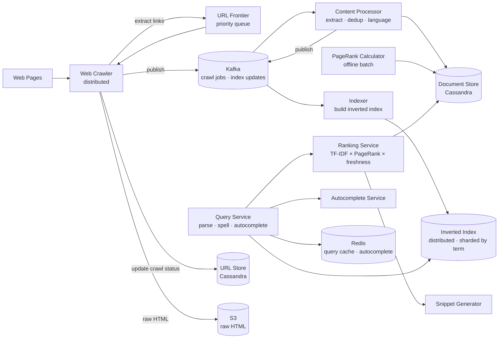
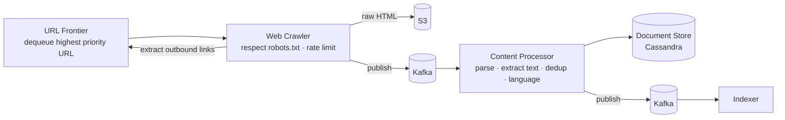
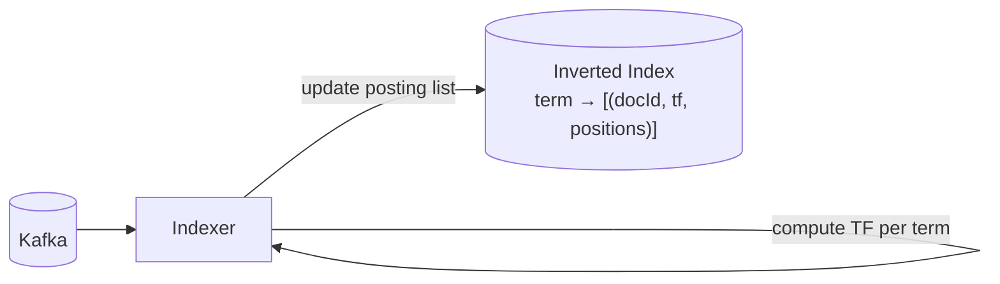
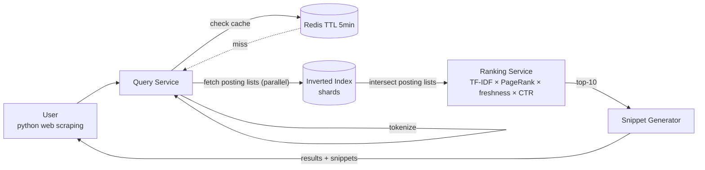
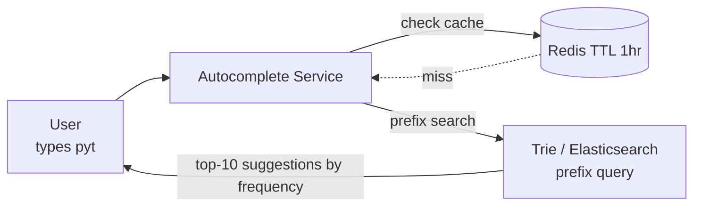

# Search Engine System Design

## System Overview
A web-scale search engine (think Google / Bing) that crawls the web, indexes content, and serves relevant search results in milliseconds — covering web crawling, indexing, ranking, and query serving.

## 1. Requirements

### Functional Requirements
- Crawl and index web pages continuously
- Full-text search with ranked results
- Autocomplete / query suggestions
- Spell correction
- Search result snippets with highlighted keywords
- Freshness: recently updated pages ranked appropriately
- Safe search filtering

### Non-Functional Requirements
- Latency: <200ms for search results
- Scale: 100B+ web pages indexed, 10B+ queries/day
- Freshness: popular pages re-crawled within hours; others within days/weeks
- Availability: 99.99%
- Relevance: results must be highly relevant to query

## 2. Back-of-the-Envelope Estimation

### Assumptions
- 100B web pages indexed; average page: 100KB raw, 10KB extracted text
- 10B queries/day, 100K queries/sec at peak
- 1B new/updated pages/day to crawl

### Traffic
```
Queries/sec (peak)  = 100K/sec
Crawl rate          = 1B pages/day = 11.6K pages/sec
```

### Storage
```
Raw pages           = 100B × 100KB = 10PB (compressed: ~2PB)
Extracted text      = 100B × 10KB  = 1PB
Inverted index      = ~500TB (compressed)
Page rank scores    = 100B × 8B = 800GB
```

## 3. Architecture Diagram

### Components

| Component | Role |
|---|---|
| URL Frontier | Priority queue of URLs to crawl; manages scheduling, politeness (robots.txt), recrawl frequency |
| Web Crawler | Distributed crawlers; fetches pages; stores raw HTML to S3; extracts links |
| Content Processor | Extracts text from HTML; deduplication; language detection |
| Indexer | Builds inverted index from processed documents |
| Inverted Index Store | Distributed index sharded by term; core data structure for search |
| Ranking Service | Scores documents using TF-IDF, PageRank, freshness, ML signals |
| PageRank Calculator | Offline batch job; computes PageRank from web graph |
| Query Service | Entry point for search; query parsing, spell correction, autocomplete; orchestrates lookup + ranking |
| Autocomplete Service | Prefix-based query suggestions; trie or Elasticsearch prefix search |
| Snippet Generator | Extracts relevant text snippet for display in results |
| Document Store (Cassandra) | Processed page content, metadata, PageRank scores |
| URL Store (Cassandra) | Crawled URLs, last crawl time, crawl frequency, status |
| Redis | Query cache, autocomplete cache |
| S3 | Raw crawled HTML, index snapshots |
| Kafka | Crawl job queue, index update stream |

### Overview



## 4. Key Flows

### 4.1 Web Crawling



Crawl priority: high for popular pages (high PageRank), recently updated, news sites. Politeness: max 1 request/sec per domain; respect Crawl-Delay in robots.txt.

### 4.2 Indexing



Posting lists sorted by relevance score (TF-IDF × PageRank) for fast retrieval.

### 4.3 Query Processing



1. Spell correction: "pythn" → "python"
2. Tokenize: ["python", "web", "scraping"]
3. Fetch posting lists for each term in parallel from index shards
4. Intersect: find docIds present in all posting lists
5. Rank: `score = TF-IDF × PageRank × freshness × click-through rate`
6. Top-10 → Snippet Generator → return results

### 4.4 PageRank Calculation

Offline batch job (runs weekly):
1. Build web graph: nodes = pages, edges = links
2. Run PageRank iteratively:
   ```
   PR(A) = (1-d) + d × Σ(PR(B) / outlinks(B))  for all B linking to A
   d = 0.85 (damping factor)
   ```
3. Converges after ~50 iterations
4. Store PageRank scores in Document Store

### 4.5 Autocomplete



## 5. Database Design

### Cassandra — documents

| Field | Type |
|---|---|
| doc_id | UUID (PK) |
| url | TEXT |
| title | VARCHAR |
| content_hash | VARCHAR (for dedup) |
| extracted_text | TEXT |
| language | VARCHAR |
| page_rank | FLOAT |
| last_crawled | TIMESTAMP |
| outbound_links | LIST\<TEXT\> |

### Inverted Index — posting list structure

```
term: "python"
→ posting list: [
    {docId: 123, tf: 5, positions: [10, 45, 102]},
    {docId: 456, tf: 3, positions: [5, 20]},
    ...
  ]  (sorted by relevance score)
```

Sharded by term hash across N index servers.

### Redis Keys

| Key Pattern | Type | Value | TTL |
|---|---|---|---|
| `query:cache:{queryHash}` | String | result JSON | 300s |
| `autocomplete:{prefix}` | List | suggested queries | 3600s |
| `trending:queries` | ZSET | query → frequency | 3600s |

## 6. Key Interview Concepts

### Inverted Index
Core data structure. Maps each term to a list of documents containing it:
```
"python" → [doc1, doc5, doc23, ...]
"scraping" → [doc5, doc12, ...]
Query "python scraping" → intersect → [doc5, ...]
```
Posting lists sorted by relevance score — top results retrieved without scanning entire list.

### TF-IDF Scoring
- TF (Term Frequency): how often term appears in document
- IDF (Inverse Document Frequency): how rare the term is across all documents
- TF-IDF = TF × IDF — "the" has high TF but low IDF → low score; "photosynthesis" has moderate TF but high IDF → high score

### PageRank
Measures page importance based on link structure. A page linked by many important pages has high PageRank. Iterative algorithm — converges to stable scores. Global quality signal independent of query.

### Crawl Freshness vs Efficiency
Popular pages (news, social media) change frequently — crawl every hour. Static pages change rarely — crawl weekly. URL Frontier assigns crawl priority based on historical change frequency and PageRank.

### Index Sharding
Inverted index is too large for one machine (500TB). Shard by term hash: all posting lists for terms "a-f" on shard 1, "g-m" on shard 2, etc. Query fans out to all shards in parallel, results merged and ranked.

### Deduplication
Web has massive duplicate content (mirrors, scrapers). Content hash (MD5/SHA256) detects exact duplicates. Near-duplicate detection: SimHash — if two pages have similar SimHash, they're near-duplicates. Only index one canonical version.

## 7. Failure Scenarios

### Crawler Blocked by Website
- Recovery: back off, retry after delay; mark domain as rate-limited
- Prevention: distributed crawlers with different IPs; respect robots.txt

### Index Shard Failure
- Impact: queries for terms on that shard return no results
- Recovery: replica shard serves reads; failed shard rebuilt from document store
- Prevention: each shard replicated to 3 nodes

### Stale Index (Crawl Lag)
- Recovery: prioritize recrawl of high-PageRank pages; real-time indexing for news/social
- Prevention: tiered crawl frequency based on page importance and change rate

### Query Spike (Trending Topic)
- Recovery: query cache in Redis absorbs repeated identical queries; auto-scale Query Service
- Prevention: aggressive caching for trending queries
