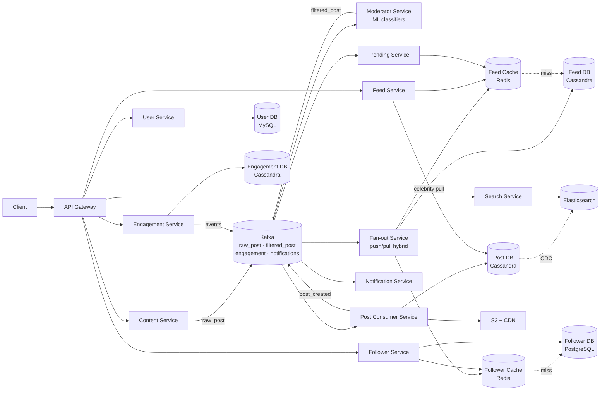
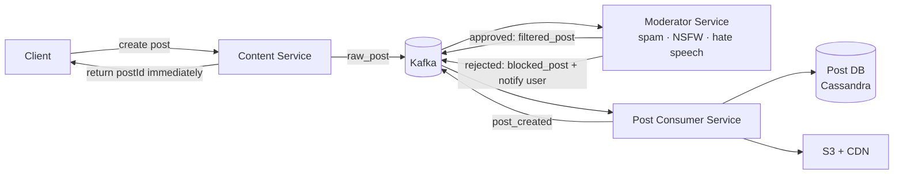
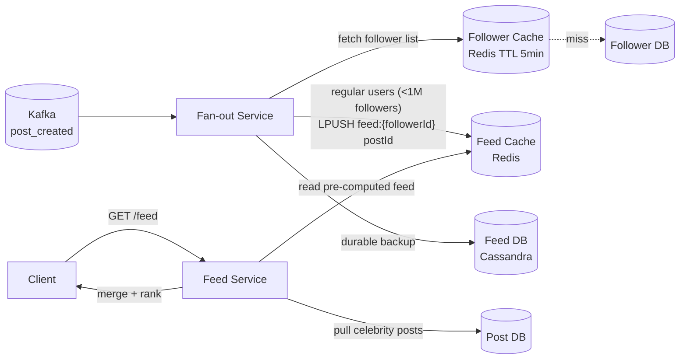
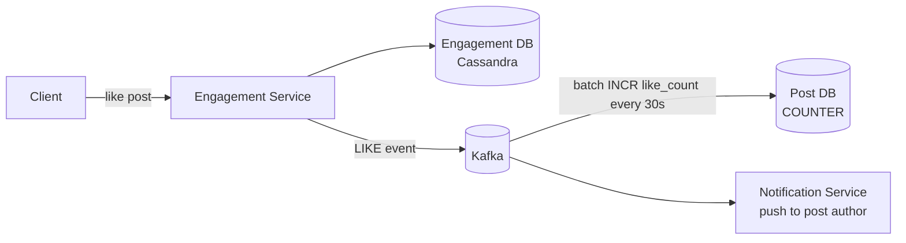
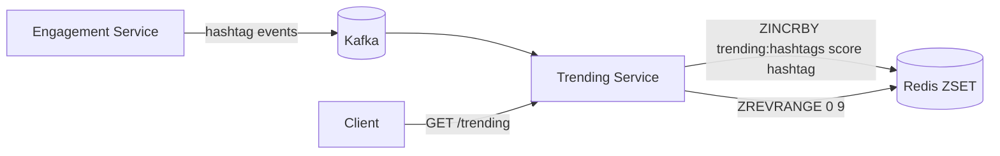

# Social Media System Design

## System Overview
A social media platform (think Twitter / Instagram / Facebook) where users post content, follow others, receive a personalized feed, interact via likes/comments/shares, and get real-time notifications.

## 1. Requirements

### Functional Requirements
- User registration, authentication, profile management
- Create posts (text, images, videos)
- Follow/unfollow users
- Personalized home feed (posts from followed users + recommendations)
- Like, comment, share posts
- Search users and posts
- Real-time notifications (likes, comments, follows, mentions)
- Direct messaging (basic)
- Trending topics/hashtags

### Non-Functional Requirements
- Availability: 99.99%
- Latency: <200ms feed load; <500ms post creation
- Scalability: 1B+ users, 500M DAU, 500M posts/day
- Read >> Write: feed reads vastly outnumber post creations
- Eventual consistency acceptable for feed and counts

## 2. Back-of-the-Envelope Estimation

### Assumptions
- 1B users, 500M DAU
- 500M posts/day; each user follows 200 people on average
- Each user reads feed 10 times/day; 20% posts contain media (avg 2MB)

### Traffic
```
Posts/sec           = 500M / 86400 ≈ 5.8K/sec
Feed reads/sec      = 500M × 10 / 86400 ≈ 58K/sec
Likes/sec           = 500M × 20 / 86400 ≈ 116K/sec
```

### Storage
```
Posts/day           = 500M × 200B = 100GB/day → ~36TB/year
Media/day           = 500M × 0.2 × 2MB = 200TB/day → S3
Follow graph        = 1B × 200 follows × 16B = 3.2TB
```

## 3. Architecture Diagram

### Components

| Component | Role |
|---|---|
| API Gateway | Auth, rate limiting, routing |
| User Service | Registration, login, profile management |
| Content Service | Post creation; validates content; publishes to Kafka `raw_post` |
| Moderator Service | Kafka consumer on `raw_post`; ML classifiers (spam/NSFW/hate speech); publishes to `filtered_post` or `blocked_post` |
| Post Consumer Service | Kafka consumer on `filtered_post`; writes to Post DB + S3; triggers search indexing |
| Feed Service | Serves personalized home feed; reads from Feed Cache (Redis) first |
| Fan-out Service | Kafka consumer; pushes postId to followers' Feed Cache and Feed DB (hybrid push/pull) |
| Follower Service | Manages follow/unfollow; writes to Follower DB; invalidates Follower Cache |
| Engagement Service | Likes (with reaction types), comments, shares; writes to Engagement DB |
| Search Service | User and post search via Elasticsearch; CDC from Post DB |
| Notification Service | Kafka consumer; real-time push via WebSocket + FCM/APNs |
| Trending Service | Computes trending hashtags from engagement events; Redis ZSET |
| Post DB (Cassandra) | Approved post records, partitioned by userId |
| User DB (MySQL) | User profiles, credentials |
| Follower DB (PostgreSQL) | Follow relationships; separate DB due to different access patterns |
| Engagement DB (Cassandra) | Likes, comments — high write throughput |
| Feed Cache (Redis) | Pre-computed feeds per user (top 200 postIds) |
| Feed DB (Cassandra) | Durable backing store for feeds; Feed Cache rebuilt from here on miss |
| Follower Cache (Redis) | Cached follower lists per user; used by Fan-out Service |
| S3 + CDN | Media storage and delivery |
| Kafka | `raw_post`, `filtered_post`, `blocked_post`; engagement events; notification fan-out |

### Overview



## 4. Key Flows

### 4.1 Post Creation & Moderation



Post creation returns immediately (async). Moderation happens in background — approved posts go live within seconds.

### 4.2 Feed Generation — Hybrid Push/Pull



Hybrid model:
- Push (regular users <1M followers): fan-out postId to all followers' Feed Cache
- Pull (celebrities >1M followers): fetch on demand at read time
- Merge both at read time in Feed Service

### 4.3 Engagement (Likes, Comments)



### 4.4 Trending Topics



Score = weighted sum of posts + likes + shares in rolling 1hr window. Refreshed every 5 min.

### 4.5 Search

CDC from Cassandra Post DB → Kafka → Elasticsearch. Full-text on post content + hashtags; user search on username/bio.

## 5. Database Design

### Selection Reasoning

| Store | Why |
|---|---|
| Cassandra (Post DB) | High write throughput, partition by userId, time-series ordering |
| MySQL (User DB) | Structured user data, ACID |
| PostgreSQL (Follower DB) | Follow graph — relational queries, ACID, separate from user data due to scale |
| Cassandra (Engagement DB) | Billions of likes/comments, append-only, high throughput |
| Cassandra (Feed DB) | Durable feed storage, partition by userId |
| Redis | Feed Cache, Follower Cache, trending topics, sessions |
| Elasticsearch | Full-text search on posts and users |

### Cassandra — posts

| Field | Type |
|---|---|
| user_id | UUID (partition key) |
| post_id | TIMEUUID (clustering) |
| post_type | VARCHAR (text / image / video) |
| content_text | TEXT |
| media_url | TEXT |
| like_count | COUNTER |
| comment_count | COUNTER |
| metadata | JSONB |

### PostgreSQL — followers

| Field | Type |
|---|---|
| follow_id | UUID (PK) |
| follower_id | UUID |
| following_id | UUID |
| status | ENUM (active / blocked) |
| timestamp | TIMESTAMP |

### Redis Keys

| Key Pattern | Type | Value | TTL |
|---|---|---|---|
| `feed:{userId}` | List | ordered postIds (top 200) | 3600s |
| `followers:{userId}` | List | top follower userIds | 300s |
| `trending:hashtags` | ZSET | hashtag → score | 300s |
| `post:meta:{postId}` | String | post JSON | 600s |

## 6. Key Interview Concepts

### Fan-out Problem
Celebrity with 100M followers posts → 100M feed cache writes. Solutions:
- Hybrid: push for regular users, pull for celebrities (threshold: ~1M followers)
- At read time: merge pre-computed feed (push) + celebrity posts (pull)

### Feed Ranking
Ranked feed considers: recency, engagement (likes/comments), relationship strength, content type preference.

### Follow Graph Storage
Stored in a separate PostgreSQL DB (not User DB). The follow graph is a completely different access pattern — high write volume, graph traversal queries. At 1B users × 200 follows = 200B edges, it dwarfs user profile data.

Two query patterns both need indexes:
- "Who does user A follow?" → `SELECT following_id WHERE follower_id = A`
- "Who follows user A?" → `SELECT follower_id WHERE following_id = A`

### Counter Accuracy
500M likes/day = 5.8K likes/sec. Writing to Cassandra COUNTER on every like creates hot partitions for viral posts. Solution: buffer in Redis (`INCR post:likes:{postId}`), batch-flush to Cassandra every 30s.

### Content Moderation Pipeline
At scale, synchronous moderation would add 500ms+ to every post. Async pipeline via Kafka: post creation returns immediately; Moderator Service runs ML classifiers in background; approved posts go live within seconds.

### Why Feed DB alongside Feed Cache
Redis TTL evicts feeds for inactive users. Feed DB (Cassandra) is the durable backing store — Feed Cache rebuilt from Feed DB on miss, not from Post DB. Faster recovery, less load on Post DB.

## 7. Failure Scenarios

### Fan-out Service Crash
- Recovery: Kafka retains events; Fan-out Service restarts and catches up; users see slightly stale feeds
- Prevention: multiple Fan-out Service instances in consumer group

### Feed Cache Miss (Redis Failure)
- Recovery: Redis Sentinel failover; cache rebuilds from Feed DB as users request feeds
- Prevention: Redis Cluster; feed is reconstructable from Feed DB

### Cassandra Hot Partition (Viral Post)
- Recovery: Redis counter absorbs writes; batch-flush to Cassandra
- Prevention: COUNTER type with batched updates

### Celebrity Posts Not in Feed
- Recovery: graceful degradation — show pre-computed push feed without celebrity posts; retry pull
- Prevention: celebrity post pull is a separate service with its own cache and fallback
