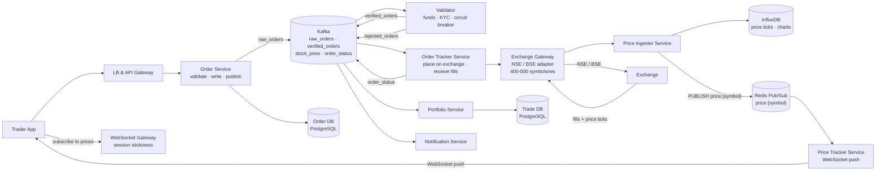
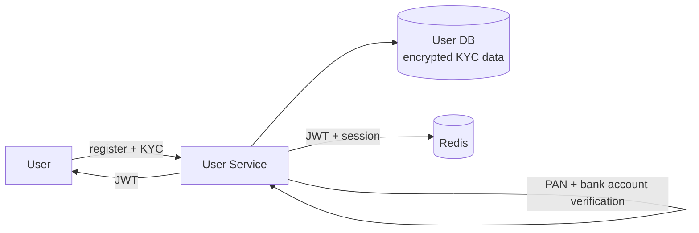
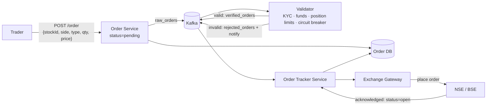
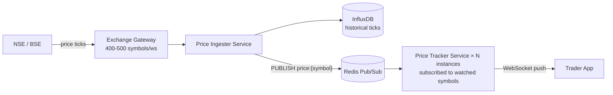
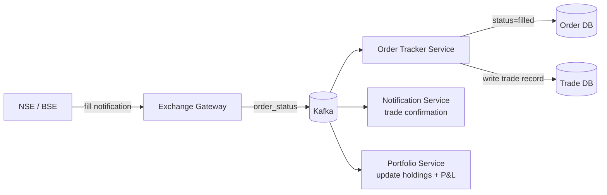

# Stock Trading System Design

## System Overview
A stock trading platform (think Zerodha / Robinhood / NSE) where users place buy/sell orders for stocks, orders are matched via an order book, trades are executed, portfolios updated, and real-time market data is streamed to clients.

## 1. Requirements

### Functional Requirements
- User registration, KYC, and account management
- View real-time stock prices and market data
- Place market and limit orders (buy/sell)
- Order matching via order book
- Trade execution and settlement
- Portfolio and holdings management
- Order history and trade confirmations
- Watchlist management

### Non-Functional Requirements
- Availability: 99.99% during market hours
- Latency: <10ms for order placement; <1ms for order matching
- Throughput: 1M+ orders/sec at peak
- Consistency: Strong — no duplicate orders, no incorrect trade execution
- Durability: Every order and trade must be permanently recorded
- Fairness: Orders matched in strict price-time priority

## 2. Back-of-the-Envelope Estimation

### Assumptions
- 10M active traders, 1M DAU during market hours
- 1M orders/day average; 10M orders/day during volatile market
- 10K stocks listed; market data: 1M price ticks/sec across all stocks
- Market hours: 6.5hr/day (9:30am–4pm)

### Traffic
```
Orders/sec (avg)        = 1M / 23400s ≈ 43/sec
Orders/sec (peak)       = 10M / 23400s ≈ 427/sec
Market data ticks/sec   = 1M/sec → pushed to all subscribers
```

### Storage
```
Orders/day          = 10M × 500B = 5GB/day → ~1.8TB/year
Trades/day          = 5M × 500B = 2.5GB/day
Market data ticks   = 1M/sec × 100B = 100MB/sec → retain 1 day = ~8.6TB
```

## 3. Architecture Diagram

### Components

| Component | Role |
|---|---|
| LB + API Gateway | Auth, rate limiting, routing; strict rate limits per user |
| WebSocket Gateway | Persistent connections with session stickiness; price updates + order status |
| User Service | Registration, KYC verification, account management |
| Order Service | Receives and validates orders; writes to Order DB; publishes to Kafka `raw_orders` |
| Validator | Kafka consumer on `raw_orders`; risk checks (funds, position limits, circuit breakers, KYC); publishes to `verified_orders` or `rejected_orders` |
| Order Tracker Service | Consumes `verified_orders`; places orders on exchange via Exchange Gateway; receives fill notifications |
| Exchange Gateway | Adapter to NSE/BSE; maintains persistent WebSocket connections (400–500 symbols/ws); translates internal format to exchange protocol; receives live price feeds |
| Price Ingester Service | Consumes live price updates from Exchange Gateway; writes to InfluxDB; publishes to Redis Pub/Sub |
| Price Tracker Service | Subscribes to Redis Pub/Sub per symbol; pushes real-time prices to WebSocket clients |
| Portfolio Service | Manages user holdings and P&L; reads from Trade DB |
| Notification Service | Kafka consumer; order confirmations, trade execution alerts |
| Order DB (PostgreSQL) | Order records, status, history |
| Trade DB (PostgreSQL) | Executed trade records |
| User DB (PostgreSQL) | User profiles, KYC data (encrypted PAN, bank details) |
| InfluxDB | Historical price ticks per symbol; time-series for charts |
| Redis Pub/Sub | Price Ingester publishes per symbol; Price Tracker instances subscribe; fan-out to WebSocket clients |
| Kafka | Order flow: `raw_orders` → `verified_orders` / `rejected_orders`; market data: `stock_price`, `order_status` |

### Overview



## 4. Key Flows

### 4.1 Auth & Account Setup



KYC verification required before trading. Encrypted PAN and bank details stored in User DB.

### 4.2 Order Placement & Validation



Validator checks: KYC verified, sufficient funds (`cash_balance - reserved >= qty × price`), position limit not exceeded, stock not circuit-breaker halted. Reserve funds on validation success.

### 4.3 Real-Time Price Updates



Publish once per symbol → fan-out to all WebSocket clients watching that symbol.

### 4.4 Order Fill & Trade Execution



### 4.5 Order Cancellation

1. User cancels order → Order Service verifies `status = open`
2. Order Tracker sends cancel request to Exchange Gateway → exchange
3. Exchange confirms cancel → update `status = cancelled`
4. Release reserved funds

## 5. Database Design

### Selection Reasoning

| Store | Why |
|---|---|
| PostgreSQL (Order/Trade DB) | ACID for financial records; relational queries for history |
| PostgreSQL (User/Payment DB) | Structured user + KYC data, ACID, encrypted sensitive fields |
| InfluxDB | Historical price ticks — time-series, efficient range queries for charts |
| Redis Pub/Sub | Sub-ms price fan-out to WebSocket clients; publish once per symbol |
| Kafka | Durable order pipeline and market data stream |

### PostgreSQL — orders

| Field | Type |
|---|---|
| order_id | UUID (PK) |
| user_id | UUID |
| stock_id | UUID |
| order_type | ENUM (market / limit) |
| side | ENUM (buy / sell) |
| quantity | INT |
| price | DECIMAL, nullable |
| trade_id | UUID, nullable |
| status | ENUM (pending / verified / rejected / open / partially_filled / filled / cancelled) |
| placed_at | TIMESTAMP |
| updated_at | TIMESTAMP |

### PostgreSQL — trades

| Field | Type |
|---|---|
| trade_id | UUID (PK) |
| buy_order_id | UUID |
| sell_order_id | UUID |
| stock_id | UUID |
| quantity | INT |
| price | DECIMAL |
| buyer_id | UUID |
| seller_id | UUID |
| executed_at | TIMESTAMP |

### PostgreSQL — users

| Field | Type |
|---|---|
| user_id | UUID (PK) |
| email | VARCHAR, unique |
| phone | VARCHAR |
| password_hash | VARCHAR |
| pan_card | VARCHAR (encrypted) |
| bank_details | JSONB (encrypted) |
| kyc_status | ENUM (pending / verified / rejected) |
| created_at | TIMESTAMP |

### Redis Keys

| Key Pattern | Type | Value | TTL |
|---|---|---|---|
| `price:{symbol}` | Pub/Sub channel | latest price tick JSON | — |
| `order:status:{orderId}` | String | status JSON | 3600s |
| `session:{sessionId}` | String | userId | 86400s |

## 6. Key Interview Concepts

### Exchange Gateway — The Critical Boundary
In a broker system (Zerodha, Robinhood), the exchange (NSE/BSE) runs the matching engine. The Exchange Gateway is the adapter:
- Maintains persistent WebSocket/FIX connections to the exchange
- Handles 400–500 symbols per WebSocket connection
- Translates internal order format to exchange protocol
- Receives live price feeds and order fill notifications
- Single point of exchange connectivity

### Validator as a Separate Service
Separating validation from Order Service keeps Order Service fast (just write + publish). Validator does expensive checks (DB reads for balance, KYC status, position limits) asynchronously. Rejected orders never reach the exchange.

### Redis Pub/Sub for Price Fan-out
1M users watching 10 stocks = 10M subscriptions. Price Ingester publishes once to `price:{symbol}` channel; all Price Tracker Service instances subscribed to that channel deliver to their connected WebSocket clients. Publish once, fan-out to all.

### Order Book Data Structure (for proprietary exchange)
- Bids: sorted map (price DESC) → FIFO queue per price level
- Asks: sorted map (price ASC) → FIFO queue per price level
- Match: O(log N) price lookup + O(1) FIFO dequeue
- Single-threaded per symbol — eliminates locking, ensures price-time priority

### Price-Time Priority
Two orders at the same price: earlier order fills first. Enforced by FIFO queue within each price level.

### Fund Reservation
On order validation: reserve `qty × price` from user's balance. Prevents placing 10 orders with only enough funds for 1. On fill: reserved → actual deduction. On cancel/reject: reserved released.

### InfluxDB for Historical Prices
Price ticks are time-series data. Efficient range queries: "give me AAPL prices for the last 1 hour" is a simple time-range query. Used for charts on portfolio and stock detail pages.

### T+2 Settlement
Trade execution is immediate (T+0). Actual share and cash transfer happens T+2 (regulatory requirement). Settlement Service handles the deferred transfer asynchronously.

## 7. Failure Scenarios

### Exchange Gateway Disconnection
- Recovery: reconnect immediately with exponential backoff; buffer outgoing orders locally; replay on reconnect
- Prevention: multiple WebSocket connections to exchange; heartbeat monitoring

### Validator Crash
- Recovery: another Validator instance picks up from Kafka; idempotent validation
- Prevention: multiple Validator instances in consumer group

### Order Tracker Crash Mid-Placement
- Recovery: on restart, query exchange for status of all open orders; reconcile with Order DB
- Prevention: exchange provides order status API for reconciliation

### Price Feed Failure
- Impact: stale prices shown; order placement unaffected (exchange handles pricing)
- Recovery: reconnect to exchange feed; users see "delayed data" warning
- Prevention: multiple feed connections; fallback to exchange REST API for last price

### Fund Reservation Race Condition
- Recovery: atomic DB update: `UPDATE accounts SET reserved = reserved + ? WHERE balance - reserved >= ?` — one fails
- Prevention: row-level lock on account during reservation check

### PostgreSQL Failure (Order DB)
- Recovery: promote replica; Order Service retries; idempotency key prevents duplicate orders
- Prevention: synchronous replication; automated failover
