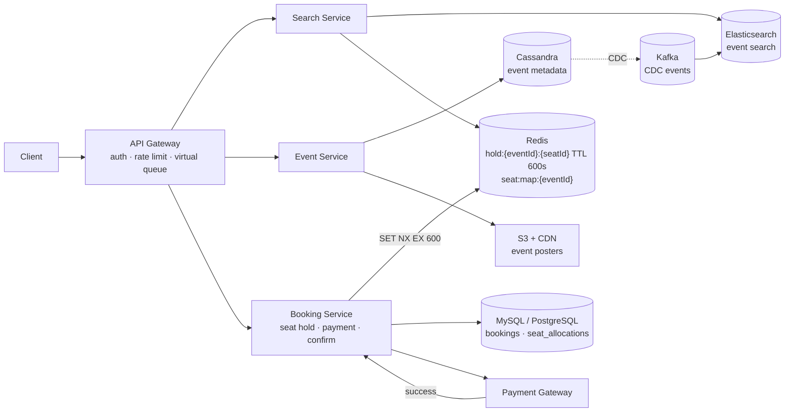
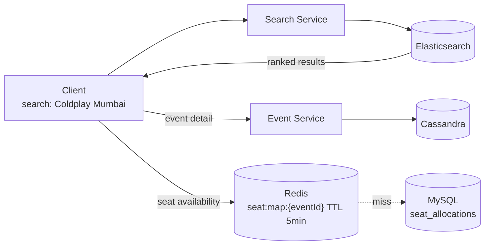
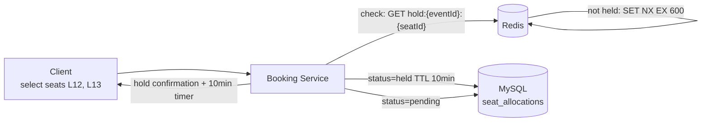
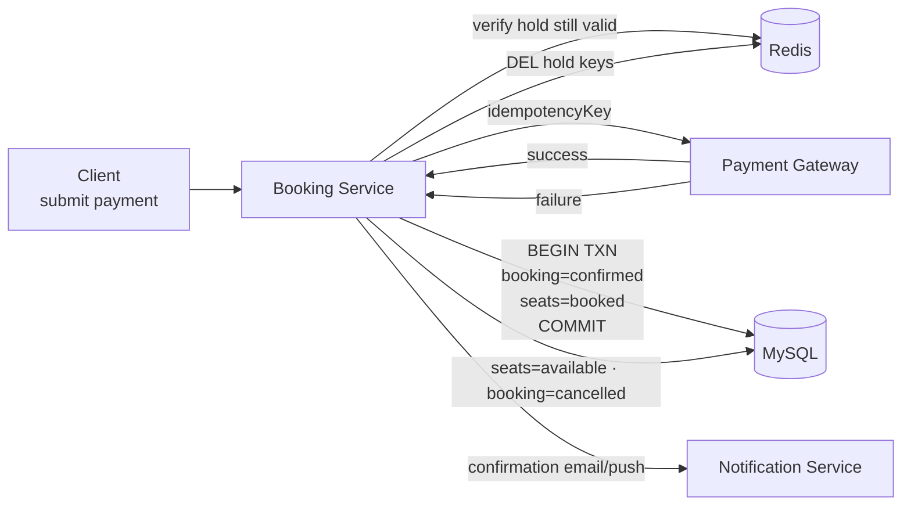

# Ticket Booking System Design

## System Overview
A ticket booking platform (think BookMyShow / Ticketmaster) where users discover events and movies, select seats, and complete bookings with payment — with strong consistency on seat allocation to prevent double-booking.

## 1. Requirements

### Functional Requirements
- Browse and search events/movies by name, venue, artist, location, date
- View event details — venue, seats, pricing
- Select seats and temporarily hold them during checkout
- Complete booking with payment
- View booking history and tickets

### Non-Functional Requirements
- Availability: 99.99% — especially during high-demand event launches
- Latency: <200ms for search; <500ms for seat selection
- Scalability: Read >> Write — millions browse, thousands book simultaneously
- Consistency: Strong consistency for seat booking — no double-booking ever
- Durability: Confirmed bookings must never be lost
- Security: PCI-DSS for payments, auth on all booking operations

## 2. Back-of-the-Envelope Estimation

### Assumptions
- 50M DAU browsing events
- 500K concurrent users during peak event launch
- 1M bookings/day average; 100K bookings in first 10 min of a hot event
- Average event has 10K seats; Read:Write ratio = 100:1

### Traffic
```
Search/browse reads/sec  = 50M × 20 / 86400 ≈ 11.5K/sec
Peak reads/sec           ≈ 100K/sec (event launch)

Booking writes/sec       = 1M / 86400 ≈ 12/sec average
Peak booking/sec         = 100K / 600s ≈ 167/sec (hot event)
```

### Storage
```
Events          = 1M × 10KB = 10GB
Seats           = 10K seats × 200B × 1M events = 2TB
Bookings/day    = 1M × 1KB = 1GB/day → ~365GB/year
```

## 3. Architecture Diagram

### Components

| Component | Role |
|---|---|
| API Gateway | Auth, rate limiting, routing; aggressive throttling during flash sales |
| Search Service | Event/movie discovery via Elasticsearch; full-text + geo search; read-heavy, stateless |
| Event Service | Event/movie metadata CRUD; writes to Cassandra; CDC to Elasticsearch |
| Booking Service | Core transactional service; seat holds, booking confirmation, cancellation |
| Payment Gateway | External payment processor; called synchronously during checkout |
| Cassandra | Event/movie metadata — high read throughput, denormalized |
| MySQL / PostgreSQL | Bookings and seat allocation — ACID transactions prevent double-booking |
| Redis | Temporary seat holds (TTL-based), session cache, hot seat map cache |
| CDC | Captures changes from Cassandra → Kafka → Elasticsearch |

### Overview



## 4. Key Flows

### 4.1 Event Discovery & Search



CDC sync: Event Service writes to Cassandra → Debezium captures → Kafka → Elasticsearch consumer updates index.

### 4.2 Seat Selection & Temporary Hold



Race condition handling:
```
User1: SET hold:event1:L12 user1 NX EX 600 → OK (wins)
User2: SET hold:event1:L12 user2 NX EX 600 → NIL (seat already held)
```

Redis `SET NX EX` is atomic — only one user wins per seat.

### 4.3 Payment & Booking Confirmation



`idempotency_key = hash(bookingId + userId)` — prevents double charge on gateway timeout retry.

### 4.4 Hold Expiry (Abandoned Checkout)

1. Redis TTL expires → `hold:{eventId}:{seatId}` key deleted automatically
2. Background cleanup job (runs every minute): query MySQL for `seat_allocations WHERE status=held AND hold_expires_at < now`
3. Update those rows to `status = available`; update `bookings.status = expired`
4. Seats become available for other users

### 4.5 Flash Sale Handling

1. API Gateway enforces strict rate limiting per user
2. Virtual waiting room: users assigned queue position, served in order
3. Seat map served from Redis cache — avoids hammering MySQL for availability checks
4. Redis `SET NX` ensures only one user holds each seat regardless of concurrent requests

## 5. Database Design

### Selection Reasoning

| Store | Why |
|---|---|
| Cassandra | Event/movie metadata — high read throughput, denormalized, scales horizontally |
| MySQL / PostgreSQL | Bookings and seat allocation — ACID transactions are non-negotiable to prevent double-booking |
| Redis | Seat holds (TTL auto-release), session cache, hot seat map cache |
| Elasticsearch | Full-text search on event name, artist, venue; geo-distance queries |

### Cassandra — events

| Field | Type |
|---|---|
| id | UUID (PK) |
| venue | VARCHAR |
| artist_id | UUID |
| name | VARCHAR |
| description | TEXT |
| seats | LIST\<UUID\> |
| event_date | TIMESTAMP |
| created_at | TIMESTAMP |

### MySQL — bookings

| Field | Type |
|---|---|
| booking_id | UUID (PK) |
| user_id | UUID |
| event_id | UUID |
| seats | JSON (array of seat IDs) |
| status | ENUM (pending / confirmed / cancelled / expired) |
| total_amount | DECIMAL |
| payment_id | VARCHAR |
| idempotency_key | VARCHAR, unique |
| created_at | TIMESTAMP |
| expires_at | TIMESTAMP |

### MySQL — seat_allocations

| Field | Type |
|---|---|
| seat_id | UUID (PK) |
| event_id | UUID |
| status | ENUM (available / held / booked) |
| held_by | UUID, nullable |
| booking_id | UUID, nullable |
| hold_expires_at | TIMESTAMP, nullable |

### Redis Keys

| Key Pattern | Type | Value | TTL |
|---|---|---|---|
| `hold:{eventId}:{seatId}` | String | userId | 600s (10 min checkout window) |
| `seat:map:{eventId}` | Hash | seatId → status | 300s |
| `session:{sessionId}` | String | userId | 86400s |
| `rate:{userId}` | Counter | request count | 60s window |

## 6. Key Interview Concepts

### Preventing Double Booking — The Core Problem
Two-phase approach:
1. Optimistic hold in Redis (`SET NX EX`) — atomic, fast, auto-expiring
2. Durable confirmation in MySQL — ACID transaction on payment success

Redis handles the race condition at the hold stage. MySQL handles durability at confirmation.

### Why Cassandra for Events but MySQL for Bookings
Events are read-heavy, no transactions needed — Cassandra's high read throughput fits perfectly. Bookings require ACID transactions (seat allocation must be atomic with booking creation) — MySQL is the right tool. Never use Cassandra for transactional data.

### CDC for Search Index Sync
Event Service writes to Cassandra. CDC captures changes → Kafka → Elasticsearch. Avoids dual-write risk. Elasticsearch is eventually consistent — search may lag a few seconds.

### Seat Hold TTL Design
10-minute TTL is a business + UX decision. Redis TTL auto-releases without explicit cleanup. MySQL cleanup job handles the durable state sync.

### Optimistic vs Pessimistic Locking
- Pessimistic (SELECT FOR UPDATE): locks the row for entire checkout duration (10 min) — blocks all other users
- Optimistic (Redis NX + version check): assume no conflict, detect and reject if conflict occurs — fast, scales well

### Virtual Waiting Room for Flash Sales
Without a queue, 500K simultaneous requests overwhelm the booking service. API Gateway puts excess users in a virtual queue, issues a queue token, admits users in batches. Prevents thundering herd, gives fair access.

## 7. Failure Scenarios

### Double Booking Attempt (Race Condition)
- Prevention: Redis `SET NX EX` is atomic — only one succeeds
- If Redis is down: fall back to MySQL `SELECT FOR UPDATE` on `seat_allocations` — slower but correct

### Redis Failure (Seat Holds Lost)
- Recovery: Redis Sentinel failover (<30s); MySQL `seat_allocations` is the durable record; Booking Service falls back to MySQL for hold checks
- Prevention: Redis Cluster + AOF; MySQL holds are the source of truth

### Payment Gateway Timeout
- Recovery: retry with same `idempotency_key`; after 3 retries, release seat hold, notify user
- Prevention: async payment with webhook callback as fallback

### MySQL Primary Failure
- Recovery: promote replica (<30s); Redis holds remain valid during failover
- Prevention: synchronous replication; automated failover

### Hold Expiry Race (User Pays Just as Hold Expires)
- Recovery: Booking Service checks MySQL `hold_expires_at` (not just Redis); if within grace period (30s), allow payment
- Prevention: payment submission deadline enforced client-side at 9min 30s
