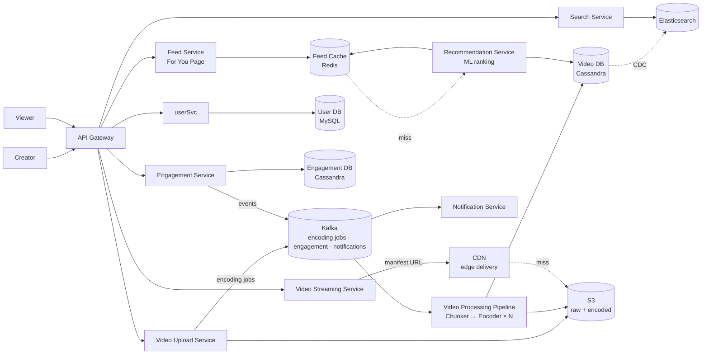
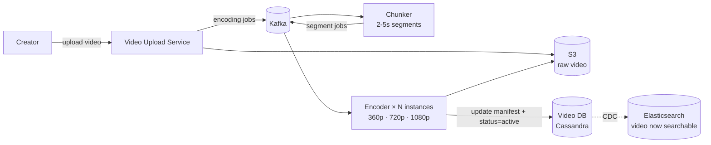
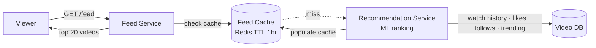
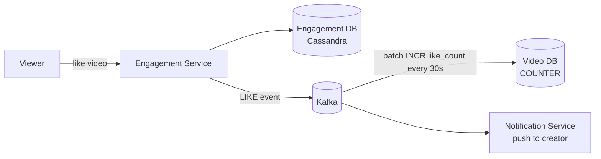

# TikTok (Short Video Platform) System Design

## System Overview
A short-form video platform where users upload, discover, and stream short videos (15s–3min) with a personalized feed powered by a recommendation engine, real-time engagement, and a global CDN for low-latency video delivery.

## 1. Requirements

### Functional Requirements
- User registration and authentication
- Upload short videos (up to 3 min)
- Personalized video feed (For You Page)
- Like, comment, share, follow
- Search videos and users
- Live streaming (basic)
- Notifications (new follower, like, comment)

### Non-Functional Requirements
- Availability: 99.99%
- Latency: <200ms feed load; video starts within 1s
- Scalability: 1B+ users, 500M DAU, 1B+ videos served/day
- Read >> Write: feed reads vastly outnumber uploads
- Durability: uploaded videos must never be lost

## 2. Back-of-the-Envelope Estimation

### Assumptions
- 500M DAU; each watches 50 videos/day, uploads 0.01 videos/day
- Average video: 30s, encoded to 50MB across all resolutions

### Traffic
```
Video views/sec     = 500M × 50 / 86400 ≈ 289K/sec → CDN
Uploads/sec         = 500M × 0.01 / 86400 ≈ 58/sec
Feed requests/sec   = 500M × 10 / 86400 ≈ 58K/sec
```

### Storage
```
Raw uploads/day     = 5M × 100MB = 500TB/day
Encoded/day         = 5M × 50MB  = 250TB/day
5-year storage      ≈ 456PB
```

## 3. Architecture Diagram

### Components

| Component | Role |
|---|---|
| API Gateway | Auth, rate limiting, routing |
| User Service | Registration, login, profile, follow graph |
| Video Upload Service | Receives raw video; stores to S3; triggers encoding pipeline |
| Video Processing Pipeline | Chunker → Encoder (360p/720p/1080p) → S3 → Video DB update |
| Feed Service | Generates personalized For You Page; reads from Feed Cache or Recommendation Service |
| Recommendation Service | ML-based video ranking; considers watch history, likes, follows, trending |
| Video Streaming Service | Serves manifest files; returns CDN URLs |
| Engagement Service | Likes, comments, shares; writes to Engagement DB; Kafka events |
| Search Service | Video and user search via Elasticsearch; CDC from Video DB |
| Notification Service | Kafka consumer; push/email notifications |
| CDN | Global edge delivery of video segments |
| Video DB (Cassandra) | Video metadata, view/like counters |
| User DB (MySQL) | User profiles, follow relationships |
| Engagement DB (Cassandra) | Likes, comments — high write throughput |
| Feed Cache (Redis) | Pre-computed feeds per user (top 200 videos) |
| S3 | Raw and encoded video storage |
| Kafka | Async event bus for encoding pipeline, engagement, notifications |

### Overview



## 4. Key Flows

### 4.1 Video Upload & Processing



### 4.2 Feed Generation (For You Page)



Hybrid fan-out:
- Push for creators with <10K followers: fan-out videoId to followers' Feed Cache
- Pull + Recommendation for mega-influencers (>10K followers): fetch on demand
- Recommendation Service fills gaps with trending/personalized content

### 4.3 Video Streaming

Same as Netflix — manifest file → CDN → ABR streaming. Client measures download speed per segment, adjusts quality at segment boundaries, maintains 30s buffer.

### 4.4 Engagement (Likes, Comments)



## 5. Database Design

### Cassandra — videos

| Field | Type |
|---|---|
| video_id | UUID (PK) |
| creator_id | UUID |
| title | VARCHAR |
| manifest_url | TEXT |
| duration_sec | INT |
| view_count | COUNTER |
| like_count | COUNTER |
| status | TEXT (processing / active / deleted) |
| created_at | TIMESTAMP |

### MySQL — users / follows

| Field | Type |
|---|---|
| user_id | UUID (PK) |
| username | VARCHAR, unique |
| follower_count | INT |
| following_count | INT |
| created_at | TIMESTAMP |

### Redis Keys

| Key Pattern | Type | Value | TTL |
|---|---|---|---|
| `feed:{userId}` | List | ordered videoIds (top 200) | 3600s |
| `trending:global` | ZSET | videoId → score | 300s |
| `video:meta:{videoId}` | String | metadata JSON | 600s |
| `session:{sessionId}` | String | userId | 86400s |

## 6. Key Interview Concepts

### Fan-out Problem
Creator with 100M followers posts → 100M feed cache writes. Hybrid approach: push for small follower counts, pull + recommend for large. Threshold typically 10K–100K followers.

### For You Page vs Following Feed
Following feed = videos from accounts you follow (pull-based). For You Page = ML-ranked mix of followed + recommended content. TikTok's FYP is the product differentiator — recommendation quality drives engagement.

### Video Counter Accuracy
Viral video gets 1M views/sec. Writing to Cassandra COUNTER 1M times/sec creates a hot partition. Solution: buffer view events in Kafka, batch-aggregate every 30s, write aggregated count to Cassandra.

### CDN Strategy
Video segments cached at edge nodes globally. Cache hit rate >99% for popular videos. Long TTL on segments (never change after encoding). Short TTL on manifest files.

## 7. Failure Scenarios

### Encoding Pipeline Failure
- Recovery: Kafka retains encoding jobs; another encoder picks up; idempotent encoding
- Video stays in `processing` status; creator notified of delay

### Feed Cache Miss
- Recovery: fall back to pull-based feed from followed creators + trending
- Recommendation Service generates feed on demand; populate cache for next request

### CDN Node Failure
- Recovery: CDN reroutes to next nearest edge; ABR drops quality to compensate
- S3 origin always available as fallback

### Recommendation Service Failure
- Recovery: fall back to chronological feed from followed creators
- Graceful degradation — users see less personalized but functional feed
