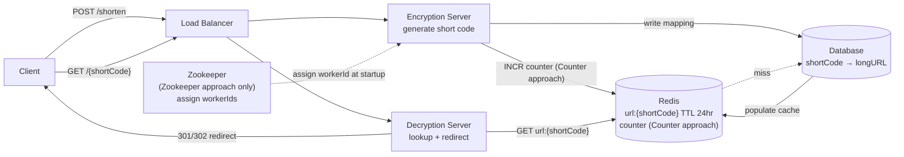
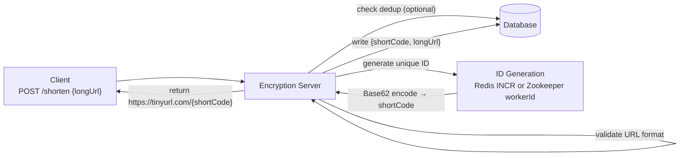
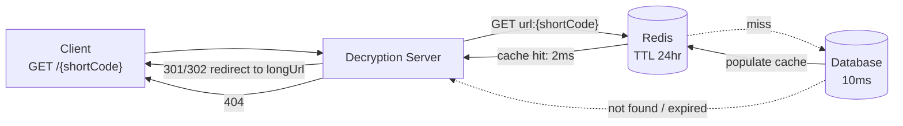

# TinyURL System Design

## System Overview
A URL shortening service that converts long URLs into short aliases (e.g., `tinyurl.com/abc123`) and redirects users to the original URL when the short link is accessed.

## 1. Requirements

### Functional Requirements
- Given a long URL, generate a unique short URL
- Redirect short URL to original long URL
- Short URLs should be as short as possible (6–7 characters)
- Optional: custom aliases, URL expiry

### Non-Functional Requirements
- Availability: 99.99% — redirects must always work
- Latency: <5ms for redirect (cache hit); <10ms for DB lookup
- Scalability: 100M+ URLs created, billions of redirects/day
- Uniqueness: no two long URLs map to the same short code
- Durability: mappings must never be lost

## 2. Back-of-the-Envelope Estimation

### Assumptions
- 100M new URLs created/day; Read:Write ratio = 100:1
- Average long URL: 200 bytes; short code: 7 characters

### Traffic
```
Writes/sec  = 100M / 86400 ≈ 1160/sec
Reads/sec   = 10B / 86400  ≈ 115K/sec
Peak (3×)   ≈ 345K redirects/sec
```

### Storage
```
Per record  = ~500B
5-year      = 100M × 365 × 5 × 500B ≈ 90TB
Cache       = 20% hot URLs × 500B = 10GB (fits in Redis)
```

## 3. Architecture Diagram

### Components

| Component | Role |
|---|---|
| Load Balancer | Round-robin across Encryption/Decryption servers |
| Encryption Server | Handles URL shortening (write path); generates unique short code |
| Decryption Server | Handles redirect (read path); looks up short code → long URL |
| Redis | Read path: cache `shortCode → longURL`; Write path (Counter approach): atomic counter |
| Database | Persistent store for all `shortCode → longURL` mappings |
| Zookeeper | (Zookeeper approach only) Assigns unique worker ID ranges to each Encryption Server |

### Overview



## 4. Short Code Generation — The Core Problem

The central challenge: generate a unique, short, non-guessable code for every URL, across multiple servers, without collisions.

### How encoding works
Take a numeric ID → encode in Base62 (a–z, A–Z, 0–9):
```
Base62 characters = 62
7-character code  = 62^7 ≈ 3.5 trillion unique codes
```

Example:
```
ID: 125          → Base62: "cb"
ID: 2009215674938 → Base62: "zn9edcu"
```

The problem reduces to: how do we generate a unique ID per request, across N servers, without duplicates?

## 5. Key Flows

### 5.1 URL Shortening (Write)



### 5.2 Redirect (Read)



## 6. Approach 1 — Redis Counter

Every Encryption Server calls `INCR counter` to get the next unique ID, then Base62-encodes it.

```
Server 1: INCR counter → 1001 → Base62 → "QZ"
Server 2: INCR counter → 1002 → Base62 → "QZa"
```

Redis `INCR` is atomic — no two servers ever get the same number.

Pros: simple, atomic, fast (2–3ms), no coordination infrastructure
Cons: Redis is a single point of failure for writes; sequential codes are guessable; bottleneck at extreme scale

## 7. Approach 2 — Zookeeper + Worker ID (Snowflake-style)

Zookeeper assigns each Encryption Server a unique worker ID at startup. Each server maintains its own local counter. The short code is generated from `workerID + localCounter` — no coordination needed per request.

Snowflake ID structure:
```
| timestamp (41 bits) | workerID (10 bits) | sequence (12 bits) |
→ 63-bit integer → Base62 encode → 7-char short code
```

This gives: 2^10 = 1024 unique worker IDs, 2^12 = 4096 IDs per ms per worker.

Pros: no per-request coordination (in-memory, sub-ms), horizontally scalable, no single point of failure for ID generation
Cons: Zookeeper adds operational complexity; clock skew can cause issues; more complex to implement

## 8. Approach Comparison

| Dimension | Redis Counter | Zookeeper + Worker ID |
|---|---|---|
| ID generation latency | 2–3ms (Redis round trip) | <1ms (in-memory) |
| Coordination per request | Yes (Redis INCR) | No (only at startup) |
| Single point of failure | Redis (mitigated by Sentinel) | None for ID gen |
| Predictability of codes | Sequential — guessable | Time-based — harder to guess |
| Operational complexity | Low | Medium (Zookeeper cluster) |
| Scalability ceiling | ~100K writes/sec | ~4M IDs/sec per worker |
| Best for | Simpler systems, moderate scale | High scale, low-latency critical |

## 9. Database Design

### Database — url_mappings

| Field | Type |
|---|---|
| short_code | VARCHAR(7) (PK) |
| long_url | TEXT |
| created_by | UUID, nullable |
| created_at | TIMESTAMP |
| expires_at | TIMESTAMP, nullable |
| hit_count | BIGINT |

### Redis Keys

| Key Pattern | Type | Value | TTL |
|---|---|---|---|
| `url:{shortCode}` | String | long URL | 24hr (sliding) |
| `counter` | String | global atomic integer | — (Counter approach) |

## 10. Key Interview Concepts

### Why Base62 over MD5/SHA256?
MD5/SHA256 of the URL produces a hash — take first 7 chars. Problem: collisions (two different URLs produce same 7-char prefix). Base62 encoding of a unique integer has zero collision risk by construction.

### 301 vs 302 Redirect
- 301 (Permanent): browser caches redirect — reduces server load but you lose click analytics
- 302 (Temporary): browser always hits server — enables analytics, higher load
- Choose based on whether analytics matter

### Read-Heavy Caching
100:1 read:write ratio. 20% of URLs drive 80% of traffic (Pareto). A 10GB Redis cache covers the hot set entirely. Cache hit rate >95% means DB sees only 5% of redirect traffic.

### Database Sharding
At 90TB over 5 years, shard by `shortCode` (hash-based). All reads and writes for a given short code go to the same shard — pure key-value lookup, no cross-shard joins needed.

### Range-Based Pre-allocation
At extreme scale, each Encryption Server fetches a range of 1000 IDs from Redis at once (`INCRBY counter 1000`), uses them locally, then fetches the next batch. Reduces Redis calls by 1000×.

## 11. Failure Scenarios

### Redis Counter Failure
- Impact: no new short URLs can be created; redirects unaffected (separate Redis cache)
- Recovery: Redis Sentinel promotes replica in <30s
- Prevention: separate Redis instances for counter vs cache

### Zookeeper Failure
- Impact: new Encryption Server instances can't register; existing running servers are unaffected (already have workerID in memory)
- Recovery: Zookeeper ensemble (3 or 5 nodes) tolerates minority node failures
- Prevention: servers cache workerID locally as fallback

### Database Failure
- Impact: cache misses can't be resolved; new URL writes fail
- Recovery: DB replica promoted; Redis cache continues serving hot URLs during failover
- Prevention: primary-replica setup with auto-failover

### Cache Stampede (Thundering Herd)
- Scenario: popular URL's cache entry expires → thousands of requests simultaneously hit DB
- Recovery: mutex lock on cache miss so only one request hits DB, others wait
- Prevention: sliding TTL (reset on each access); jitter on TTL to avoid synchronized expiry
