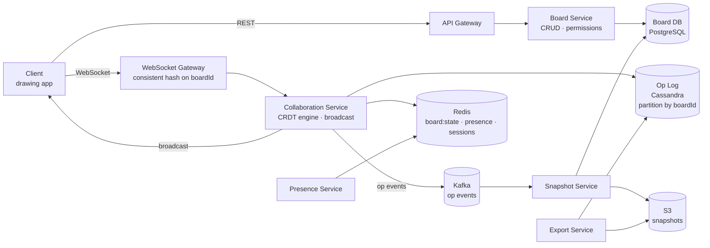
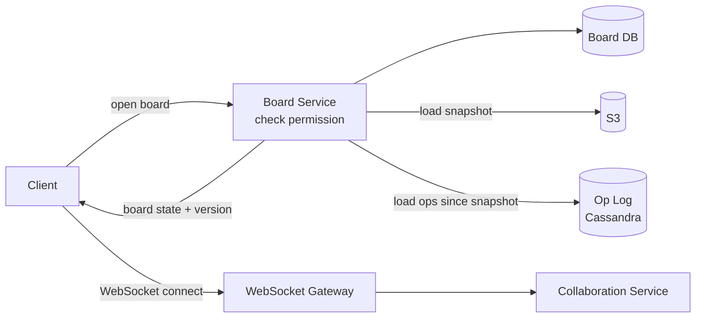
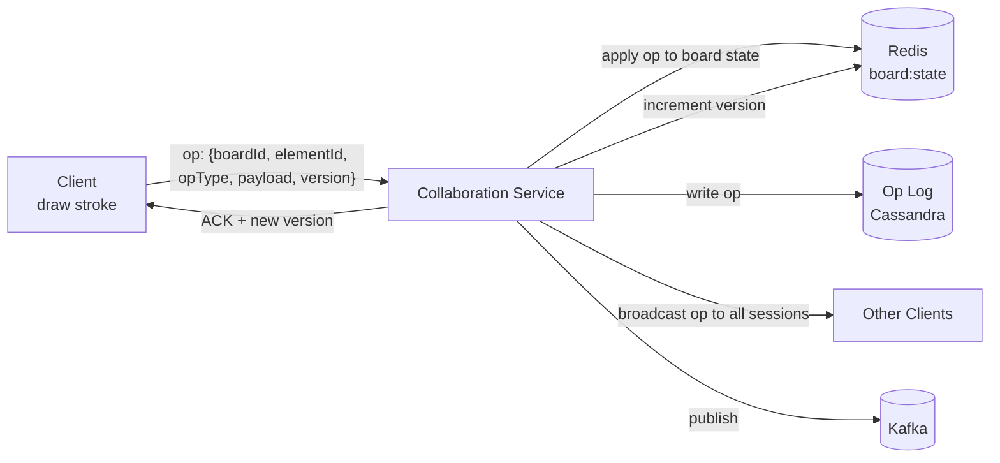
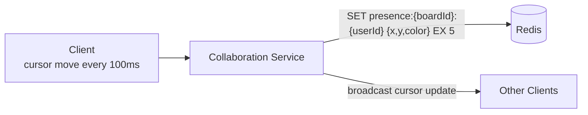
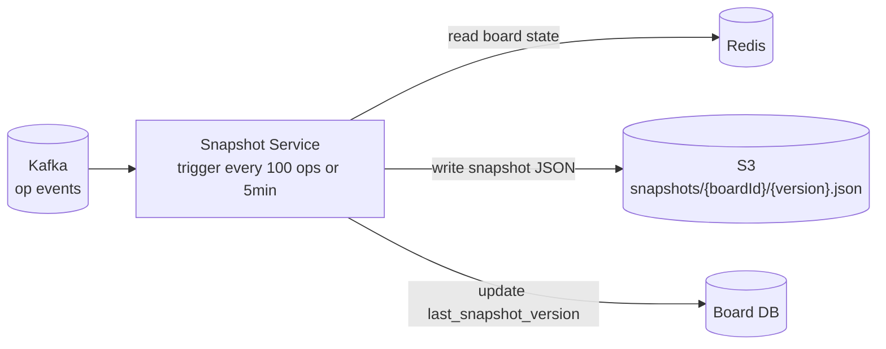

# Whiteboard (Collaborative Drawing) System Design

## System Overview
A real-time collaborative whiteboard (think Miro / FigJam / Excalidraw) where multiple users simultaneously draw, add shapes, text, and sticky notes on an infinite canvas — with real-time sync, conflict resolution, and persistent state.

## 1. Requirements

### Functional Requirements
- Create and manage whiteboards (boards)
- Real-time collaborative drawing (multiple users, same board)
- Drawing tools: pen, shapes, text, sticky notes, images
- Infinite canvas with pan and zoom
- Cursor presence (see where others are)
- Board sharing with permission levels (view / edit)
- Version history and undo/redo
- Export board as image/PDF

### Non-Functional Requirements
- Availability: 99.99%
- Latency: <50ms for local stroke to appear; <200ms for remote user to see it
- Scalability: 1M+ boards, 10M+ users, 100K concurrent collaborative sessions
- Consistency: All collaborators converge to the same board state
- Durability: Board state must never be lost

## 2. Back-of-the-Envelope Estimation

### Assumptions
- 10M DAU, 100K concurrent collaborative sessions at peak
- Each session generates ~100 drawing ops/min; average op size: 200B
- Average board size: 5MB; board snapshot every 5 min or 100 ops

### Traffic
```
Ops/sec                  = 100K × 100/60 ≈ 167K ops/sec
Presence updates/sec     = 100K × 2/sec = 200K/sec (cursor moves)
```

### Storage
```
Boards              = 1M × 5MB = 5TB
Op log/day          = 167K × 200B × 86400 = 2.9TB/day (rolling 30 days = 87TB)
```

## 3. Architecture Diagram

### Components

| Component | Role |
|---|---|
| API Gateway | Auth, rate limiting, routing |
| WebSocket Gateway | Persistent connections; consistent hashing on boardId |
| Board Service | Board CRUD, metadata, permissions, sharing |
| Collaboration Service | Core real-time engine; receives drawing ops; applies CRDT merge; broadcasts to collaborators |
| CRDT Engine | Conflict-free Replicated Data Type for drawing ops; runs inside Collaboration Service |
| Snapshot Service | Periodically computes and stores full board snapshots from op log |
| Presence Service | Tracks cursor positions and active users per board; ephemeral, Redis-based |
| Export Service | Renders board to image/PDF on demand |
| Board DB (PostgreSQL) | Board metadata, permissions, version info |
| Op Log (Cassandra) | Append-only drawing operation log; partition by boardId |
| Snapshot Store (S3) | Full board state snapshots (JSON) |
| Redis | Active board state cache, cursor presence, session store |
| Kafka | Op events for snapshot triggers, analytics |

### Overview



## 4. Key Flows

### 4.1 Auth & Board Open



1. Check permission → load latest snapshot from S3 (or Redis cache if hot)
2. Load ops since `last_snapshot_version` from Cassandra → apply → reconstruct current state
3. Return board state + current version to client
4. Client connects WebSocket to Collaboration Service (routed by boardId)

### 4.2 Real-Time Drawing (CRDT-based)



CRDT approach:
- Each element (shape, stroke, text) has a globally unique `elementId` (UUID)
- Operations: `add(elementId, data)`, `move(elementId, newPos)`, `delete(elementId)`, `update(elementId, props)`
- Deletes use tombstones — element marked deleted, never truly removed
- Concurrent moves of same element: last-write-wins by timestamp
- No lock needed — each op targets a specific `elementId`

### 4.3 Cursor Presence



TTL = 5s — cursor disappears if user stops moving (idle/disconnected).

### 4.4 Snapshotting



### 4.5 Undo/Redo

Client-side undo/redo stack:
- Each client maintains local undo stack of ops it generated
- Undo: send inverse op (e.g., delete the element that was added)
- Inverse ops go through normal CRDT flow — all clients see the undo
- Collaborative undo: only undo your own ops (not others')

## 5. Database Design

### Selection Reasoning

| Store | Why |
|---|---|
| PostgreSQL (Board DB) | Board metadata, permissions — ACID, relational |
| Cassandra (Op Log) | Append-only ops, high write throughput, time-series, partition by boardId |
| Redis | Active board state cache, cursor presence (ephemeral, TTL) |
| S3 | Board snapshots — large JSON blobs, durable |

### PostgreSQL — boards

| Field | Type |
|---|---|
| board_id | UUID (PK) |
| owner_id | UUID |
| title | VARCHAR |
| latest_version | BIGINT |
| last_snapshot_version | BIGINT |
| created_at | TIMESTAMP |

### PostgreSQL — board_permissions

| Field | Type |
|---|---|
| board_id | UUID |
| user_id | UUID, nullable |
| access_type | ENUM (owner / editor / viewer) |
| share_link_token | VARCHAR, nullable |

### Cassandra — op_log

Partition key: `board_id`, Clustering: `version ASC`

| Field | Type |
|---|---|
| board_id | UUID (partition key) |
| version | BIGINT (clustering) |
| op_type | TEXT (draw / erase / add_shape / move / delete / text) |
| op_payload | TEXT (JSON — coordinates, style, elementId) |
| author_id | UUID |
| client_id | UUID (dedup) |
| timestamp | TIMESTAMP |

### Redis Keys

| Key Pattern | Type | Value | TTL |
|---|---|---|---|
| `board:state:{boardId}` | String | full board JSON | while active |
| `board:version:{boardId}` | String | current version | while active |
| `board:sessions:{boardId}` | Set | connected sessionIds | — |
| `presence:{boardId}:{userId}` | String | `{x, y, color, name}` | 5s |
| `session:{sessionId}` | String | userId | 86400s |

## 6. Key Interview Concepts

### CRDT vs OT for Whiteboard
Google Docs uses OT (requires central server, lock per document). Whiteboards use CRDT because:
- Drawing elements are independent — adding shape A doesn't affect shape B
- CRDTs are commutative — order of ops doesn't matter for most drawing ops
- No central lock → lower latency, better offline support
- Trade-off: CRDT has higher memory overhead (tombstones for deleted elements)

### Element-Based vs Pixel-Based
- Pixel-based: store bitmap; simple but large, hard to edit individual elements
- Element-based (vector): store shapes, strokes as structured data; smaller, editable, scalable
This design uses element-based — each shape/stroke is a JSON object with coordinates and style.

### Infinite Canvas
Canvas has no fixed size. Client maintains viewport (pan + zoom). Server stores absolute coordinates. Client transforms coordinates based on current viewport.

### Consistent Hashing for Collaboration Service
WebSocket Gateway uses consistent hashing on `boardId` to route all connections for the same board to the same Collaboration Service instance. Warm in-memory board state, no cross-instance coordination.

### Offline Drawing
User draws offline → ops queued locally with `baseVersion = last known`. On reconnect: send queued ops. Server fetches ops since `baseVersion` from Cassandra. CRDT merges offline ops with server ops — no conflicts for independent elements.

### Presence Scalability
100K sessions × 2 cursor updates/sec = 200K Redis writes/sec. Redis handles this easily. Cursor updates are fire-and-forget — no ACK needed. TTL auto-cleans stale cursors.

## 7. Failure Scenarios

### Collaboration Service Crash
- Recovery: clients reconnect; consistent hashing routes to new instance; new instance loads board state from Redis; clients resend pending ops
- Prevention: Redis holds board state independently of any instance

### Redis Failure (Board State Lost)
- Recovery: Redis Sentinel failover (<30s); board state reconstructed from S3 snapshot + Cassandra ops on reconnect
- Prevention: Redis Cluster + AOF; board state is a cache, Cassandra is the truth

### Cassandra Op Log Write Failure
- Recovery: Collaboration Service does not ACK client until Cassandra write succeeds; client retries; CRDT dedup prevents duplicate ops
- Prevention: Cassandra RF=3, QUORUM writes

### Concurrent Move Conflict (Same Element)
- Scenario: two users move the same shape simultaneously
- Recovery: last-write-wins by timestamp; one user's move wins; other user sees their move reverted
- Acceptable UX for drawing — users can see the conflict and re-move

### Large Board Performance
- Scenario: board with 100K elements; loading takes too long
- Recovery: lazy loading — load only elements in current viewport; load more as user pans
- Prevention: viewport-based rendering; server returns only elements in requested viewport bounds
