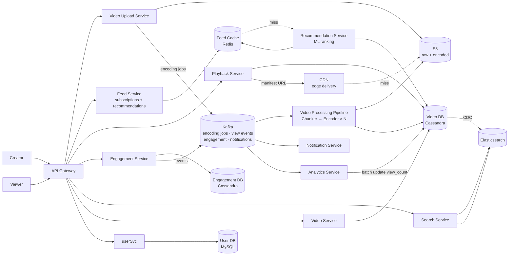
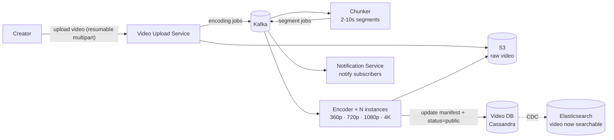
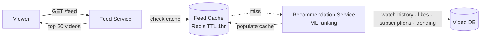
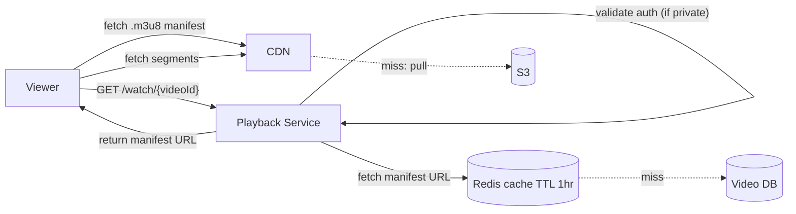
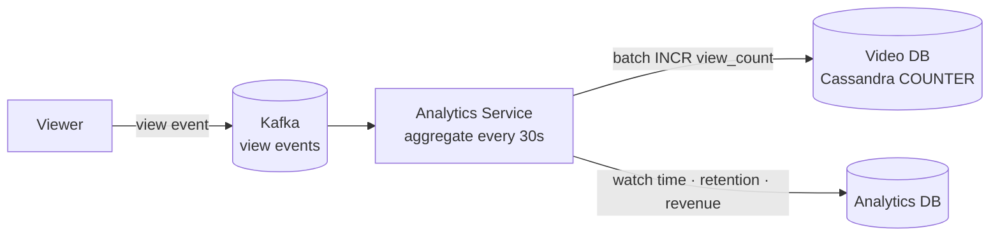
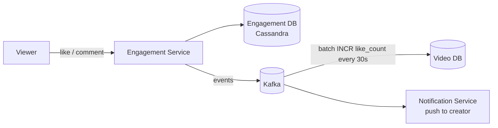
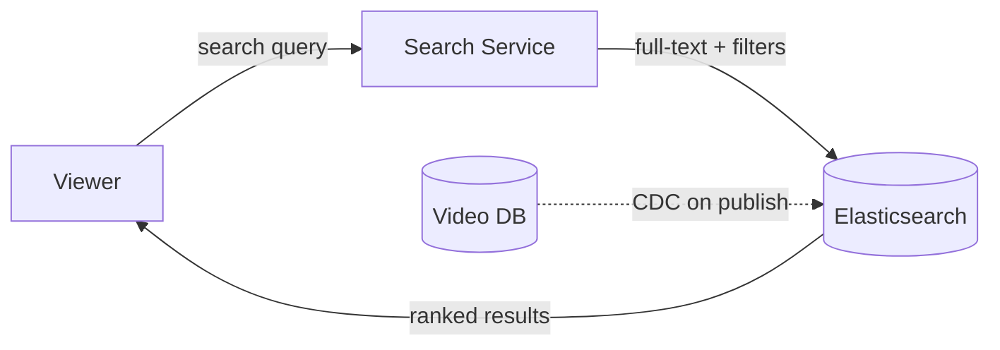

# YouTube System Design

## System Overview
A video sharing platform where users upload, discover, and watch long-form videos with comments, likes, subscriptions, and a recommendation-driven home feed. Similar to Netflix for streaming architecture but with user-generated content, public discovery, and monetization.

## 1. Requirements

### Functional Requirements
- User registration, authentication, channel management
- Upload videos (up to 12hr / 256GB)
- Watch videos with adaptive quality
- Search videos by title, description, channel
- Subscribe to channels; personalized home feed
- Like, dislike, comment on videos
- Video recommendations
- Notifications for new uploads from subscribed channels

### Non-Functional Requirements
- Availability: 99.99%
- Latency: <200ms feed load; video starts within 1s
- Scalability: 2B+ users, 500M+ videos, 1B+ hours watched/day
- Read >> Write: views vastly outnumber uploads
- Durability: uploaded videos must never be lost

## 2. Back-of-the-Envelope Estimation

### Assumptions
- 2B users, 500M DAU
- 500 hours of video uploaded per minute
- 1B hours watched/day
- Average video: 10 min, encoded to 5 quality variants at avg 3GB total
- Read:Write = 10000:1

### Traffic
```
Uploads/sec         = 500hr/min × 60min / 86400 ≈ 500/sec (raw video minutes)

Views/day           = 1B hours × 60min / 10min avg = 6B views/day
Views/sec           = 6B / 86400 ≈ 69K/sec → CDN

Feed requests/sec   = 500M × 5 / 86400 ≈ 29K/sec
```

### Storage
```
Uploads/day         = 720K hr/day × 60min × 3GB/10min ≈ 13PB/day (encoded)
Total catalog       = 500M videos × 3GB = 1.5EB
```

## 3. Architecture Diagram

### Components

| Component | Role |
|---|---|
| API Gateway | Auth, rate limiting, routing |
| User Service | Registration, login, channel management, subscription graph |
| Video Upload Service | Receives raw video; stores to S3; triggers processing pipeline |
| Video Processing Pipeline | Chunker → Encoder (multiple bitrates) → S3 → Video DB update |
| Video Service | Video metadata CRUD; view count updates; CDC to Elasticsearch |
| Feed Service | Personalized home feed; mix of subscribed channels + recommendations |
| Recommendation Service | ML-based video ranking; considers watch history, likes, search, trending |
| Search Service | Full-text video search via Elasticsearch; CDC from Video DB |
| Playback Service | Returns manifest URL for video streaming; validates auth |
| Engagement Service | Likes, dislikes, comments; writes to Engagement DB; Kafka events for counters |
| Notification Service | Kafka consumer; push/email for new uploads, comments, milestones |
| Analytics Service | Kafka consumer; processes view events for watch time, retention, revenue |
| Video DB (Cassandra) | Video metadata, view/like counters |
| User DB (MySQL) | Users, channels, subscriptions |
| Engagement DB (Cassandra) | Comments, likes — high write throughput |
| Feed Cache (Redis) | Pre-computed feeds per user |
| S3 + CDN | Video storage and global delivery |
| Kafka | Async event bus for all downstream processing |

### Overview



## 4. Key Flows

### 4.1 Video Upload & Processing



Large file handling: resumable uploads via multipart. Client uploads in 5MB chunks; server reassembles. Same encoding pipeline as Netflix — parallel encoding across N instances via Kafka.

### 4.2 Feed Generation (Home Page)



Hybrid fan-out:
- Push for channels with <100K subscribers: fan-out videoId to subscribers' Feed Cache on upload
- Pull + Recommendation for large channels (>100K subscribers): fetch on demand at read time
- Recommendation Service fills gaps with personalized content

### 4.3 Video Streaming



Identical to Netflix — manifest file → CDN → ABR streaming. Client adjusts quality at segment boundaries based on download speed.

### 4.4 View Count & Analytics



Viral video gets 1M views/sec. Writing to Cassandra COUNTER 1M times/sec creates a hot partition. Solution: buffer in Kafka, batch-aggregate every 30s, write aggregated count. Slight staleness acceptable.

### 4.5 Engagement (Likes, Comments)



### 4.6 Search



Full-text on title, description, channel. Filters: duration, upload date, channel. Autocomplete via prefix search.

## 5. Database Design

### Selection Reasoning

| Store | Why |
|---|---|
| Cassandra (Video DB) | High read/write throughput for video metadata and counters |
| MySQL (User DB) | Structured user data, subscription graph, ACID |
| Cassandra (Engagement DB) | Billions of likes/comments, append-only, time-series |
| Redis | Pre-computed feed cache, trending videos, session store |
| Elasticsearch | Full-text video/user search |
| S3 + CDN | Petabyte video storage, global delivery |
| Kafka | Async event bus for all downstream processing |

### Cassandra — videos

| Field | Type |
|---|---|
| video_id | UUID (PK) |
| channel_id | UUID |
| title | VARCHAR |
| description | TEXT |
| manifest_url | TEXT |
| thumbnail_url | TEXT |
| duration_sec | INT |
| view_count | COUNTER |
| like_count | COUNTER |
| status | TEXT (processing / public / private / deleted) |
| published_at | TIMESTAMP |

### MySQL — users / channels

| Field | Type |
|---|---|
| user_id | UUID (PK) |
| channel_name | VARCHAR |
| email | VARCHAR, unique |
| password_hash | VARCHAR |
| subscriber_count | INT |
| created_at | TIMESTAMP |

### MySQL — subscriptions

| Field | Type |
|---|---|
| subscriber_id | UUID |
| channel_id | UUID |
| subscribed_at | TIMESTAMP |

### Cassandra — comments

| Field | Type |
|---|---|
| video_id | UUID (partition key) |
| comment_id | TIMEUUID (clustering) |
| user_id | UUID |
| content | TEXT |
| like_count | COUNTER |
| created_at | TIMESTAMP |

### Redis Keys

| Key Pattern | Type | Value | TTL |
|---|---|---|---|
| `feed:{userId}` | List | ordered videoIds | 3600s |
| `trending:global` | ZSET | videoId → score | 300s |
| `video:meta:{videoId}` | String | metadata JSON | 600s |
| `session:{sessionId}` | String | userId | 86400s |

## 6. Key Interview Concepts

### YouTube vs Netflix Architecture
Both use the same video encoding and CDN delivery pipeline. Key differences:
- YouTube: user-generated content — anyone uploads; Netflix: curated professional content
- YouTube: public discovery, search, recommendations are core; Netflix: subscription-gated
- YouTube: view counts, likes, comments are public engagement signals; Netflix: private watch history
- YouTube: monetization (ads) requires view tracking; Netflix: subscription model

### Subscription Fan-out
Channel with 100M subscribers uploads video → 100M feed cache writes. Same fan-out problem as TikTok. Hybrid approach: push to small subscriber counts (<100K), pull for large channels.

### Video Counter Accuracy vs Performance
Viral video gets 1M views/sec. Writing to Cassandra COUNTER 1M times/sec creates a hot partition. Solution: buffer view events in Kafka, batch-aggregate every 30s, write aggregated count. Acceptable staleness.

### Recommendation at Scale
Two-stage pipeline:
1. Candidate generation: retrieve ~100 candidate videos from watch history, subscriptions, trending
2. Ranking: ML model scores and ranks candidates by predicted watch time
3. Result: top 20 videos for feed

### Resumable Uploads
Videos up to 256GB can't be uploaded in a single request. Multipart upload: client splits into 5MB chunks, uploads each independently, server reassembles. On failure: resume from last successful chunk. Same pattern as S3 multipart upload.

### CDC for Search Sync
Video DB (Cassandra) → Debezium → Kafka → Elasticsearch. Decouples Video Service from search indexing. If Elasticsearch is down, CDC replays missed changes on recovery.

## 7. Failure Scenarios

### Encoding Pipeline Failure
- Recovery: Kafka retains encoding jobs; another encoder picks up; idempotent encoding
- Video stays in `processing` status; creator notified of delay

### Feed Cache Miss
- Recovery: fall back to pull-based feed from subscriptions + trending; Recommendation Service generates on demand
- Prevention: Redis Cluster; feed is reconstructable from Video DB

### View Count Kafka Lag
- Impact: view counts temporarily stale
- Recovery: Kafka retains events; Analytics Service catches up; no data loss
- Prevention: monitor consumer lag; scale up Analytics Service instances

### Search Index Stale
- Recovery: CDC replays missed changes on Elasticsearch recovery
- Prevention: Elasticsearch cluster with replicas; non-critical path — video playback unaffected

### CDN Node Failure
- Recovery: CDN reroutes to next nearest edge; ABR drops quality to compensate
- Prevention: S3 origin always available as fallback; CDN provider has redundant PoPs
